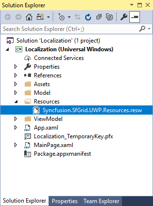
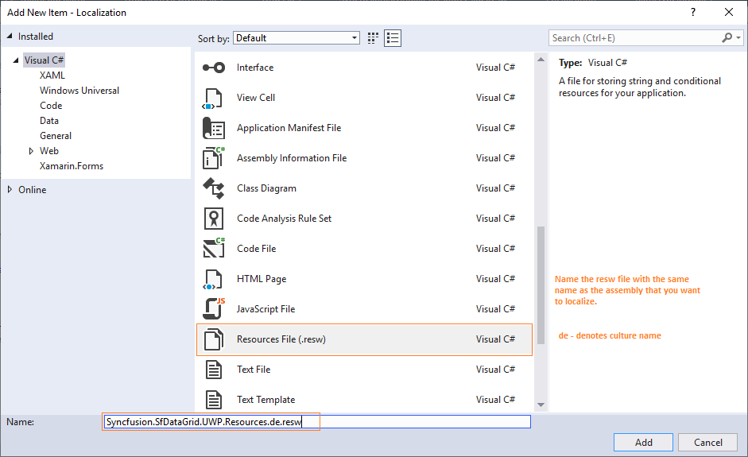
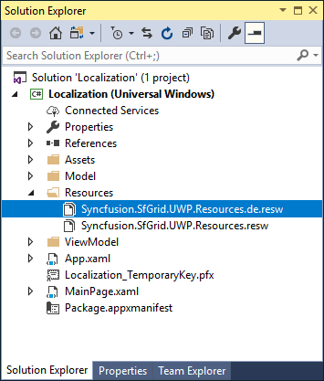
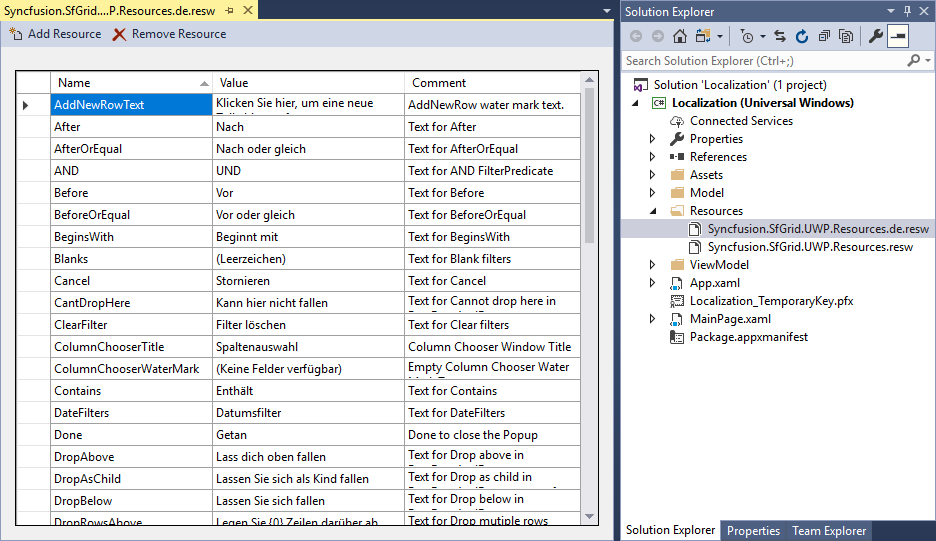

# Localization of Syncfusion&reg; UWP controls

Localization is the process of translating the application resources into different languages for specific cultures. You can localize the Syncfusion&reg; UWP controls by adding a resource file for each language.

## Changing application culture

When you are changing the application culture, then you can localize the application based on application culture by creating .resw file.





using System.Globalization;

public sealed partial class MainPage
{
    public MainPage()
    {
        CultureInfo.CurrentUICulture = new CultureInfo("de");
        this.InitializeComponent();
    }
}





Imports System.Globalization

Public NotInheritable Partial Class MainPage
	Public Sub New()
		CultureInfo.CurrentUICulture = New CultureInfo("de")
		Me.InitializeComponent()
	End Sub
End Class





## Creating .resw files

You can create .resw files for any language by following the below steps:

N> You can get the default resource files of all Syncfusion&reg; UWP libraries from [GitHub](https://github.com/syncfusion/uwp-controls-localization-resource-files).

1) Right-click your project and add a new folder named `Resources`.

2) Add the [default resource files](https://github.com/syncfusion/uwp-controls-localization-resource-files) of the libraries you are using into the `Resources` folder.

N> Consider that you are using the `SfDataGrid` control in your application. Then you need to copy and include `Syncfusion.SfGrid.UWP.Resources.resw` (since `SfDataGrid` is present in the `Syncfusion.SfGrid.UWP` library) file in your application under the `Resources` folder. Now you can see the key names and values of the default strings used in the `Syncfusion.SfGrid.UWP.dll` library.

3) Right-click the `Resources` folder and select `Add` and then `New Item`. In the `Add New Item` wizard, select the Resources File option and name the file `Syncfusion.SfGrid.UWP.Resources.<culture name>.resw` (for example, `Syncfusion.SfGrid.UWP.Resources.de.resw` for `German` culture). Then, select `Add` to add the resource file for the German culture to the `Resources` folder. In the same way, add new resource files for other libraries used in your application.

4) In the **Properties** window, set the **Build Action** of the `.resw` file to **PRIResource** so it is compiled into the application's PRI file.

5) Now, copy the key names from the default resource files and assign each value based on the culture that the resource file targets.

N> Download the demo from [GitHub](https://github.com/SyncfusionExamples/uwp-datagrid-localization).

## Editing default culture strings

You can change the default string of any control by adding the default .resw files ([from GitHub](https://github.com/syncfusion/uwp-controls-localization-resource-files)) to the `Resources` folder of your application. The default .resw file should be named `<assembly-name>.Resources.resw` (for example, `Syncfusion.SfGrid.UWP.Resources.resw`). Syncfusion&reg; UWP controls read the default strings from the .resw files of the application if they are added.
