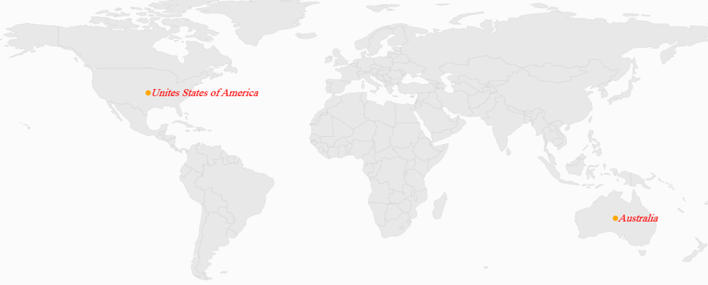
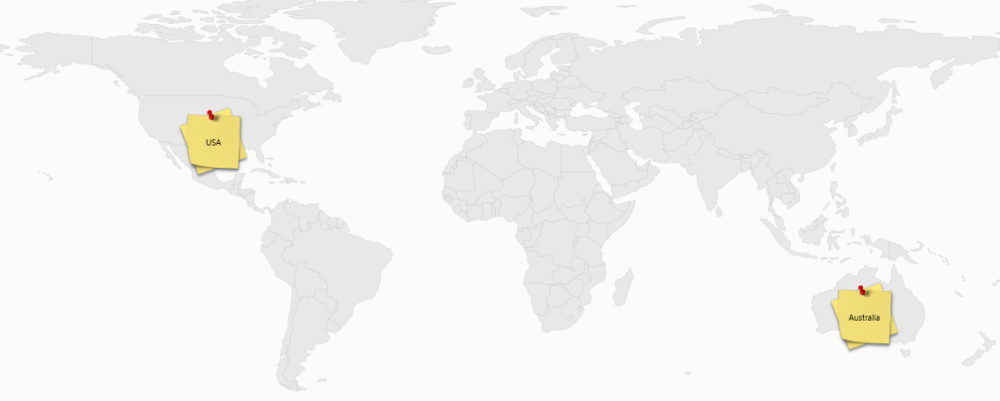

# Annotations in UWP Map (SfMaps)

`Annotations` are notes used to leave some message on the map. In SfMap, annotations are denoted by the `MapAnnotations`. MapAnnotation has two major parts:

* AnnotationLabel
* AnnotationSymbol

`AnnotationLabel` is a “Text” that shows some information in the text format. 

`AnnotationSymbol` is a “VisualObject” that shows a note symbolically.

## Customize AnnotationLabel

AnnotationLabel’s appearance is customized by the following properties:

* `AnnotationLabelForeground`: Gets or sets the foreground color of the annotation label.
* `AnnotationLabelFontStyle`: Gets or sets the font style of the annotation label.
* `AnnotationLabelBackground`: Gets or sets the background color of the annotation label.
* `AnnotationLabelFontFamily`: Gets or sets the font family for the annotation label.
* `AnnotationLabelFontSize`: Gets or sets the annotation label font size.



    <syncfusion:SfMap >         
        <syncfusion:SfMap.Layers>
            <syncfusion:ShapeFileLayer   Uri="MapApp.world1.shp">                    
                <syncfusion:ShapeFileLayer.Annotations>
                    <syncfusion:MapAnnotations Latitude="-22" Longitude="132" AnnotationLabel="Australia" AnnotationLabelFontFamily="Times New Roman" AnnotationLabelFontSize="20" AnnotationLabelFontStyle="Oblique" AnnotationLabelForeground="Red" >
                        <syncfusion:MapAnnotations.AnnotationSymbol>
                            <Ellipse Fill="Orange" Height="10" Width="10">                                    
                            </Ellipse>
                        </syncfusion:MapAnnotations.AnnotationSymbol>
                    </syncfusion:MapAnnotations>
                    <syncfusion:MapAnnotations Latitude="40" Longitude="-98" AnnotationLabel="Unites States of America" AnnotationLabelFontFamily="Times New Roman" AnnotationLabelFontSize="20" AnnotationLabelFontStyle="Oblique" AnnotationLabelForeground="Red" >
                        <syncfusion:MapAnnotations.AnnotationSymbol>
                            <Ellipse Fill="Orange" Height="10" Width="10">
                            </Ellipse>
                        </syncfusion:MapAnnotations.AnnotationSymbol>
                    </syncfusion:MapAnnotations>
                </syncfusion:ShapeFileLayer.Annotations>
            </syncfusion:ShapeFileLayer>
        </syncfusion:SfMap.Layers>
    </syncfusion:SfMap >



## Positioning a MapAnnotation

`MapAnnotation` can be positioned anywhere on the map based on latitude and longitude. MapAnnotation has two properties called `Latitude` and `Longitude` of string type used to set latitude and longitude co-ordinates of the MapAnnotation. 

### Customizing the Annotation Template

The default appearance of the annotation can be customized by using the `AnnotationTemplate` property. The annotation template property is available in the ShapeFileLayer.

#### About the AnnotationTemplate Property

AnnotationTemplate is a `DataTemplate` type, used to customize or override the default template of MapAnnotations.



        <syncfusion:SfMap >
            <syncfusion:SfMap.Layers>
                <syncfusion:ShapeFileLayer   Uri="MapApp.world1.shp">
                    <syncfusion:ShapeFileLayer.AnnotationTemplate>
                        <DataTemplate>
                            <Grid Margin="-50,-20,0,0">
                                <ContentPresenter Content="{Binding AnnotationSymbol}"/>
                                <TextBlock Text="{Binding AnnotationLabel}" HorizontalAlignment="Center" VerticalAlignment="Center"/>
                            </Grid>
                        </DataTemplate>
                    </syncfusion:ShapeFileLayer.AnnotationTemplate>
                    <syncfusion:ShapeFileLayer.Annotations>
                        <syncfusion:MapAnnotations Latitude="-22" Longitude="132" AnnotationLabel="Australia"  >
                            <syncfusion:MapAnnotations.AnnotationSymbol>
                                <Image Height="100" Width="100" Source="note.jpg" />
                            </syncfusion:MapAnnotations.AnnotationSymbol>
                        </syncfusion:MapAnnotations>
                        <syncfusion:MapAnnotations Latitude="40" Longitude="-98" AnnotationLabel="USA">
                            <syncfusion:MapAnnotations.AnnotationSymbol>
                                <Image Height="100" Width="100" Source="note.jpg" />
                            </syncfusion:MapAnnotations.AnnotationSymbol>
                        </syncfusion:MapAnnotations>
                    </syncfusion:ShapeFileLayer.Annotations>
                </syncfusion:ShapeFileLayer>
            </syncfusion:SfMap.Layers>
        </syncfusion:SfMap >



