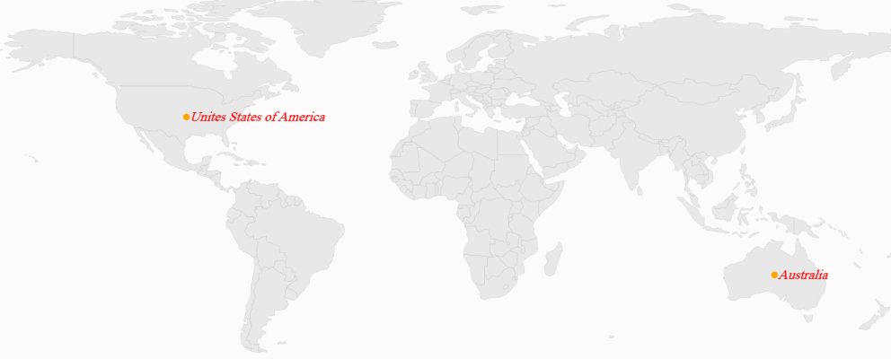
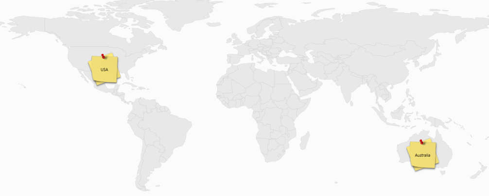

# Annotations in UWP Map (SfMaps)

`Annotations` are notes used to leave some message on the map. In the [`SfMap`](https://help.syncfusion.com/cr/uwp/Syncfusion.UI.Xaml.Maps.SfMap.html), annotations are denoted by the [`MapAnnotations`](https://help.syncfusion.com/cr/uwp/Syncfusion.UI.Xaml.Maps.MapAnnotations.html). `MapAnnotations` has two major parts:

* [`AnnotationLabel`](https://help.syncfusion.com/cr/uwp/Syncfusion.UI.Xaml.Maps.MapAnnotations.html#Syncfusion_UI_Xaml_Maps_MapAnnotations_AnnotationLabel) : A text that shows some information in text format.

* [`AnnotationSymbol`](https://help.syncfusion.com/cr/uwp/Syncfusion.UI.Xaml.Maps.MapAnnotations.html#Syncfusion_UI_Xaml_Maps_MapAnnotations_AnnotationSymbol) : A visual object that shows a note symbolically.

## Customize AnnotationLabel

The appearance of `AnnotationLabel` is customized by the following properties:

* [`AnnotationLabelForeground`](https://help.syncfusion.com/cr/uwp/Syncfusion.UI.Xaml.Maps.MapAnnotations.html#Syncfusion_UI_Xaml_Maps_MapAnnotations_AnnotationLabelForeground): Gets or sets the foreground color of the annotation label.
* [`AnnotationLabelFontStyle`](https://help.syncfusion.com/cr/uwp/Syncfusion.UI.Xaml.Maps.MapAnnotations.html#Syncfusion_UI_Xaml_Maps_MapAnnotations_AnnotationLabelFontStyle): Gets or sets the font style of the annotation label.
* [`AnnotationLabelBackground`](https://help.syncfusion.com/cr/uwp/Syncfusion.UI.Xaml.Maps.MapAnnotations.html#Syncfusion_UI_Xaml_Maps_MapAnnotations_AnnotationLabelBackground): Gets or sets the background color of the annotation label.
* [`AnnotationLabelFontFamily`](https://help.syncfusion.com/cr/uwp/Syncfusion.UI.Xaml.Maps.MapAnnotations.html#Syncfusion_UI_Xaml_Maps_MapAnnotations_AnnotationLabelFontFamily): Gets or sets the font family for the annotation label.
* [`AnnotationLabelFontSize`](https://help.syncfusion.com/cr/uwp/Syncfusion.UI.Xaml.Maps.MapAnnotations.html#Syncfusion_UI_Xaml_Maps_MapAnnotations_AnnotationLabelFontSize): Gets or sets the annotation label font size.



<syncfusion:SfMap>
    <syncfusion:SfMap.Layers>
        <syncfusion:ShapeFileLayer Uri="MapApp.world1.shp">
            <syncfusion:ShapeFileLayer.Annotations>
                <syncfusion:MapAnnotations Latitude="-22" Longitude="132" AnnotationLabel="Australia" AnnotationLabelFontFamily="Times New Roman" AnnotationLabelFontSize="20" AnnotationLabelFontStyle="Oblique" AnnotationLabelForeground="Red">
                    <syncfusion:MapAnnotations.AnnotationSymbol>
                        <Ellipse Fill="Orange" Height="10" Width="10" />
                    </syncfusion:MapAnnotations.AnnotationSymbol>
                </syncfusion:MapAnnotations>
                <syncfusion:MapAnnotations Latitude="40" Longitude="-98" AnnotationLabel="United States of America" AnnotationLabelFontFamily="Times New Roman" AnnotationLabelFontSize="20" AnnotationLabelFontStyle="Oblique" AnnotationLabelForeground="Red">
                    <syncfusion:MapAnnotations.AnnotationSymbol>
                        <Ellipse Fill="Orange" Height="10" Width="10" />
                    </syncfusion:MapAnnotations.AnnotationSymbol>
                </syncfusion:MapAnnotations>
            </syncfusion:ShapeFileLayer.Annotations>
        </syncfusion:ShapeFileLayer>
    </syncfusion:SfMap.Layers>
</syncfusion:SfMap>



## Positioning a MapAnnotation

`MapAnnotation` can be positioned anywhere on the map based on latitude and longitude. `MapAnnotations` has two properties called [`Latitude`](https://help.syncfusion.com/cr/uwp/Syncfusion.UI.Xaml.Maps.MapAnnotations.html#Syncfusion_UI_Xaml_Maps_MapAnnotations_Latitude) and [`Longitude`](https://help.syncfusion.com/cr/uwp/Syncfusion.UI.Xaml.Maps.MapAnnotations.html#Syncfusion_UI_Xaml_Maps_MapAnnotations_Longitude) of double type, used to set the latitude and longitude coordinates of the `MapAnnotations`. 

### Customizing the Annotation Template

The default appearance of the annotation can be customized by using the [`AnnotationTemplate`](https://help.syncfusion.com/cr/uwp/Syncfusion.UI.Xaml.Maps.ShapeFileLayer.html#Syncfusion_UI_Xaml_Maps_ShapeFileLayer_AnnotationTemplate) property. The `AnnotationTemplate` property is available in the [`ShapeFileLayer`](https://help.syncfusion.com/cr/uwp/Syncfusion.UI.Xaml.Maps.ShapeFileLayer.html).

#### About the AnnotationTemplate Property

`AnnotationTemplate` is a `DataTemplate` type, used to customize or override the default template of `MapAnnotations`.



<syncfusion:SfMap>
    <syncfusion:SfMap.Layers>
        <syncfusion:ShapeFileLayer Uri="MapApp.world1.shp">
            <syncfusion:ShapeFileLayer.AnnotationTemplate>
                <DataTemplate>
                    <Grid Margin="-50,-20,0,0">
                        <ContentPresenter Content="{Binding AnnotationSymbol}"/>
                        <TextBlock Text="{Binding AnnotationLabel}" HorizontalAlignment="Center" VerticalAlignment="Center"/>
                    </Grid>
                </DataTemplate>
            </syncfusion:ShapeFileLayer.AnnotationTemplate>
            <syncfusion:ShapeFileLayer.Annotations>
                <syncfusion:MapAnnotations Latitude="-22" Longitude="132" AnnotationLabel="Australia">
                    <syncfusion:MapAnnotations.AnnotationSymbol>
                        <Image Height="100" Width="100" Source="note.jpg" />
                    </syncfusion:MapAnnotations.AnnotationSymbol>
                </syncfusion:MapAnnotations>
                <syncfusion:MapAnnotations Latitude="40" Longitude="-98" AnnotationLabel="USA">
                    <syncfusion:MapAnnotations.AnnotationSymbol>
                        <Image Height="100" Width="100" Source="note.jpg" />
                    </syncfusion:MapAnnotations.AnnotationSymbol>
                </syncfusion:MapAnnotations>
            </syncfusion:ShapeFileLayer.Annotations>
        </syncfusion:ShapeFileLayer>
    </syncfusion:SfMap.Layers>
</syncfusion:SfMap>



