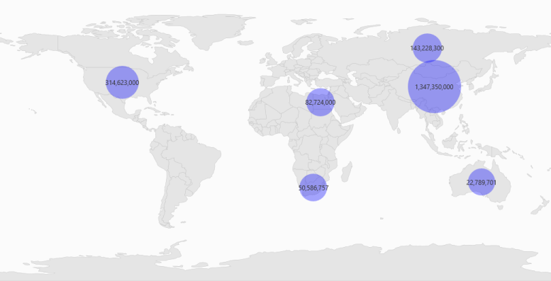
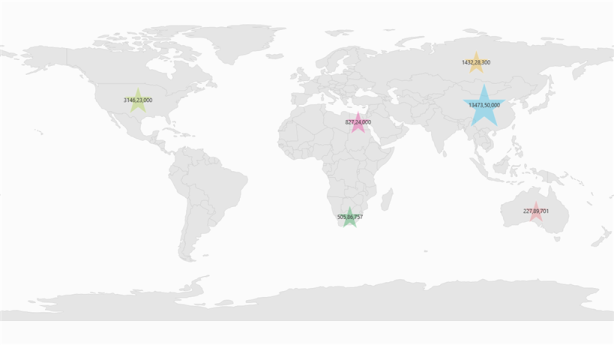
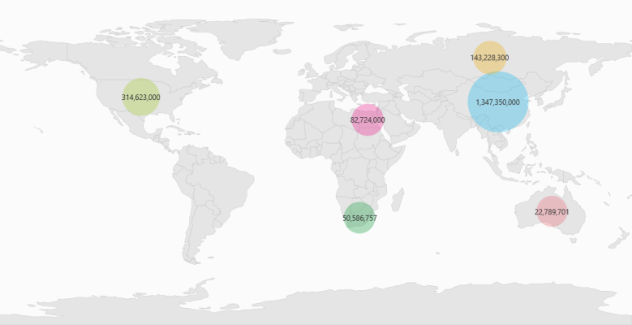

# Bubbles in UWP Map (SfMaps)

`Bubbles` in the Maps control represent the under-bound data values of the map. Bubbles are scattered throughout map shapes that contain bound values.

Bubbles are included when data binding is set as mentioned above and the `BubbleMarkerSetting` is set. 

The following properties are available in the BubbleMarkerSetting:

<table>
<tr>
<th>
Property</th><th>
Type</th><th>
Description</th></tr>
<tr>
<td>
AutoFillColor</td><td>
Boolean (true / false)</td><td>
Gets or sets whether the colors should be automatically filled.</td></tr>
<tr>
<td>
MaxSize</td><td>
Double</td><td>
Get or sets the maximum height and width of the bubble.</td></tr>
<tr>
<td>
MinSize</td><td>
Double</td><td>
Gets or sets the minimum height and width of the bubble.</td></tr>
<tr>
<td>
ValuePath</td><td>
String</td><td>
Gets or sets the name of the under-bound property in ItemsSource.</td></tr>
<tr>
<td>
ColorMapping</td><td>
ObservableCollection&lt;RangeColorMapping&gt;</td><td>
Gets or sets the tree map colors.</td></tr>

</table>

## Adding Bubbles to a Map

To add bubbles to a map, `BubbleMarkerSetting` has to be added to the `ShapeFileLayer`.  Set the `AutoFillColor` as true and set the `Fill` property. Create the `Model` and `ViewModel` as illustrated in the [Data Binding](/winrt/Maps/Data-Binding "Data Binding") topic and add the following code. Also set the `MaxSize`, `MinSize`, and `ValuePath` properties as illustrated in the following code example.



        <syncfusion:SfMap >
                <syncfusion:SfMap.Layers>
                    <syncfusion:ShapeFileLayer EnableSelection="False" ItemsSource="{Binding Countries1}" ShapeIDPath="Country"  ShapeIDTableField="NAME" Uri="SampleBrowser.Assets.ShapeFiles.world1.shp">
                        <syncfusion:ShapeFileLayer.BubbleMarkerSetting>
                            <syncfusion:BubbleMarkerSetting AutoFillColor="True" MaxSize="100" MinSize="50"  StrokeThickness="0" ValuePath="Population">
                            </syncfusion:BubbleMarkerSetting>
                        </syncfusion:ShapeFileLayer.BubbleMarkerSetting>
                        <syncfusion:ShapeFileLayer.ShapeSettings>
                            <syncfusion:ShapeSetting ShapeStroke="#C1C1C1" ShapeStrokeThickness="0.5" ShapeValuePath="Population" ShapeFill="#E5E5E5"/>
                        </syncfusion:ShapeFileLayer.ShapeSettings>
                    </syncfusion:ShapeFileLayer>
                </syncfusion:SfMap.Layers>
         </syncfusion:SfMap >



## Customizing Bubble Symbol

Bubble symbol can be modified using built-in symbols like circle, rectangle, diamond, triangle, trapezoid, star, pentagon, and pushpin available in the `BubbleType` enum property. Also, bubbles can be customized by setting the CustomTemplate of the BubbleMarkerSetting.

<table>
<tr>
<th>
Property</th><th>
Type</th><th>
Description</th></tr>
<tr>
<td>
BubbleType</td><td>
BubbleType (enum)</td><td>
Gets or sets the type of bubble symbol needed to be used in maps.</td></tr>
<tr>
<td>
CustomTemplate</td><td>
DataTemplate</td><td>
Gets or sets the template to customize the bubble.>  BubbleType should be set as “Custom” to show a customized bubble shape.</td></tr>
</table>



    <syncfusion:SfMap>
        <syncfusion:SfMap.Layers>
            <syncfusion:ShapeFileLayer x:Name="shapeFileLayer"   
                                       ItemsSource="{Binding Countries}"
                                       ShapeIDPath="NAME" 
                                       ShapeIDTableField="NAME" Uri="BubbleTypeDemo.Assets.World.shp">
                <syncfusion:ShapeFileLayer.BubbleMarkerSetting>
                    <syncfusion:BubbleMarkerSetting AutoFillColor="False" MaxSize="100" MinSize="50" ValuePath="Population" BubbleType="Star">
                        <syncfusion:BubbleMarkerSetting.ColorMappings>
                            <syncfusion:RangeColorMapping Color="#7F20BCEE" To="1347350000" From="314623001"/>
                            <syncfusion:RangeColorMapping Color="#7FA7CE38" To="314623001" From="143228301"/>
                            <syncfusion:RangeColorMapping Color="#7FF1B21A" To="143228301" From="82724090"/>
                            <syncfusion:RangeColorMapping Color="#7F1DA249" To="50586757" From="22789702"/>
                            <syncfusion:RangeColorMapping Color="#7FEB737C" To="22789702" From="0"/>
                            <syncfusion:RangeColorMapping Color="#7FED2D95" To="82724090" From="50586757"/>
                        </syncfusion:BubbleMarkerSetting.ColorMappings>
                    </syncfusion:BubbleMarkerSetting>
                </syncfusion:ShapeFileLayer.BubbleMarkerSetting>
                <syncfusion:ShapeFileLayer.ItemsTemplate>
                    <DataTemplate>
                        <Border Background="Transparent">
                            <TextBlock FontFamily="Segoe UI" FontSize="12" Foreground="#FF333333" Text="{Binding Data.PopulationFormat}"/>
                        </Border>
                   </DataTemplate>
                </syncfusion:ShapeFileLayer.ItemsTemplate>
                <syncfusion:ShapeFileLayer.ShapeSettings>
                    <syncfusion:ShapeSetting ShapeStroke="#C1C1C1" ShapeStrokeThickness="0.5" ShapeValuePath="Population" ShapeFill="#E5E5E5"/>
                </syncfusion:ShapeFileLayer.ShapeSettings>
            </syncfusion:ShapeFileLayer>
        </syncfusion:SfMap.Layers>
    </syncfusion:SfMap>	



## Range Color Mapping

`RangeColorMapping` is one of the features used to differentiate the bubble fill, based on its under-bound value and color ranges. It contains the following properties:

<table>
<tr>
<th>
Property</th><th>
Type</th><th>
Description</th></tr>
<tr>
<td>
Range</td><td>
Double</td><td>
Gets or sets the value range of the bubble.</td></tr>
<tr>
<td>
Color</td><td>
Color</td><td>
Gets or sets the color values for a given range.</td></tr>
</table>

The fill color of a particular bubble fill can be determined by its under-bound value and the color range. For example, consider the following color ranges:



    <syncfusion:BubbleMarkerSetting.ColorMappings>
        <syncfusion:RangeColorMapping Color="#7F20BCEE" To="1347350000" From="314623001"/>
        <syncfusion:RangeColorMapping Color="#7FA7CE38" To="314623001" From="143228301"/>
        <syncfusion:RangeColorMapping Color="#7FF1B21A" To="143228301" From="82724090"/>
        <syncfusion:RangeColorMapping Color="#7F1DA249" To="50586757" From="22789702"/>
        <syncfusion:RangeColorMapping Color="#7FEB737C" To="22789702" From="0"/>
        <syncfusion:RangeColorMapping Color="#7FED2D95" To="82724090" From="50586757"/>                        </syncfusion:BubbleMarkerSetting.ColorMappings>
    </syncfusion:BubbleMarkerSetting.ColorMappings>



When the under-bound object value is 22789702, then the fill color of the corresponding bubble is set to “#7FEB737C”.  As mentioned earlier, the under-bound value of the bubble is set through the “ValuePath” in the BubbleMarkerSetting.

When the under-bound value is under any of the given sorted range or above the sorted range, then the fill is set as “Black.”

`AutoFillColor` must be set as `false` to enable range color mapping.



        <syncfusion:SfMap >
                <syncfusion:SfMap.Layers>
                    <syncfusion:ShapeFileLayer EnableSelection="False" ItemsSource="{Binding Countries1}" ShapeIDPath="Country"  ShapeIDTableField="NAME" Uri="SampleBrowser.Assets.ShapeFiles.world1.shp">
                        <syncfusion:ShapeFileLayer.BubbleMarkerSetting>
                            <syncfusion:BubbleMarkerSetting AutoFillColor="False" Fill="Blue" MaxSize="100" MinSize="50"  StrokeThickness="0" ValuePath="Population">
                                <syncfusion:BubbleMarkerSetting.ColorMappings>
                                    <syncfusion:RangeColorMapping Color="#7F20BCEE" To="1347350000" From="314623001"/>
                                    <syncfusion:RangeColorMapping Color="#7FA7CE38" To="314623001" From="143228301"/>
                                    <syncfusion:RangeColorMapping Color="#7FF1B21A" To="143228301" From="82724090"/>
                                    <syncfusion:RangeColorMapping Color="#7F1DA249" To="50586757" From="22789702"/>
                                    <syncfusion:RangeColorMapping Color="#7FEB737C" To="22789702" From="0"/>
                                    <syncfusion:RangeColorMapping Color="#7FED2D95" To="82724090" From="50586757"/>                        </syncfusion:BubbleMarkerSetting.ColorMappings>
                                </syncfusion:BubbleMarkerSetting.ColorMappings>
                            </syncfusion:BubbleMarkerSetting>
                        </syncfusion:ShapeFileLayer.BubbleMarkerSetting>
                        <syncfusion:ShapeFileLayer.ShapeSettings>
                            <syncfusion:ShapeSetting ShapeStroke="#C1C1C1" ShapeStrokeThickness="0.5" ShapeValuePath="Population" ShapeFill="#E5E5E5"/>
                        </syncfusion:ShapeFileLayer.ShapeSettings>
                    </syncfusion:ShapeFileLayer>
                </syncfusion:SfMap.Layers>
            </syncfusion:SfMap >



