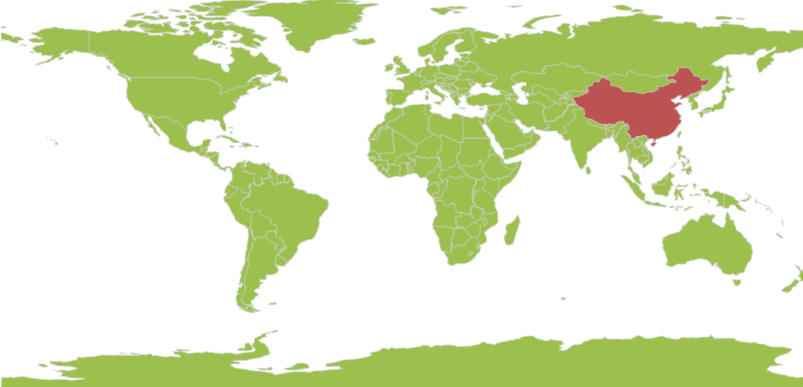

# Data Binding in UWP Map (SfMaps)

The following properties expose data binding in the Maps control:

* `ItemsSource`
* `ShapeIDPath`
* `ShapeIDTableField`

### Items Source

This is the basic property that exposes data binding for Maps. `ItemsSource` is the property that accepts the collection type values. For example, the ItemsSource property accepts the `ObservableCollections`, `Lists`, and `Linq` result values.

### ShapeID Path

`ShapeIDPath` is the string type property used to refer to the ID of a shape from the ItemsSource. The ItemsSource property must have a property with name of the ShapeIDPath. The ShapeIDPath and the ShapeIDTableField properties are related to each other (refer to [ShapeIDTableField](#ShapeIDTableField) for more details).

### ShapeID TableField

`ShapeIDTableField` property is similar to the ShapeIDPath. It is a string type property that refers to the column name in the dbf file to identify the shape. When values of the ShapeIDPath property in the ItemsSource and the value of ShapeIDTableField in the .dbf file match, then the associated object from the ItemsSource is bound to the corresponding shape.

### ShapeValuePath

`ShapeValuePath` is a string type property used to define the object bound to the shapes of the map. The ShapeValuePath must be the name of any property that is defined in the ItemsSource items. The ShapeIDPath, ShapeIDTableField, and ShapeValue paths are dependent upon one another. Without specifying the `ShapeIDPath` and `ShapeIDTableField`, `ShapeValuePath` has no effect.  When `ShapeIDPath` and `ShapeIDTableField` are properly set as mentioned in the [Data Binding](#Data-Binding) section, the `ShapeValuePath` has an impact on the map.

## Role of DBF file in Data Binding

The `.dbf` file that is included in the main shape file, is required to work with data binding. The .dbf file contains the information about the shapes in the main shape file. Each record in the .dbf file is associated with the each shape in the main file. Shapes in the main file and records in the .dbf file are organized in the same sequence. Therefore, the Nth shape in the main file is associated with Nth record in the .dbf file. A record of the .dbf file can contain the name of the shape or population data or some other statistical data of a geographic shape.



        <syncfusion:SfMap >
            <syncfusion:SfMap.Layers>
                <syncfusion:ShapeFileLayer EnableSelection="True" ItemsSource="{Binding Countries}" ShapeIDPath="Country" ShapeIDTableField="NAME" Uri="ms-appx:///Assets/world1.shp">
                    <syncfusion:ShapeFileLayer.ShapeSettings>
                        <syncfusion:ShapeSetting ShapeStroke="#FFD0D1D7" ShapeStrokeThickness="1" ShapeValuePath="Population" ShapeFill="#9CBF4E" SelectedShapeColor="#BC5353"/>
                    </syncfusion:ShapeFileLayer.ShapeSettings>
                </syncfusion:ShapeFileLayer>
            </syncfusion:SfMap.Layers>
        </syncfusion:SfMap >
        


## Customize Map Appearance 

You can customize the shape’s color by using `ShapeFill`, `ShapeStroke` and `ShapeStrokeThickness` properties in `ShapeSettings`.




    public class Country : INotifyPropertyChanged    
    {
        public string NAME { get; set; }
        private Visibility visibility = Visibility.Visible;        
        public Visibility ItemsVisibility        
        {           
            get { return visibility; }            
            set {visibility = value; }        
        }        
        private double weather { get; set; }       
        public double Weather        
        {            
            get            
            {               
                return weather;            
            }           
            set            
            {               
                weather = value;            
            }       
        }       
        private double population { get; set; }       
        public double Population        
        {            
            get            
            {               
                return population;            
            }            
            set            
            {                
                population = value;                
                OnPropertyChanged(new PropertyChangedEventArgs("Population"));            
            }        
        }       
        public string PopulationFormat { get; set; }       
        public event PropertyChangedEventHandler PropertyChanged;        
        public void OnPropertyChanged(PropertyChangedEventArgs e)        
        {            
            this.PopulationFormat = (String.Format("{0:0,0}", this.Population).Trim('$'));            
            if (PropertyChanged != null)            
            {               
                PropertyChanged(this, e);            
            }            
        }    
    }    
    public class MapViewModel    
    {        
        public ObservableCollection<Country> Countries { get; set; }        
        public MapViewModel()        
        {            
            Countries = new ObservableCollection<Country>();            
            Countries = GetCountriesAndPopulation();        
        }        
        private ObservableCollection<Country> GetCountriesAndPopulation()        
        {            
            ObservableCollection<Country> countries = new ObservableCollection<Country>();            
            countries.Add(new Country() { NAME = "China", Population = 1347350000 });            
            countries.Add(new Country() { NAME = "United States", Population = 314623000 });           
            countries.Add(new Country() { NAME = "Australia", Population = 22789701 });           
            countries.Add(new Country() { NAME = "Russia", Population = 143228300 });            
            countries.Add(new Country() { NAME = "Egypt", Population = 82724000 });            
            countries.Add(new Country() { NAME = "South Africa", Population = 50586757 });           
            return countries;       
        }   
    } 




    <syncfusion:SfMap>
        <syncfusion:SfMap.Layers>               
            <syncfusion:ShapeFileLayer EnableSelection="True" ItemsSource="{Binding Countries}" ShapeIDPath="Country" 
                ShapeIDTableField="NAME" Uri="MapApp.world1.shp">                    
                <syncfusion:ShapeFileLayer.ShapeSettings>                        
                    <syncfusion:ShapeSetting ShapeStroke="#FFD0D1D7" ShapeStrokeThickness="1" ShapeValuePath="Population" 
                        ShapeFill="#9CBF4E" SelectedShapeColor="#BC5353"/>                    
                    </syncfusion:ShapeFileLayer.ShapeSettings>                  
                </syncfusion:ShapeFileLayer>            
            </syncfusion:SfMap.Layers>        
    </syncfusion:SfMap >





