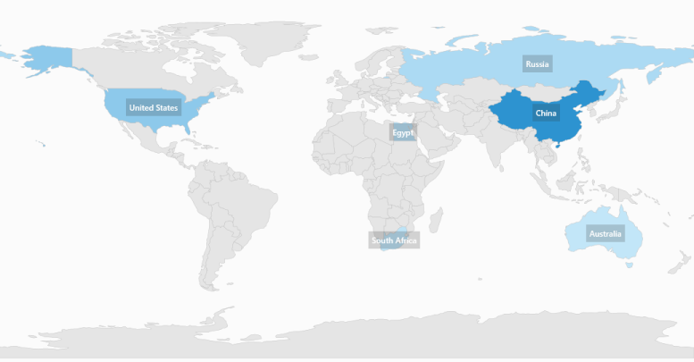

# Displaying Items on a Map in UWP Map (SfMaps)

Along with bubbles, the ItemsSource data can be visualized with other elements. The `ItemsTemplate` property is used to define the template for the items that are displayed on the map. By default, the map elements show the values of the object that is defined in the `ShapeValuePath` of the ShapeFileLayer’s `ShapeSetting`.

## About the ShapeValuePath property

ShapeValuePath is a string type property used to define the object bound to the shapes of the map. The ShapeValuePath must be the name of any property that is defined in the ItemsSource items. The ShapeIDPath, ShapeIDTableField, and ShapeValue paths are dependent upon one another. Without specifying the `ShapeIDPath` and `ShapeIDTableField`, `ShapeValuePath` has no effect.  When ShapeIDPath and ShapeIDTableField are properly set as mentioned in the Data Binding section, the ShapeValuePath will have an impact on the map.

## ItemsTemplate

`ItemsTemplate` is a type of DataTemplate, which is used to override the default template for map items. “Data” is the property that holds the object for a map item.

Implement the Model and ViewModel, as mentioned in the [Data Binding](/winrt/Maps/Data-Binding "Data Binding") topic, and include the following code in the XAML page:



        <syncfusion:SfMap >
                <syncfusion:SfMap.DataContext>
                    <local:ViewModel/>
                </syncfusion:SfMap.DataContext>
                <syncfusion:SfMap.Layers>
                    <syncfusion:ShapeFileLayer ItemsSource="{Binding Countries}" ShapeIDPath="Country" ShapeIDTableField="NAME" Uri="SampleBrowser.Assets.ShapeFiles.world1.shp">
                        <syncfusion:ShapeFileLayer.ItemsTemplate>
                            <DataTemplate>
                                <Grid Background="#332D2D2D">
                                    <TextBlock Margin="5" Foreground="White" Opacity="1" FontSize="12" FontWeight="SemiBold" FontFamily="Segoe UI" Text="{Binding Data.NAME}"/>
                                </Grid>
                            </DataTemplate>
                        </syncfusion:ShapeFileLayer.ItemsTemplate>
                        <syncfusion:ShapeFileLayer.ShapeSettings>
                            <syncfusion:ShapeSetting ShapeFill="#E5E5E5" ShapeStroke="#C1C1C1" ShapeStrokeThickness="0.5" ShapeValuePath="Population" >
                            </syncfusion:ShapeSetting>
                        </syncfusion:ShapeFileLayer.ShapeSettings>
                    </syncfusion:ShapeFileLayer>
                </syncfusion:SfMap.Layers>
            </syncfusion:SfMap >



