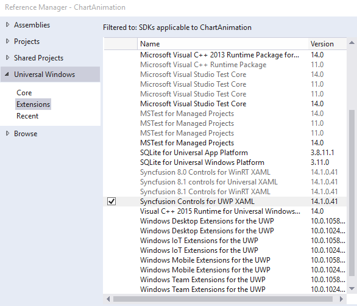
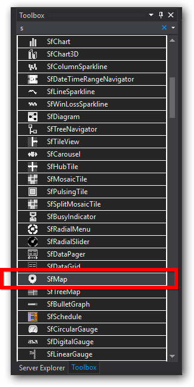
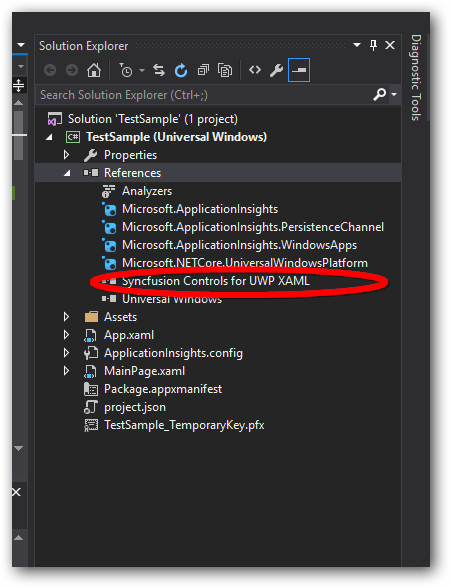
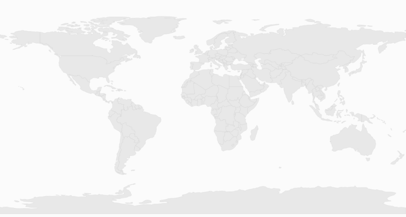

# Getting Started with UWP Map (SfMaps)

## Creating Maps for a Windows Store App

`SfMaps` is available in the following assembly and namespace:

`Assembly`: Syncfusion.SfMaps.UWP

`Namespace`: Syncfusion.UI.Xaml.Maps

### Adding assembly reference

1. Open the Add Reference window from your project.
2. Choose Windows > Extensions > SyncfusionControls for UWP XAML.

### Add SfMaps from Toolbox

Drag and drop the SfMaps control from the Toolbox to your application.

Now the SyncfusionControls for UWP XAML reference is added to the application references and the xmlns namespace code is generated in MainWindow.xaml as below.



    <Page
    xmlns="http://schemas.microsoft.com/winfx/2006/xaml/presentation"
    xmlns:x="http://schemas.microsoft.com/winfx/2006/xaml"
    xmlns:local="using:TestSample"
    xmlns:d="http://schemas.microsoft.com/expression/blend/2008"
    xmlns:mc="http://schemas.openxmlformats.org/markup-compatibility/2006"
    xmlns:Maps="using:Syncfusion.UI.Xaml.Maps"
    x:Class="TestSample.MainPage"
    mc:Ignorable="d">

        <Grid Background="{ThemeResource ApplicationPageBackgroundThemeBrush}">

            <Maps:SfMap HorizontalAlignment="Left" Height="100" Margin="119,302,0,0" VerticalAlignment="Top" Width="100"/>

        </Grid>
    </Page>


Refer to the following code to add the map:




    <Page x:Class="App2.MainPage"
    xmlns="http://schemas.microsoft.com/winfx/2006/xaml/presentation"
    xmlns:x="http://schemas.microsoft.com/winfx/2006/xaml"
    xmlns:local="using:App2"
    xmlns:d="http://schemas.microsoft.com/expression/blend/2008"
    xmlns:mc="http://schemas.openxmlformats.org/markup-compatibility/2006"                           
    xmlns:syncfusion="using:Syncfusion.UI.Xaml.Maps"
    mc:Ignorable="d">

    <Grid Background="{StaticResource ApplicationPageBackgroundThemeBrush}" Name="mainGrid">
        <syncfusion:SfMap>         
            <syncfusion:SfMap.Layers>
                <syncfusion:ShapeFileLayer   Uri="ms-appx:///Assets/world1.shp">                    
                </syncfusion:ShapeFileLayer>
            </syncfusion:SfMap.Layers>
        </syncfusion:SfMap>
    </Grid>
    
    </Page>





            SfMap syncMap = new SfMap();
            syncMap.EnablePan = true;
            ShapeFileLayer layer = new ShapeFileLayer();
            layer.Uri = "ms-appx:///Assets/world1.shp";
            syncMap.Layers.Add(layer);
            MainGrid.Children.Add(syncMap);




### Key Features

The Maps control includes the following key features:

* Reading and Loading Shape File 
* Data Binding
* Bubbles
* Displaying Item by Data Binding
* Zooming and Panning
* Annotations
* Shape Color Customization
* Commands
* Map Selection
* Map Popups
* Custom Data Binding

## Reading and Loading the Shapes

The Maps control supports reading and loading shape files. A shape file is a set of files which are stored in a non-topological geometry and the attribute information for the spatial features and records in a data set. Spatial features and records are stored as shapes that consist of set vector coordinates.  A computer program can read the content of the shape files and parse them as vector elements. The Maps control also reads and parses the spatial information of a shape file into the graphical elements. 

As mentioned earlier, a shape file can be a set of files or a single file. Generally, the shape file contains the following files:

* `Main file (.shp)`
* `Index file (.shx)`
* `dBASE file (.dbf)`

All files must adhere to the 8.3 naming conventions. The Main file, Index file, and dBase file must have the same prefix, i.e., they must have the same file name. This naming convention allows the user or developer to identify specific geographical information.

The main file (.shp) contains a fixed-length file header followed by the variable-length records. Each variable-length record is made up of a fixed-length record header followed by the variable-length record contents.  

The index file (.shx) contains a 100-byte header followed by 8-byte, fixed-length records.

The dBase file (.dbf) contains any desired feature attributes or attributes keys to which other tables can be joined. Its format is a standard .dbf file used by many table-based applications in Windows™ and DOS.  Any set of fields can be present in the table.

For more information about the 8.3 naming convention, shape files and their descriptions, visit the following link:

[http://www.esri.com/library/whitepapers/pdfs/shapefile.pdf](http://www.esri.com/library/whitepapers/pdfs/shapefile.pdf)

Maps read the main file and create the map shapes. The associated .dbf file contents are then incorporated with the shapes created from the main files.

## Attach the Shape file with Maps

To read the shape file using Maps, the shape file’s main file and .dbf file need to be added as an embedded resource in the application project. Then, the main file’s path has to be given in the Uri file of the shape file layer.

### About the Uri property

Uri is the string type property that retrieves the location of the shape file that is added as an embedded resource. 

### Structure of Uri property

The Uri property contains the following information:

* Namespace
* Subfolder names
* ShapeFilename.shp



    <syncfusion:ShapeFileLayer Uri=”ms-appx:///Assets/world1.shp”  x:Name="shapeControl"  EnableColorPalette="True">

    </syncfusion:ShapeFileLayer>



In the above code sample, MapApp is the namespace, ShapeFile is the subfolder name, and world.shp is the name of the shape file. 

## Load Shapefile as Content File Instead of Embedded Resource

This feature enables the control to read a shapefile from an HTTP path, as a content file, or from shapefiles and DBF files as a stream. It can also be used to render map shapes at run time.

### From HTTP Path

By giving the URL path of the file to the URI property, a shapefile will be read. Here, the file will not be downloaded. It only reads the content from the web. 



    <syncfusion:SfMap>
        <syncfusion:SfMap.Layers>
            <syncfusion:ShapeFileLayer  Uri="http://bi.syncfusion.com/shapefiles/world1.shp">
            </syncfusion:ShapeFileLayer>
        </syncfusion:SfMap.Layers>
    </syncfusion:SfMap>



### File as a Content File 

Reading a file as a content file leaves the resource as a loose file, and upon compilation this resource information is not embedded in the assembly. Instead, it adds a custom attribute to the assembly which records the existence and relative location of the file. It is also possible to access the resource file without adding it to the project. However, with this approach, management of the resource file becomes difficult. This approach is useful if a resource file is generated dynamically using some runtime information. In such a case, the resource file will not be available at compile time and so cannot be added to project.



    <syncfusion:SfMap>
        <syncfusion:SfMap.Layers>
            <syncfusion:ShapeFileLayer  Uri="ms-appx:///Assets/world1.shp">
            </syncfusion:ShapeFileLayer>
         </syncfusion:SfMap.Layers>
    </syncfusion:SfMap>



### Load as a Stream      

Shapefiles and DBF files can be loaded as a stream. The main reason for this method is to reduce the size of the file. LoadToStream is an overloaded method that is available in the ShapeFileLayer class.

To load the shapefile alone:



    (map.Layers[0] as ShapeFileLayer).LoadFromStream(stream);  



To load a shapefile and DBF file:



    (map.Layers[0] as ShapeFileLayer).LoadFromStream(stream,dbf);   



You can find the complete getting started sample from this [link.](https://github.com/SyncfusionExamples/SfMaps_GettingStarted_UWP)

