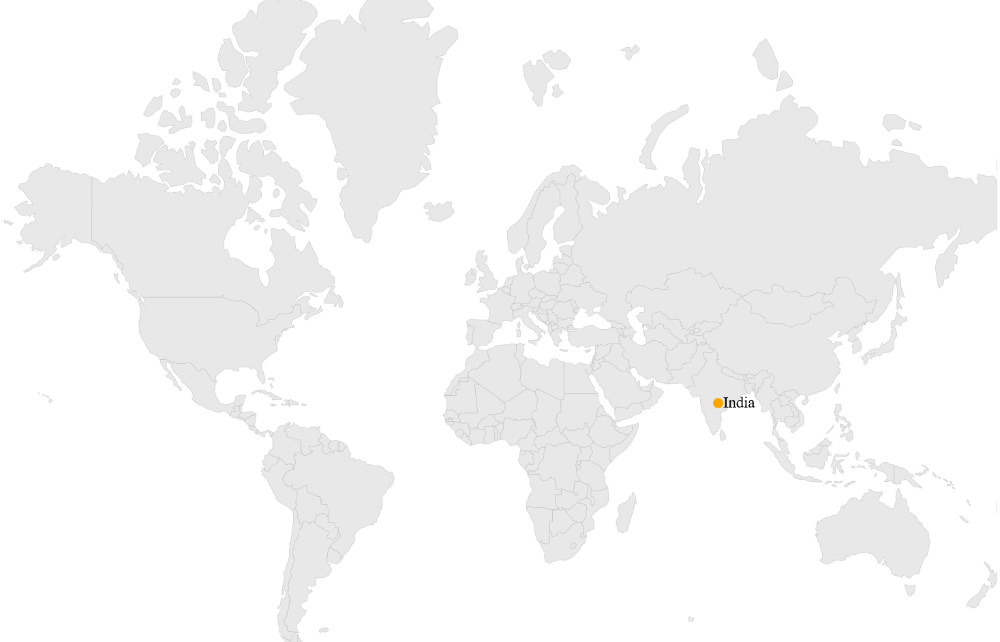

# How to convert coordinates in UWP Map

## Transform latitude and longitude value to pixel value and vice-versa

[`SfMap`](https://help.syncfusion.com/cr/uwp/Syncfusion.UI.Xaml.Maps.SfMap.html) offers two utility methods to transform the pixel values to longitude and latitude values and vice-versa. These methods are used for both [`ShapeFileLayer`](https://help.syncfusion.com/cr/uwp/Syncfusion.UI.Xaml.Maps.ShapeFileLayer.html) and [`ImageryLayer`](https://help.syncfusion.com/cr/uwp/Syncfusion.UI.Xaml.Maps.ImageryLayer.html).

* `LatitudeLongitudeToPoint(double latitude, double longitude)` - Converts the latitude and longitude values to a screen point. Here, pass the parameters as latitude and longitude values, from which you can get the screen points x and y.
* [`GetLatLonFromPoint(Point point)`](https://help.syncfusion.com/cr/uwp/Syncfusion.UI.Xaml.Maps.MapLayer.html#Syncfusion_UI_Xaml_Maps_MapLayer_GetLatLonFromPoint_Windows_Foundation_Point_) - Converts the screen point to longitude and latitude values. Here, pass the parameters as screen points x and y, from which you can get the longitude (`Point.X`) and latitude (`Point.Y`) values.




Point pixelPoint = layer.GeopointToViewPoint(21.00, 78.00);
Point longitudeLatitude = layer.GetLatLonFromPoint(pixelPoint);
mapAnnotations.Latitude = longitudeLatitude.Y;
mapAnnotations.Longitude = longitudeLatitude.X;




