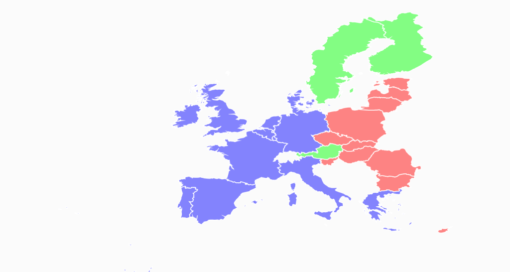

# KML Shapes Rendered in ShapeFileLayer

A `KML` file can be rendered with the help of the [`ShapeFileLayer`](https://help.syncfusion.com/cr/uwp/Syncfusion.UI.Xaml.Maps.ShapeFileLayer.html) in [`SfMap`](https://help.syncfusion.com/cr/uwp/Syncfusion.UI.Xaml.Maps.SfMap.html). The KML file should be added as an embedded resource to the application project. The [`Uri`](https://help.syncfusion.com/cr/uwp/Syncfusion.UI.Xaml.Maps.ShapeFileLayer.html#Syncfusion_UI_Xaml_Maps_ShapeFileLayer_Uri) of the KML file must be given in the following order:

* Namespace of the project
* Folder names
* KmlFileName.kml



<syncfusion:SfMap>
    <syncfusion:SfMap.Layers>
        <syncfusion:ShapeFileLayer Uri="KmlImportDemo.Assets.KMLFiles.Eu.kml"/>
    </syncfusion:SfMap.Layers>
</syncfusion:SfMap>



