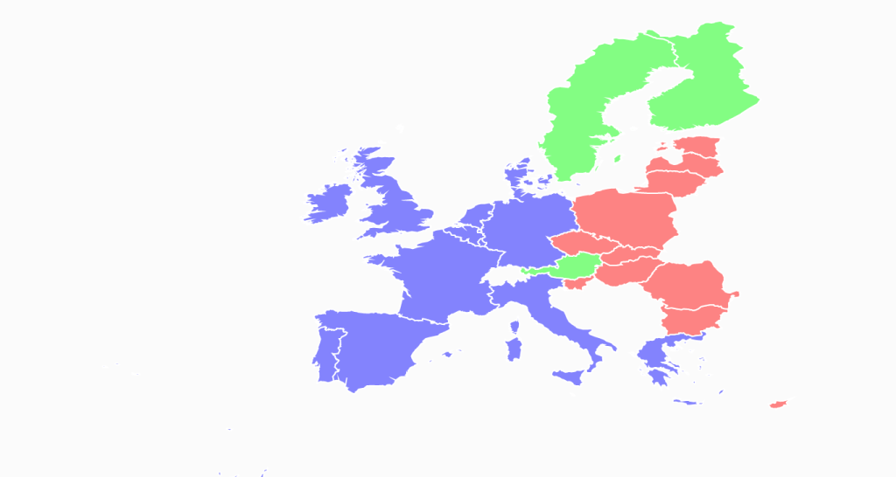

# KML Shapes Rendered in ShapeFileLayer

A `KML` file can be rendered with the help of the ShapeFileLayer in SfMap. The KML file should be added as an Embedded Resource to the application project. The URI of the KML file must be given in the following order:

*  Namespace of project
* Folder names
* KmlFileName.kml



        <syncfusion:SfMap>
            <syncfusion:SfMap.Layers>
                <syncfusion:ShapeFileLayer Uri="KmlImportDemo.Assets.KMLFiles.Eu.kml">                    
                </syncfusion:ShapeFileLayer>
            </syncfusion:SfMap.Layers>
        </syncfusion:SfMap>



