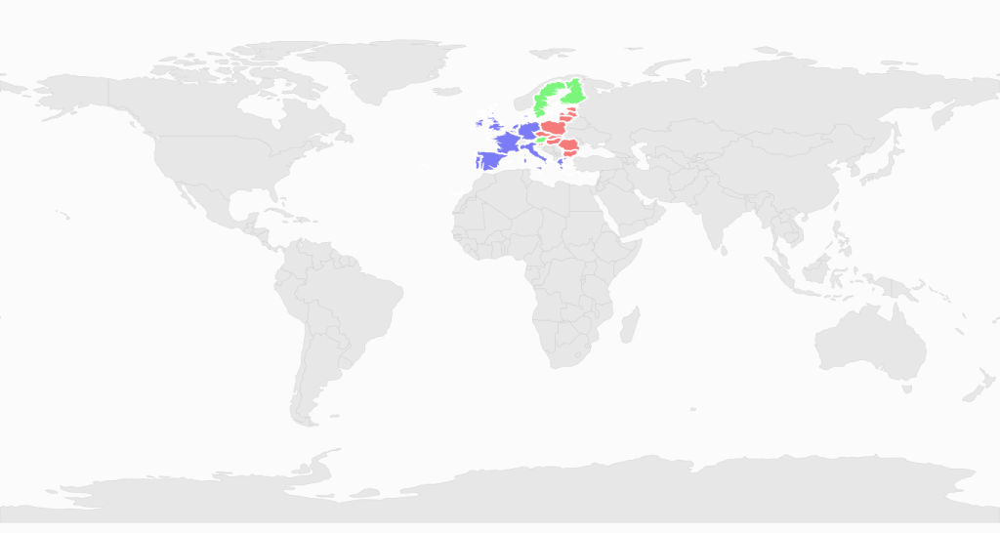

# KML Shapes Rendered in SubShapeFileLayer

A `KML` file can be rendered with the help of the [`SubShapeFileLayer`](https://help.syncfusion.com/cr/uwp/Syncfusion.UI.Xaml.Maps.SubShapeFileLayer.html) also in [`SfMap`](https://help.syncfusion.com/cr/uwp/Syncfusion.UI.Xaml.Maps.SfMap.html). The KML file should be added as an embedded resource to the application project. For more information on the [`Uri`](https://help.syncfusion.com/cr/uwp/Syncfusion.UI.Xaml.Maps.ShapeFileLayer.html#Syncfusion_UI_Xaml_Maps_ShapeFileLayer_Uri) for KML, refer to [KML rendering in ShapeFileLayer](/uwp/SfMap/KML-Shapes-Rendered-in-ShapeFileLayer).



<syncfusion:SfMap>
    <syncfusion:SfMap.Layers>
        <syncfusion:ShapeFileLayer Uri="KmlImportDemo.Assets.ShapeFiles.world1.shp">
            <syncfusion:ShapeFileLayer.SubShapeFileLayers>
                <syncfusion:SubShapeFileLayer Uri="KmlImportDemo.Assets.KmlFiles.Eu.kml"/>
            </syncfusion:ShapeFileLayer.SubShapeFileLayers>
        </syncfusion:ShapeFileLayer>
    </syncfusion:SfMap.Layers>
</syncfusion:SfMap>



