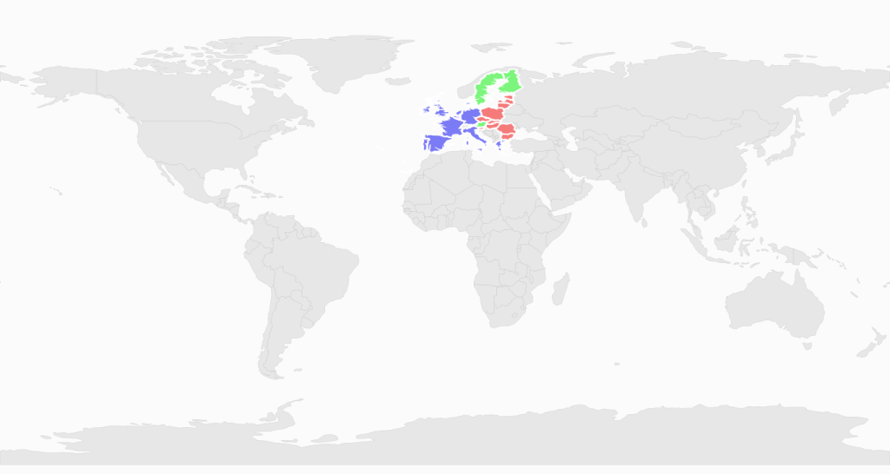

# KML Shapes Rendered in SubShapeFileLayer

A `KML` file can be rendered with the help of SubShapeFileLayer also in SfMap. The KML file should be added as an `Embedded Resource` to the application project. For more information on the Uri for KML refer [KML rendering in ShapeFileLayer](/wpf/SfMap/KML-Shapes-Rendered-in-ShapeFileLayer)



        <syncfusion:SfMap>
            <syncfusion:SfMap.Layers>
                <syncfusion:ShapeFileLayer Uri="KmlImportDemo.Assets.ShapeFiles.world1.shp">
                    <syncfusion:ShapeFileLayer.SubShapeFileLayers>
                        <syncfusion:SubShapeFileLayer Uri="KmlImportDemo.Assets.KmlFiles.Eu.kml"/>
                    </syncfusion:ShapeFileLayer.SubShapeFileLayers>
                </syncfusion:ShapeFileLayer>
            </syncfusion:SfMap.Layers>
        </syncfusion:SfMap>



