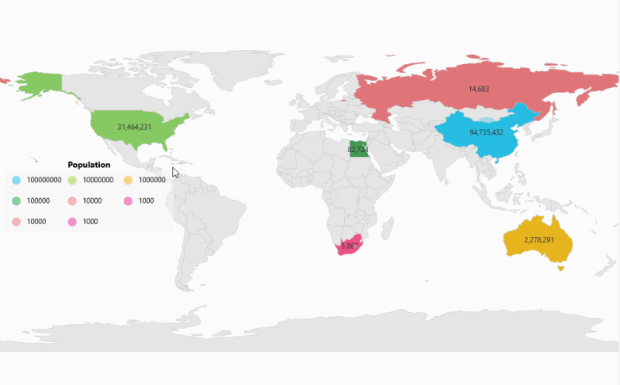
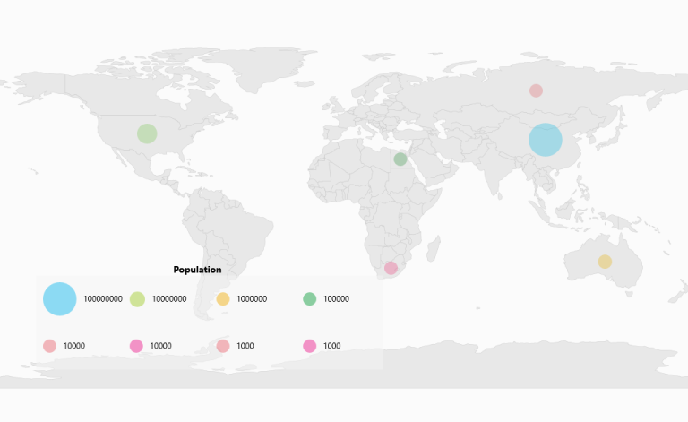

# Legend in UWP Map (SfMaps)

A legend is a key to symbolism used on a map, usually containing swatches of symbols with descriptions. It provides valuable information for interpreting what the map is showing you, and can be represented in various colors and shapes based on the data.

## Visibility of Legend 

`Legends` are visible only by setting the `LegendVisibility` property of the `Visibility` type as Visible in the ShapeFileLayer.

## Positioning of Legend 

Map legends can be positioned by setting the `LegendPosition` property in ShapeFileLayer. Also, the legend can be positioned based on the margin values for the x axis and the y axis with the help of the LegendPositionX and LegendPositionY properties available in ShapeFileLayer. For positioning the legend based on margins corresponding to a map, LegendPosition must be set with value of `Default`.

<table>
<tr>
<th>
Property</th><th>
Type</th><th>
Description</th></tr>
<tr>
<td>
LegendPosition</td><td>
LegendPosition (enum) </td><td>
Gets or sets the standard position for the legend.</td></tr>
<tr>
<td>
LegendPositionX</td><td>
Double</td><td>
Gets or sets the margin value for the x axis.</td></tr>
<tr>
<td>
LegendPositionY</td><td>
Double</td><td>
Gets or sets the margin value for the y axis.</td></tr>
</table>

## Header for Legends 

A header for the legend can be added by setting the `LegendHeader` property of the string type.

## Categories of Legend 

`Legends` are categorized as two types:

* Legends for shape layers.
* Legends for bubbles.

These can be set using the LegendType property of the type LegendType.

## Legends for Shapes 

Layer shape type legends can be different shapes for the legend. The shapes can be set using the LegendIcon, of the LegendIcon type.



        <syncfusion:SfMap>
            <syncfusion:SfMap.Layers>
                <syncfusion:ShapeFileLayer 
                    LegendType="Layers" LegendHeader="LegendHeader"
                    LegendColumnSplit="2" LegendPositionX="10"
                    LegendPositionY="200" LegendVisibility="Visible"
                    LegendIcon="Rectangle" ItemsSource="{Binding Countries1}" ShapeIDPath="NAME"  
                    ShapeIDTableField="NAME" Uri="LegendSample.ShapeFile.world1.shp">
                    <syncfusion:ShapeFileLayer.ShapeSettings>
                        <syncfusion:ShapeSetting ShapeFill="#E5E5E5" ShapeStroke="#C1C1C1" ShapeStrokeThickness="0.5" ShapeValuePath="Population" >
                            <syncfusion:ShapeSetting.FillSetting>
                                <syncfusion:ShapeFillSetting AutoFillColors="False">
                                     <syncfusion:ShapeFillSetting.ColorMappings>
                                        <syncfusion:RangeColorMapping Color="#7F20BCEE" From="100000000"  To="1000000000"/>
                                        <syncfusion:RangeColorMapping Color="#7FA7CE38" From="10000000" To="100000000"/>
                                        <syncfusion:RangeColorMapping Color="#7FF1B21A" From="1000000" To="10000000"/>
                                        <syncfusion:RangeColorMapping Color="#7F1DA249" From="10000" To="100000"/>
                                        <syncfusion:RangeColorMapping Color="#7FEB737C" From="1000" To="10000"/>
                                        <syncfusion:RangeColorMapping Color="#7FED2D95" From="0" To="1000"/>
                                    </syncfusion:ShapeFillSetting.ColorMappings>
                                </syncfusion:ShapeFillSetting>
                            </syncfusion:ShapeSetting.FillSetting>
                        </syncfusion:ShapeSetting>
                    </syncfusion:ShapeFileLayer.ShapeSettings>
                   </syncfusion:ShapeFileLayer>
            </syncfusion:SfMap.Layers>
        </syncfusion:SfMap>



 

## Legends for Bubbles

`Bubble` type legends are always bubbles with varying sizes.  The size of the bubbles is obtained from the `SizeRatio` from the BubbleMarkerSetting.


         
         <syncfusion:SfMap>
             <syncfusion:SfMap.Layers>
                 <syncfusion:ShapeFileLayer LegendType="Bubble" LegendHeader="LegendHeader" LegendColumnSplit="2" LegendPositionX="10"                    LegendPositionY="200" LegendVisibility="Visible"                    LegendIcon="Rectangle" ItemsSource="{Binding Countries1}"                          ShapeIDPath="NAME" ShapeIDTableField="NAME" Uri="LegendSample.ShapeFile.world1.shp">                  
                                <syncfusion:ShapeFileLayer.BubbleMarkerSetting>                                               
                                        <syncfusion:BubbleMarkerSetting AutoFillColor="False" MaxSize="50" MinSize="20" StrokeThickness="0" ValuePath="Population">
                                                <syncfusion:ShapeFillSetting.ColorMappings>                                        
                                                        <syncfusion:RangeColorMapping Color="#7F20BCEE" From="100000000"  To="1000000000"/>        
                                                        <syncfusion:RangeColorMapping Color="#7FA7CE38" From="10000000" To="100000000"/>                                        
                                                        <syncfusion:RangeColorMapping Color="#7FF1B21A" From="1000000" To="10000000"/>
                                                        <syncfusion:RangeColorMapping Color="#7F1DA249" From="10000" To="100000"/>                                        
                                                        <syncfusion:RangeColorMapping Color="#7FEB737C" From="1000" To="10000"/>      
                                                        <syncfusion:RangeColorMapping Color="#7FED2D95" From="0" To="1000"/>                                    
                                                </syncfusion:ShapeFillSetting.ColorMappings> 
                                        </syncfusion:BubbleMarkerSetting>
                                </syncfusion:ShapeFileLayer.BubbleMarkerSetting>
                          </syncfusion:ShapeFileLayer>
                     </syncfusion:SfMap.Layers>    
                  </syncfusion:SfMap>
               


## Arranging the Legends 

Legends are arranged in matrix format. The number of columns in the arranging matrix can be set by setting the `LegendColumnSplit` property of the `int` type. 

