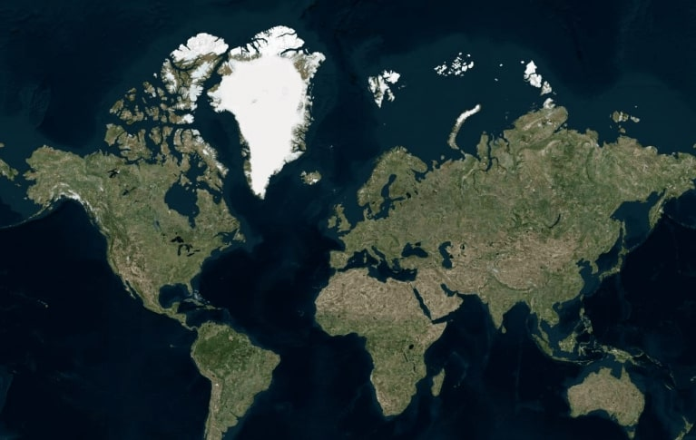
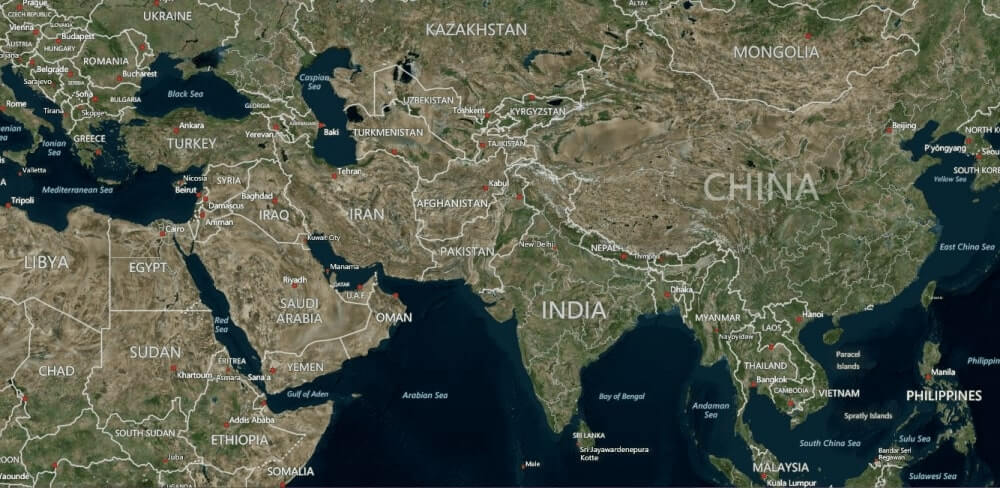
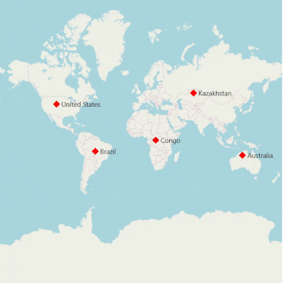

# Map Providers in UWP Map (SfMaps)

SfMap control supports map providers such as `OpenStreetMap` and `Bing Map` that can be added to any layers in maps.

## Open Street Map

`OpenStreetMap` is a map of the entire world. The OpenStreetMap allows you to view, edit and use geographical data in a collaborative way from any place on the Earth.

### Enable OSM

You can enable this feature by setting the `LayerType` property value as `OSM`.



        <syncfusion:SfMap>
            <syncfusion:SfMap.Layers>
                <syncfusion:ImageryLayer LayerType="OSM" />
            </syncfusion:SfMap.Layers>
        </syncfusion:SfMap >
        


## Bing Map

`Bing Map` is a key feature in accessing the external geospatial imagery services for deep-zoom satellite view.

### Enable Bing Map 

You can enable this feature by defining the LayerType as `Bing`. 

### Bing Map Key

The bing Map key is provided as input to this key property. The Bing Map key can be obtained from 

[http://www.microsoft.com/maps/create-a-bing-maps-key.aspx](http://www.microsoft.com/maps/create-a-bing-maps-key.aspx).

### Aerial View



        <syncfusion:SfMap>
            <syncfusion:SfMap.Layers>
                <syncfusion:ImageryLayer LayerType="Bing" BingMapKey="Bing Map Key" BingMapStyle="Aerial" />     
            </syncfusion:SfMap.Layers>
        </syncfusion:SfMap >



### Road View



        <syncfusion:SfMap>
            <syncfusion:SfMap.Layers>
                <syncfusion:ImageryLayer LayerType="Bing" BingMapKey="Bing Map Key" BingMapStyle="Road" />     
            </syncfusion:SfMap.Layers>
        </syncfusion:SfMap >



### AerialWithLabelView



        <syncfusion:SfMap>
            <syncfusion:SfMap.Layers>
                <syncfusion:ImageryLayer LayerType="Bing" BingMapKey="Bing Map Key" BingMapStyle="AerialWithLabels" />     
            </syncfusion:SfMap.Layers>
        </syncfusion:SfMap >



## Calculate zoom level based on map Geo-bounds or distance

This feature is used to calculate the initial zoom level automatically in two ways.

* Distance in radius(Meter/KiloMeter/Mile)
* Geo-bounds(Northeast, Southwest)

### Distance in radius 

Calculate the initial zoom level automatically based on the `Radius` and `DistanceType` properties of imagery layer class.

N> `DistanceType` property default value is KiloMeter.





     <Page.Resources>
        <ResourceDictionary>
            <DataTemplate x:Key="markerTemplate">
                <Grid Margin="-12,-30,0,0">
                    <Canvas>
                        <Image Source="pin.png" Height="30"/>
                    </Canvas>
                </Grid>
            </DataTemplate>
        </ResourceDictionary>
    </Page.Resources>
	
    <Grid>
        <maps:SfMap>
            <maps:SfMap.Layers>
                <maps:ImageryLayer MarkerTemplate="{StaticResource ResourceKey=markerTemplate}" Markers="{Binding Models}" Center="38.909804, -77.043442" Radius="5" DistanceType="KiloMeter" >
                </maps:ImageryLayer>
            </maps:SfMap.Layers>
        </maps:SfMap>
    </Grid>

	




          SfMap maps = new SfMap();
            ImageryLayer layer = new ImageryLayer();
            layer.Center = new Point(38.909804, -77.043442);
            layer.Radius = 5;
            layer.DistanceType = DistanceType.KiloMeter;
            layer.Markers = obj.Models;
            layer.MarkerTemplate = this.Resources["markerTemplate"] as DataTemplate;
            maps.Layers.Add(layer);
			
	  public class Model
      {
        public string Longitude { get; set; }
        public string Latitude { get; set; }
      }
			
	   public class ViewModel
       {
          public ObservableCollection<Model> Models { get; set; }
          public ViewModel()
          {
            this.Models = new ObservableCollection<Model>();
            this.Models.Add(new Model() { Latitude = "38.909804", Longitude = "-77.043442" });
         }
      }





### Geo-bounds

Calculate the initial zoom level automatically based on the LatLngBounds(Northeast, Southwest) of imagery layer class.





     <Page.Resources>
        <ResourceDictionary>
            <DataTemplate x:Key="markerTemplate">
                <Grid Margin="-12,-30,0,0">
                    <Canvas>
                        <Image Source="pin.png" Height="30"/>
                    </Canvas>
                </Grid>
            </DataTemplate>
        </ResourceDictionary>
    </Page.Resources>
    <Grid>
        <maps:SfMap>
            <maps:SfMap.Layers>
                <maps:ImageryLayer LayerType="OSM" MarkerTemplate="{StaticResource ResourceKey=markerTemplate}"  Markers="{Binding Models}"  >
                    <maps:ImageryLayer.LatLngBounds>
                        <maps:LatLngBounds Northeast="38.909804, -77.043442" Southwest="38.909804, -77.043442" >
                        </maps:LatLngBounds>
                    </maps:ImageryLayer.LatLngBounds>
                </maps:ImageryLayer>
            </maps:SfMap.Layers>
        </maps:SfMap >
	   </Grid>




            SfMap maps = new SfMap();
            ImageryLayer layer = new ImageryLayer();
            LatLngBounds bounds = new LatLngBounds();
            bounds.Northeast = new Point(38.909804, -77.043442);
            bounds.Southwest = new Point(38.909804, -77.043442);
            layer.LatLngBounds = bounds;
            layer.Markers = obj.Models;
            layer.MarkerTemplate = this.Resources["markerTemplate"] as DataTemplate;
            maps.Layers.Add(layer);
			
	  public class Model
      {
        public string Longitude { get; set; }
        public string Latitude { get; set; }
      }
			
	   public class ViewModel
       {
          public ObservableCollection<Model> Models { get; set; }
          public ViewModel()
          {
            this.Models = new ObservableCollection<Model>();
            this.Models.Add(new Model() { Latitude = "38.909804", Longitude = "-77.043442" });
         }
      }





N> When setting LatLngBounds and DistanceRadius at the same time, the priority is `DistanceRadius` and calculate zoom level based radius value.

## Get the map tile layer bounds

You can get imagery layer pixel bounds by using `MapBounds` property while zooming, panning, and changing Geo-Coordinate value in imagery layer.





      <maps:SfMap>
            <maps:SfMap.Layers>
                <maps:ImageryLayer x:Name="layer"  Center="30.9709225, -100.2187212" CenterChanged="layer_CenterChanged">
                </maps:ImageryLayer>
            </maps:SfMap.Layers>
      </maps:SfMap>





    public partial class MapBound : ContentPage
    {
        ImageryLayer layer = new ImageryLayer();
        public MapBound()
        {
            InitializeComponent();
            SfMap maps = new SfMap();
            layer.Center = new Point(30.9709225, -100.2187212);
            layer.CenterChanged += layer_CenterChanged;
            maps.Layers.Add(layer);
            this.Content = maps;
        }
        private void layer_CenterChanged(object sender, CenterChangedEventArgs e)
        {
            var pixelbounds = layer.MapBounds;
        }
    }





## Marker selected event

The [`MarkerSelected`](https://help.syncfusion.com/cr/uwp/Syncfusion.UI.Xaml.Maps.MapLayer.html#Syncfusion_UI_Xaml_Maps_MapLayer_MarkerSelected) event is fired when a marker is selected. The MarkerSelected event has the following arguments.

[`SelectedMarker`](https://help.syncfusion.com/cr/uwp/Syncfusion.UI.Xaml.Maps.MarkerSelectedEventArgs.html#Syncfusion_UI_Xaml_Maps_MarkerSelectedEventArgs_SelectedMarker) : Gets the selected marker.

[`CanBringToTop`](https://help.syncfusion.com/cr/uwp/Syncfusion.UI.Xaml.Maps.MarkerSelectedEventArgs.html#Syncfusion_UI_Xaml_Maps_MarkerSelectedEventArgs_CanBringToTop) : When set to true the selected marker will be on the top of all other markers.

[`MarkerTemplate`](https://help.syncfusion.com/cr/uwp/Syncfusion.UI.Xaml.Maps.MarkerSelectedEventArgs.html#Syncfusion_UI_Xaml_Maps_MarkerSelectedEventArgs_MarkerTemplate) : Gets or sets the template of the selected marker.

## Reset the old custom view marker

If you add any view for marker using `CustomView` property from [`MarkerSelected`](https://help.syncfusion.com/cr/uwp/Syncfusion.UI.Xaml.Maps.MapLayer.html#Syncfusion_UI_Xaml_Maps_MapLayer_MarkerSelected) event, then the corresponding view will be applied to the selected marker. Custom view will be added continuously for all the selected marker, but do not have option to reset the old one. Now, you can achieve this using the [`ResetOldSelectedView`](https://help.syncfusion.com/cr/uwp/Syncfusion.UI.Xaml.Maps.MapLayer.html#Syncfusion_UI_Xaml_Maps_MapLayer_ResetOldSelectedView) property. If the Boolean set as true, then it will be removed the old view of marker and load the initially rendered marker.




       <Page.Resources>
        <ResourceDictionary>
            <DataTemplate x:Key="markerTemplate">
                <Grid Margin="-12,-30,0,0">
                    <Canvas>
                        <Image Source="pin.png" Height="30"/>
                    </Canvas>
                </Grid>
            </DataTemplate>
        </ResourceDictionary>
    </Page.Resources>
    <Grid>
        <maps:SfMap>
            <maps:SfMap.Layers>
                <maps:ImageryLayer LayerType="OSM" Markers="{Binding Models}"  MarkerSelected="Layer_MarkerSelected" ResetOldSelectedView="True" >
                </maps:ImageryLayer>
            </maps:SfMap.Layers>
        </maps:SfMap>
    </Grid>
	




    public sealed partial class ResetMarkerSample : Page
    {
        public ResetMarkerSample()
        {
            this.InitializeComponent();
            this.DataContext = new ViewModel();
        }

        private void Layer_MarkerSelected(object sender, Syncfusion.UI.Xaml.Maps.MarkerSelectedEventArgs e)
        {
            e.MarkerTemplate = this.Resources["markerTemplate"] as DataTemplate;
        }
    }

    public class ViewModel
    {
        public ObservableCollection<Model> Models { get; set; }
        public ViewModel()
        {
            this.Models = new ObservableCollection<Model>();
            this.Models.Add(new Model() { Name = "USA ", Latitude = "38.8833N", Longitude = "77.0167W" });
            this.Models.Add(new Model() { Name = "Brazil ", Latitude = "15.7833S", Longitude = "47.8667W" });
            this.Models.Add(new Model() { Name = "India ", Latitude = "21.0000N", Longitude = "78.0000E" });
            this.Models.Add(new Model() { Name = "China ", Latitude = "35.0000N", Longitude = "103.0000E" });
            this.Models.Add(new Model() { Name = "Indonesia ", Latitude = "6.1750S", Longitude = "106.8283E" });
        }
    }

    public class Model
    {
        public string Name { get; set; }
        public string Longitude { get; set; }
        public string Latitude { get; set; }
    }





