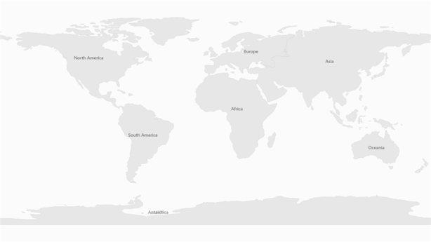

# Map Shape Labels in UWP Map (SfMaps)

`Labels` for map shapes can be displayed by using the `LabelPath` of `ShapeFileLayer`. The value of `LabelPath` must be a field name specified in the `.dbf` file corresponding to the shapefile.

<table>
<tr>
<th>
Property</th><th>
Type</th><th>
Description</th></tr>
<tr>
<td>
LabelPath</td><td>
string</td><td>
Gets or sets the field name in the database (.dbf) file.</td></tr>
</table>



    <syncfusion:SfMap>
        <syncfusion:SfMap.Layers>
            <syncfusion:ShapeFileLayer x:Name="shapeFileLayer"   
                                       Uri="DBFLabelDemo.Assets.Continent.shp"                                                               
                                       LabelPath="CONTINENT" FontSize="14">
            </syncfusion:ShapeFileLayer>
        </syncfusion:SfMap.Layers>
    </syncfusion:SfMap>  



The labels can also be customized by modifying the `ItemsTemplate` of ShapeFileLayer. The labels can be accessed by using DBFData as follows:



     <syncfusion:SfMap>
        <syncfusion:SfMap.Layers>
            <syncfusion:ShapeFileLayer x:Name="shapeFileLayer" 
                                       Uri="DBFLabelDemo.Assets.Continent.shp"
                                       LabelPath="CONTINENT">
                <syncfusion:ShapeFileLayer.ItemsTemplate>
                    <DataTemplate>
                        <Grid Background="Gray" Opacity="0.75">
                            <TextBlock Text="{Binding DBFData[CONTINENT]}"
                                       FontSize="14" Margin="10 5"/>
                        </Grid>
                    </DataTemplate>
                </syncfusion:ShapeFileLayer.ItemsTemplate>
            </syncfusion:ShapeFileLayer>
        </syncfusion:SfMap.Layers>
    </syncfusion:SfMap> 



