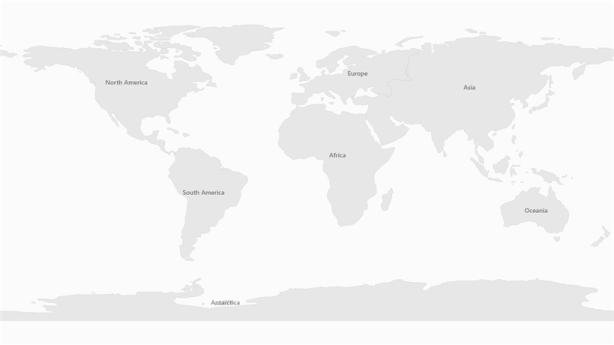

# Map Shape Labels in UWP Map (SfMaps)

`Labels` for map shapes can be displayed by using the [`LabelPath`](https://help.syncfusion.com/cr/uwp/Syncfusion.UI.Xaml.Maps.ShapeFileLayer.html#Syncfusion_UI_Xaml_Maps_ShapeFileLayer_LabelPath) property of the [`ShapeFileLayer`](https://help.syncfusion.com/cr/uwp/Syncfusion.UI.Xaml.Maps.ShapeFileLayer.html). The value of `LabelPath` must be a field name specified in the `.dbf` file corresponding to the shape file.

<table>
<tr>
<th>
Property</th><th>
Type</th><th>
Description</th></tr>
<tr>
<td>
[LabelPath](https://help.syncfusion.com/cr/uwp/Syncfusion.UI.Xaml.Maps.ShapeFileLayer.html#Syncfusion_UI_Xaml_Maps_ShapeFileLayer_LabelPath)</td><td>
string</td><td>
Gets or sets the field name in the database (.dbf) file.</td></tr>
</table>



<syncfusion:SfMap>
    <syncfusion:SfMap.Layers>
        <syncfusion:ShapeFileLayer x:Name="shapeFileLayer"
            Uri="DBFLabelDemo.Assets.Continent.shp"
            LabelPath="CONTINENT" FontSize="14"/>
    </syncfusion:SfMap.Layers>
</syncfusion:SfMap>



The labels can also be customized by modifying the [`ItemsTemplate`](https://help.syncfusion.com/cr/uwp/Syncfusion.UI.Xaml.Maps.ShapeFileLayer.html#Syncfusion_UI_Xaml_Maps_ShapeFileLayer_ItemsTemplate) of the `ShapeFileLayer`. The labels can be accessed by using `DBFData` as follows:



<syncfusion:SfMap>
    <syncfusion:SfMap.Layers>
        <syncfusion:ShapeFileLayer x:Name="shapeFileLayer"
            Uri="DBFLabelDemo.Assets.Continent.shp"
            LabelPath="CONTINENT">
            <syncfusion:ShapeFileLayer.ItemsTemplate>
                <DataTemplate>
                    <Grid Background="Gray" Opacity="0.75">
                        <TextBlock Text="{Binding DBFData[CONTINENT]}"
                            FontSize="14" Margin="10 5"/>
                    </Grid>
                </DataTemplate>
            </syncfusion:ShapeFileLayer.ItemsTemplate>
        </syncfusion:ShapeFileLayer>
    </syncfusion:SfMap.Layers>
</syncfusion:SfMap>



