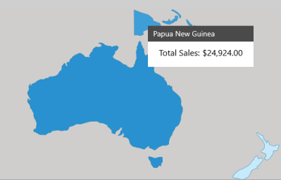

# MapPopup in UWP Map (SfMaps)

`MapPopup` is a hanging window, displayed when the shape is tapped. It shows additional information from the object bounded with the shape. By default, it takes the property of the bounded object that is referred in the `ShapeValuePath` and displays its content when the corresponding shape is tapped.

MapPopup is displayed only when `MapPopupVisibility` set to true in the shape file layer.

It also customizes the MapPopup template. `MapPopupCustomTemplate` is a DataTemplate type API that is used to expose the custom template for the MapPopup.



    <maps:ShapeFileLayer TranslateZoomLevel="5" ShapeIDPath="Country" MapPopupVisibility="Visible" Background="#FFCFCECD" ShapeIDTableField="Country"   ItemsSource="{Binding SalesByCountry}" Uri="MapApp.ShapeFile.Oceania.shp">
                        <maps:ShapeFileLayer.PopupCustomTemplate>
                            <DataTemplate>
                                <Border>
                                    <Grid Width="200">
                                        <Grid.RowDefinitions>
                                            <RowDefinition />
                                            <RowDefinition />
                                            <RowDefinition />
                                        </Grid.RowDefinitions>
                                        <Grid.ColumnDefinitions>
                                            <ColumnDefinition/>
                                        </Grid.ColumnDefinitions>
                                        <Border VerticalAlignment="Center" Padding="10,5,0,0" Height="30" Background="#FF4B4A4A"  Grid.ColumnSpan="2">
                                            <TextBlock Foreground="White" FontFamily="Segoe UI" FontSize="14"  Text="{Binding Country}"/>
                                        </Border>
                                        <Border Padding="3,10,3,3"  Background="White"  Grid.Row="1" Grid.ColumnSpan="2">
                                            <StackPanel HorizontalAlignment="Center" VerticalAlignment="Center"  Height="35" Background="White" Orientation="Horizontal">
                                                <TextBlock  Foreground="Black" FontFamily="Segoe UI"  FontSize="16" Text="Total Sales:" />
                                                <TextBlock Foreground="Black"  FontFamily="Segoe UI" FontSize="16" Text="{Binding Sales,Converter={StaticResource SalesToPriceConverterKey}}"/>
                                            </StackPanel>
                                        </Border>
                                        <Border HorizontalAlignment="Center" Grid.Row="2">
                                            <StackPanel Orientation="Horizontal">
                                                <ItemsControl Background="White" x:Name="ProductName"  ItemsSource="{Binding Products}" DisplayMemberPath="Name"/>
                                                <ItemsControl  Background="White"  ItemsSource="{Binding Products}" DisplayMemberPath="Sales"/>
                                           </StackPanel>
                                        </Border>
                                    </Grid>
                                </Border>
                            </DataTemplate>
                        </maps:ShapeFileLayer.PopupCustomTemplate>
                        <maps:ShapeFileLayer.ShapeSettings>
                            <maps:ShapeSetting  ShapeStroke="#FF1978AA" ColorPalette="CustomPalette" ShapeStrokeThickness="0.5"  >
                                <maps:ShapeSetting.CustomColors>
                                    <maps:MapColorPalette FillBrush="#FFC6EAFB"/>
                                    <maps:MapColorPalette FillBrush="#FF93D3F4"/>
                                    <maps:MapColorPalette FillBrush="#FF5FB5E6"/>
                                    <maps:MapColorPalette FillBrush="#FF3E9FD8"/>
                                    <maps:MapColorPalette FillBrush="#FF2991CF"/>
                                </maps:ShapeSetting.CustomColors>
                                <maps:ShapeSetting.FillSetting>
                                    <maps:ShapeFillSetting AutoFillColors="True"/>
                                </maps:ShapeSetting.FillSetting>
                            </maps:ShapeSetting>
                        </maps:ShapeFileLayer.ShapeSettings>

                    </maps:ShapeFileLayer>



