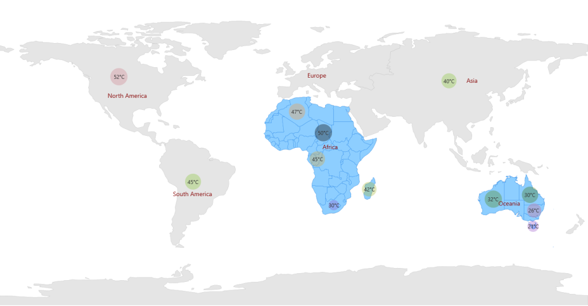
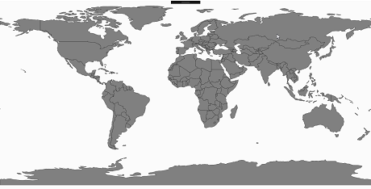
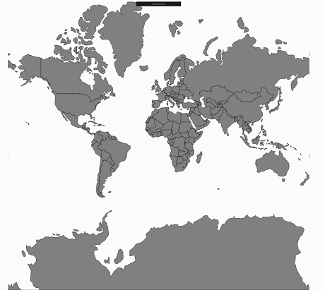

# Multilayer Support in UWP Map (SfMaps)

`Multilayer` support allows you to load multiple shapefiles in a single container, enabling maps to display more detail.

## Loading Multiple Shapefiles in a Single Container

This feature enables the map to load multiple types of shapefiles in a single container. Basically, shape files contain point shapes in a single container.

Situations arise where, any combination of available shapefiles needs to be loaded in a single container. In such situations this feature enables the map to load multiple shape layers in a single container. 

## Adding Multiple Layers in the Map

`ShapeFileLayer` is the core layer for the map. Multiple layers can be added in the ShapeFileLayer itself. They have to be added in SubShapeFileLayers within the ShapeFileLayer.

## SubShapeFileLayers

`SubShapeFileLayers` is the collection of `SubShapeFileLayer`. SubShapeFileLayer is also a type of shapefile layer. The following code adds multiple layers in the ShapeFileLayer.




      <syncfusion:SfMap>
           <syncfusion:SfMap.Layers>
               <syncfusion:ShapeFileLayer ShapeIDPath="NAME"  ShapeIDTableField="Continent"                                                         
                                    EnableSelection="True”                                                                                                                   
                                    Uri=" MapApp.ShapeFiles.continent.shp">
                     <syncfusion:ShapeFileLayer.ItemsTemplate>
                           <DataTemplate>
                                <Border Visibility="{Binding Data.ItemsVisibility}" Background="Transparent">
                                    <StackPanel Orientation="Horizontal">
                                         <TextBlock FontFamily="Segoe UI" Foreground="#FF333333" FontSize="12" Text="{Binding Data.Weather}"/>
                                         <TextBlock FontFamily="Segoe UI" Foreground="#FF333333" FontSize="12"         
                                              Text="°C"/>
                                     </StackPanel>
                                 </Border>
                           </DataTemplate>
                  </syncfusion:ShapeFileLayer.ItemsTemplate>
            <syncfusion:ShapeFileLayer.ShapeSettings>
                <syncfusion:ShapeSetting ShapeStroke="#C1C1C1" ShapeStrokeThickness="0.5" 
                        ShapeValuePath="Weather" ShapeFill="#E5E5E5"/>
                </syncfusion:ShapeFileLayer.ShapeSettings>
            <syncfusion:ShapeFileLayer.SubShapeFileLayers>
               <syncfusion:SubShapeFileLayer ShapeIDPath="NAME" ItemsSource="{Binding AfricaList}" 
                                              ShapeIDTableField="Country"  
                                              Uri=” MapApp.ShapeFiles.Africa.shp">
                    <syncfusion:SubShapeFileLayer.ItemsTemplate>
                        <DataTemplate>
                            <Border  Background="Transparent">
                                <StackPanel Orientation="Horizontal">
                                     <TextBlock FontFamily="Segoe UI" Foreground="#FF333333"   
                                                FontSize="12"  Text="{Binding Data.Weather}"/>
                                     <TextBlock FontFamily="Segoe UI" Foreground="#FF333333" 
                                                FontSize="12"  Text="°C"/>
                                </StackPanel>
                              </Border>
                         </DataTemplate>
                    </syncfusion:SubShapeFileLayer.ItemsTemplate>
                         <syncfusion:SubShapeFileLayer.ShapeSettings>
                             <syncfusion:ShapeSetting ShapeStroke="#2F8CEA"
                                                      ShapeValuePath="Weather" ShapeFill="#8DCEFF">
                             </syncfusion:ShapeSetting>
                         </syncfusion:SubShapeFileLayer.ShapeSettings>
                   </syncfusion:SubShapeFileLayer>
                   <syncfusion:SubShapeFileLayer ShapeIDPath="NAME" ShapeIDTableField="ADMIN_NAME"
                                               ItemsSource="{Binding OceaniaList}" 
                                               Uri=" MapApp.ShapeFiles.Australia.shp">
                       <syncfusion:SubShapeFileLayer.ShapeSettings>
                           <syncfusion:ShapeSetting ShapeStroke="#2F8CEA" ShapeValuePath="Weather" 
                                                                             ShapeFill="#8DCEFF"/>
                           </syncfusion:SubShapeFileLayer.ShapeSettings>
                           <syncfusion:SubShapeFileLayer.ItemsTemplate>
                                    <DataTemplate>
                                        <Border Background="Transparent">
                                            <StackPanel Orientation="Horizontal">
                                                <TextBlock FontFamily="Segoe UI"
                                                           Foreground="#FF333333" FontSize="12"  
                                                           Text="{Binding Data.Weather}"/>
                                                <TextBlock FontFamily="Segoe UI" 
                                                            Foreground="#FF333333" FontSize="12"
                                                           Text="°C"/>
                                            </StackPanel>
                                        </Border>
                                    </DataTemplate>
                                </syncfusion:SubShapeFileLayer.ItemsTemplate>
                           </syncfusion:SubShapeFileLayer>
                       </syncfusion:ShapeFileLayer.SubShapeFileLayers>
                    </syncfusion:ShapeFileLayer>
            </syncfusion:SfMap.Layers>
        </syncfusion:SfMap>          





    public class Country : INotifyPropertyChanged    
    {        
      public string NAME { get; set; }        
      private Visibility visibility = Visibility.Visible;       
      public Visibility ItemsVisibility        
      {            
        get { return visibility; }           
        set { visibility = value; }        
      }        
      private double weather { get; set; }        
      public double Weather        
      {            
        get            
        {               
          return weather;            
        }            
        set            
        {                
          weather = value;            
        }        
      }        
      private double population { get; set; }        
      public double Population       
      {            
        get           
        {                
          return population;            
        }            
        set            
        {                
          population = value;                
          OnPropertyChanged(new PropertyChangedEventArgs("Population"));            
        }       
      }        
      public string PopulationFormat { get; set; }       
      public event PropertyChangedEventHandler PropertyChanged;        
      public void OnPropertyChanged(PropertyChangedEventArgs e)        
      {            
        this.PopulationFormat = (String.Format("{0:0,0}", this.Population).Trim('$'));            
        if (PropertyChanged != null)            
        {                
          PropertyChanged(this, e);            
        }        
      }    
    }    
    public class MapViewModel    
    {       
      public ObservableCollection<Country> Multilayer { get; set; }       
      public ObservableCollection<Country> AfricaList { get; set; }        
      public ObservableCollection<Country> OceaniaList { get; set; }        
      public MapViewModel()        
      {            
        this.OceaniaList.Add(new Country() { NAME = "New South Wales", Weather = 26 });           
        this.OceaniaList.Add(new Country() { NAME = "Queensland", Weather = 30 });            
        this.OceaniaList.Add(new Country() { NAME = "Tasmania", Weather = 21 });            
        this.OceaniaList.Add(new Country() { NAME = "Western Australia", Weather = 32 });            
        this.AfricaList = new ObservableCollection<Country>();           
        this.AfricaList.Add(new Country() { NAME = "Algeria", Weather = 47 });            
        this.AfricaList.Add(new Country() { NAME = "Congo (Brazzaville)", Weather = 45 });            
        this.AfricaList.Add(new Country() { NAME = "Ethiopia", Weather = 50 });            
        this.AfricaList.Add(new Country() { NAME = "South Africa", Weather = 30 });            
        this.Multilayer = new ObservableCollection<Country>();            
        this.Multilayer.Add(new Country() { NAME = "Asia", Weather = 40 });           
        this.Multilayer.Add(new Country() { NAME = "South America", Weather = 45 });           
        this.Multilayer.Add(new Country() { NAME = "North America", Weather = 52 });           
        this.Multilayer.Add(new Country() { NAME = "Antarctica", ItemsVisibility = Visibility.Collapsed });          
        this.Multilayer.Add(new Country() { NAME = "Oceania", ItemsVisibility = Visibility.Collapsed });         
        this.Multilayer.Add(new Country() { NAME = "Europe", ItemsVisibility = Visibility.Collapsed });         
        this.Multilayer.Add(new Country() { NAME = "Africa", ItemsVisibility = Visibility.Collapsed });      
      }  
    }

 


## Layout type

The LayoutType defines how to project the map. This can be categorized into the following types:
 
  * Default
  * Tile

### Default

In the default layout, the maps will be rendered based on the given points of shape file without any further manipulation of maps scale.



                <syncfusion:ShapeFileLayer  x:Name="shapelayer" Uri="Maps.Assets.world1.shp" LayoutType="Default">
                    <syncfusion:ShapeFileLayer.ShapeSettings>
                        <syncfusion:ShapeSetting ShapeFill="Gray" ShapeStroke="Black" 
                                                 ShapeStrokeThickness="0.5"></syncfusion:ShapeSetting>
                    </syncfusion:ShapeFileLayer.ShapeSettings>
                </syncfusion:ShapeFileLayer>





            ShapeFileLayer layer = new ShapeFileLayer();
            layer.Uri = "Maps.Assets.world1.shp";
            layer.LayoutType = LayoutType.Default;

            ShapeSetting setting = new ShapeSetting();
            setting.ShapeFill = new SolidColorBrush(Colors.Gray);
            setting.ShapeStroke= new SolidColorBrush(Colors.Black);
            setting.ShapeStrokeThickness = 0.5;

            layer.ShapeSettings = setting;
            map.Layers.Add(layer);



### Tile

In the tile layout, the maps scale value is maintained in every direction around a point. Therefore, the shapes are represented accurately and without distortion for small areas



                  <syncfusion:ShapeFileLayer  x:Name="shapelayer" Uri="Maps.Assets.world1.shp" LayoutType="Tile">
                    <syncfusion:ShapeFileLayer.ShapeSettings>
                        <syncfusion:ShapeSetting ShapeFill="Gray" ShapeStroke="Black" 
                                                 ShapeStrokeThickness="0.5"></syncfusion:ShapeSetting>
                    </syncfusion:ShapeFileLayer.ShapeSettings>
                </syncfusion:ShapeFileLayer>





            ShapeFileLayer layer = new ShapeFileLayer();
            layer.Uri = "Maps.Assets.world1.shp";
            layer.LayoutType = LayoutType.Tile;

            ShapeSetting setting = new ShapeSetting();
            setting.ShapeFill = new SolidColorBrush(Colors.Gray);
            setting.ShapeStroke= new SolidColorBrush(Colors.Black);
            setting.ShapeStrokeThickness = 0.5;

            layer.ShapeSettings = setting;
            map.Layers.Add(layer);



