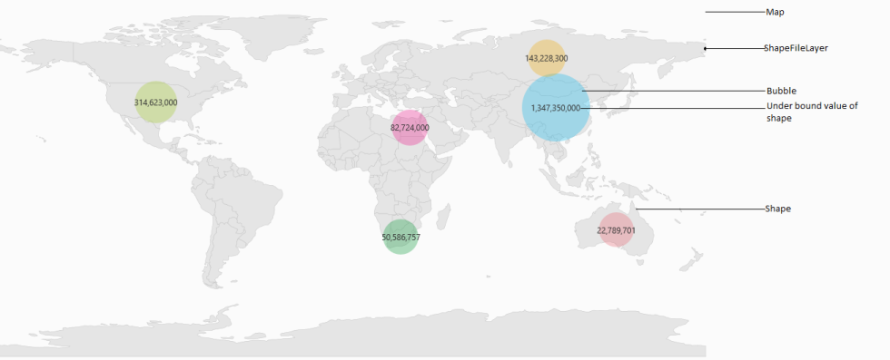

# UWP Map (SfMaps) Overview

A map is a graphical representation of geographical data. It is used to represent the statistical data of a particular geographical area on Earth. Panning and Zooming enables navigation around the map. `Data Visualization` can be enhanced in the map control with bubbles and labels. Bubbles and labels visualize the data that is bound to the map.

## Use case scenario

The Maps control can be used in following cases:

* To visualize weather data.
* To visualize geographical statistics information.
* To visualize the density or availability of resources in an area.
* To visualize political information.
* To visualize the layout of a building.

## Key Concepts of Map

A map contains a set of elements, including shapes, bubbles, annotations, and data items, that is maintained in layers. `ShapeFileLayer` is one of the layers that generates map shapes and bind business objects with them. `Bubbles` and `MapItems` enhance the data visualization capabilities of the map with data binding.

`Treemap` like support provides rich UI for shapes and bubbles. `Markers` and `CustomDataBinding` items shows additional information on the map.

Options like zooming, panning, and map selection extend the interactivity of the map.

## Structure of Map

A map is maintained through layers. The shape file layer is one of the layers that consist of vector shapes, bubbles and data visual items.

<table>
<tr>
<th>
Map</th></tr>
<tr>
<td>
</td></tr>
<tr>
<td>
Layers</td></tr>
<tr>
<td>
</td></tr>
<tr>
<td>
ShapeFileLayer</td></tr>
</table>

