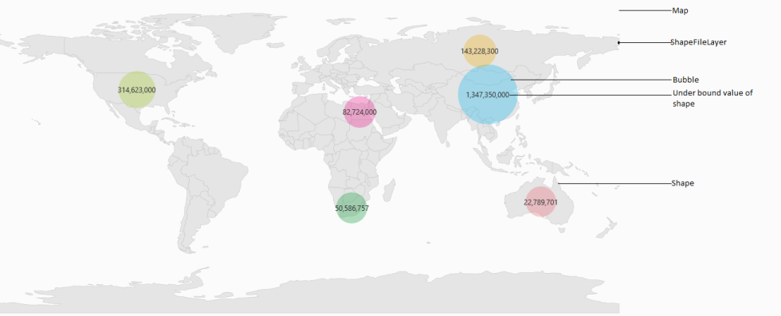

# UWP Map (SfMaps) Overview

A map is a graphical representation of geographical data. It is used to represent the statistical data of a particular geographical area on Earth. Panning and zooming enable navigation around the map. Data visualization can be enhanced in the map control with bubbles and labels. Bubbles and labels visualize the data that is bound to the map.

## Use case scenario

The Maps control can be used in the following cases:

* To visualize weather data.
* To visualize geographical statistics information.
* To visualize the density or availability of resources in an area.
* To visualize political information.
* To visualize the layout of a building.

## Key Concepts of Map

A map contains a set of elements, including shapes, bubbles, annotations, and data items, that are maintained in layers. The [`ShapeFileLayer`](https://help.syncfusion.com/cr/uwp/Syncfusion.UI.Xaml.Maps.ShapeFileLayer.html) is one of the layers that generates map shapes and binds business objects with them. Bubbles and map items enhance the data visualization capabilities of the map with data binding.

Tree map-like support provides a rich UI for shapes and bubbles. Markers and custom data binding items show additional information on the map.

Options like zooming, panning, and map selection extend the interactivity of the map.

## Structure of Map

A map is maintained through layers. The [`ShapeFileLayer`](https://help.syncfusion.com/cr/uwp/Syncfusion.UI.Xaml.Maps.ShapeFileLayer.html) is one of the layers that consists of vector shapes, bubbles, and data visual items.

<table>
<tr>
<th>
Map</th></tr>
<tr>
<td>
</td></tr>
<tr>
<td>
Layers</td></tr>
<tr>
<td>
</td></tr>
<tr>
<td>
ShapeFileLayer</td></tr>
</table>

