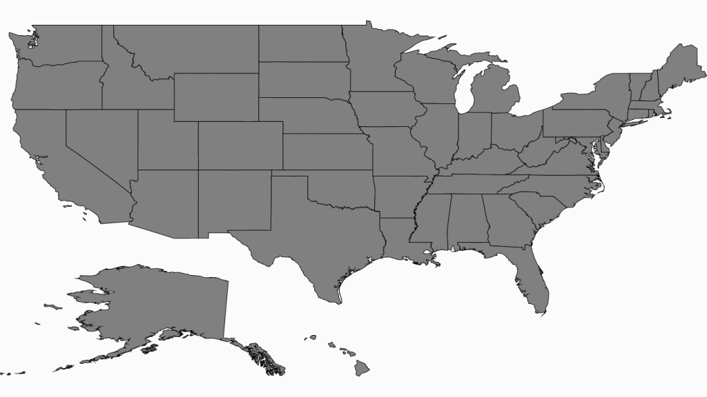
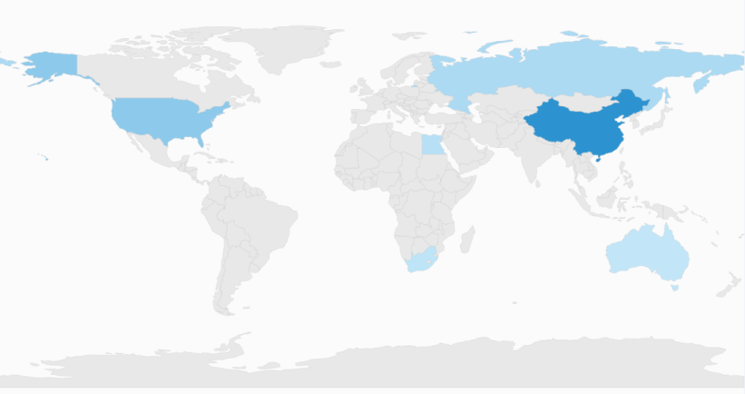
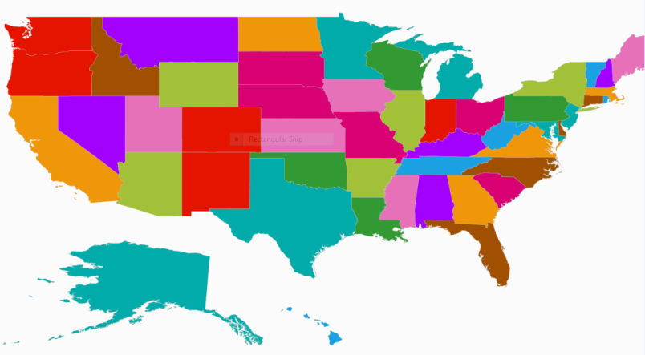
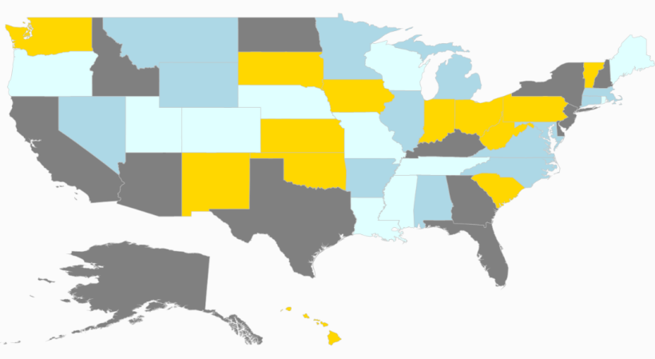

# Shapes Color Customization in UWP Map (SfMaps)

Maps highly support the customization of the shape’s color. The shape’s color can be customized using the following methods:

* Using the `ShapeFill`, `ShapeStroke` and `ShapeStrokeThickness` properties.
* Using tree map-like support.
* Using the color palette.

The important property that makes an impact on shape colors is AutoFillColors. This is a Boolean type property. This property is available in the FillSetting. The use of this property is explained in the following sections.

## About ShapeFill, ShapeStroke and ShapeStrokeThickness

The above mentioned properties are available in the `ShapesSetting` property of the ShapeFileLayer. ShapeSetting defines the basic customization settings of shapes in the map. 

## ShapeFill

`ShapeFill` is a Brush type property which sets the fill color of the shapes in the map.

## ShapeStroke

`ShapeStroke` is also a brush type property that sets the border color of the shape in the map.

## ShapeStrokeThickness

`ShapeStrokeThickness` is a double type property that sets the border thickness of the shape in the map.

N> These setting works only when `AutoFillColor` is set as false.



        <syncfusion:SfMap>
            <syncfusion:SfMap.Layers>
                <syncfusion:ShapeFileLayer Uri="MapApp.usa_st.shp">
                    <syncfusion:ShapeFileLayer.ShapeSettings>
                        <syncfusion:ShapeSetting ShapeFill="Gray" ShapeStroke="Black" ShapeStrokeThickness="1">
                            <syncfusion:ShapeSetting.FillSetting>
                                <syncfusion:ShapeFillSetting AutoFillColors="False"/>
                            </syncfusion:ShapeSetting.FillSetting>
                        </syncfusion:ShapeSetting>
                    </syncfusion:ShapeFileLayer.ShapeSettings>
                </syncfusion:ShapeFileLayer>
            </syncfusion:SfMap.Layers>
        </syncfusion:SfMap >



## Tree map-like support

ShapeFill is set based on the under-bound values of the shape. This provides a tree map-like impact on the map UI. The RangeColorMapping property provides a tree map-like fill for the shapes.

## Range Color Mapping

Range color mapping is one of the features used to differentiate the shape’s fill based on its under-bound value and color ranges. Range color mapping contains the following properties:

<table>
<tr>
<th>
Property</th><th>
Type</th><th>
Description</th></tr>
<tr>
<td>
Range</td><td>
Double</td><td>
Gets or sets the value range of the bubble.</td></tr>
<tr>
<td>
Color</td><td>
Color</td><td>
Gets or sets the color values for the given range.</td></tr>
</table>

The fill color of a particular bubble fill is determined by its under-bound value and color range. To provide a Tree Map like impact on the map, the data binding should work properly. For example, consider the following color ranges.



    <syncfusion:ShapeSetting ShapeFill="#E5E5E5" ShapeStroke="#C1C1C1" ShapeStrokeThickness="0.5" ShapeValuePath="Population">
        <syncfusion:ShapeSetting.FillSetting>
            <syncfusion:ShapeFillSetting AutoFillColors="False">
               <syncfusion:ShapeFillSetting.ColorMappings>
                  <syncfusion:RangeColorMapping To="1500000000" From="750000000" Color="#2A91CF"/>
                  <syncfusion:RangeColorMapping To="750000000" From="0" Color="#3D9FD8"/>
                  <syncfusion:RangeColorMapping To="0" From="0" Color="#C7E9FA"/>
               </syncfusion:ShapeFillSetting.ColorMappings>
           </syncfusion:ShapeFillSetting>
       </syncfusion:ShapeSetting.FillSetting>
     </syncfusion:ShapeSetting>



AutoFillColor must be set to false to enable the range color mapping.

N>  The shape’s under-bound object value must have numeric property and should be mentioned in `ShapeValuePath` to work on this. The color between the given ranges is applied only to the shapes that have a proper under-bound values. The color for other shapes will be the ShapeFill’s color. 



    <syncfusion:SfMap >
            <syncfusion:SfMap.DataContext>
                <local:ViewModel/>
            </syncfusion:SfMap.DataContext>
            <syncfusion:SfMap.Layers>
                <syncfusion:ShapeFileLayer ItemsSource="{Binding Countries}" Uri="App2.world1.shp" ShapeIDPath="Country" ShapeIDTableField="NAME">
                    <syncfusion:ShapeFileLayer.ShapeSettings>
                        <syncfusion:ShapeSetting ShapeValuePath="Population">
                            <syncfusion:ShapeSetting.FillSetting>
                                <syncfusion:ShapeFillSetting AutoFillColors="False">
                                    <syncfusion:ShapeFillSetting.ColorMappings>
                                        <syncfusion:RangeColorMapping To="1500000000" From="750000000" Color="#2A91CF"/>
                                        <syncfusion:RangeColorMapping To="750000000" From="0" Color="#3D9FD8"/>
                                        <syncfusion:RangeColorMapping To="0" From="0" Color="#C7E9FA"/>
                                     </syncfusion:ShapeFillSetting.ColorMappings>
                                </syncfusion:ShapeFillSetting>
                            </syncfusion:ShapeSetting.FillSetting>
                        </syncfusion:ShapeSetting>
                    </syncfusion:ShapeFileLayer.ShapeSettings>
                </syncfusion:ShapeFileLayer>
            </syncfusion:SfMap.Layers>
        </syncfusion:SfMap >



## ColorPalette

`ColorPalette` is a set of colors that are applied on the shapes. Map contains two built-in color palettes. They are: 

* Metro 
* CoolBlue 
* CustomPalette

ColorPalette has to be set in the ShapeSetting’s ColorPalette property. ColorPalette is the enum property which accepts `Metro`, `CoolBlue` and `CustomPalette`.



    <syncfusion:SfMap >
            <syncfusion:SfMap.Layers>
                <syncfusion:ShapeFileLayer Uri="MapApp.usa_st.shp">
                    <syncfusion:ShapeFileLayer.ShapeSettings>
                       <syncfusion:ShapeSetting ColorPalette="Metro">
                            <syncfusion:ShapeSetting.FillSetting>
                                <syncfusion:ShapeFillSetting AutoFillColors="True"/>
                            </syncfusion:ShapeSetting.FillSetting>
                        </syncfusion:ShapeSetting>
                   </syncfusion:ShapeFileLayer.ShapeSettings>
                </syncfusion:ShapeFileLayer>
            </syncfusion:SfMap.Layers>
        </syncfusion:SfMap >



## About CustomPalette

Besides the built-in color palettes, the custom colors can be defined for the color palette. The custom colors are defined in the `CustomColors` in `ShapeSetting`. CustomColors is the collection property which accepts the `MapColorPalette`. To apply the custom colors, “ColorPalette” must be set to `CustomPalette` and `CustomColors` should be defined.

## About MapColorPalette

`MapColorPalette` contains a property named `FillBrush`. This property sets the fill color of the shape when custom palette is set.



        <syncfusion:SfMap>
            <syncfusion:SfMap.Layers>
                <syncfusion:ShapeFileLayer Uri="MapApp.usa_st.shp">
                    <syncfusion:ShapeFileLayer.ShapeSettings>
                        <syncfusion:ShapeSetting ColorPalette="CustomPalette">
                            <syncfusion:ShapeSetting.CustomColors>
                                <syncfusion:MapColorPalette FillBrush="Gray"/>
                                <syncfusion:MapColorPalette FillBrush="Gold"/>
                                <syncfusion:MapColorPalette FillBrush="LightBlue"/>
                                <syncfusion:MapColorPalette FillBrush="LightCyan"/>
                            </syncfusion:ShapeSetting.CustomColors>
                            <syncfusion:ShapeSetting.FillSetting>
                                <syncfusion:ShapeFillSetting AutoFillColors="True"/>
                            </syncfusion:ShapeSetting.FillSetting>
                        </syncfusion:ShapeSetting>
                    </syncfusion:ShapeFileLayer.ShapeSettings>
                </syncfusion:ShapeFileLayer>
            </syncfusion:SfMap.Layers>
        </syncfusion:SfMap >



