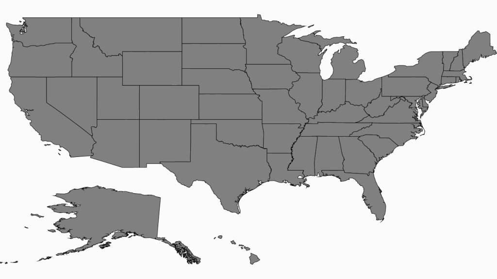
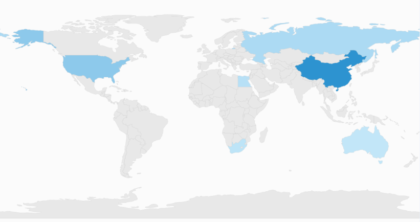
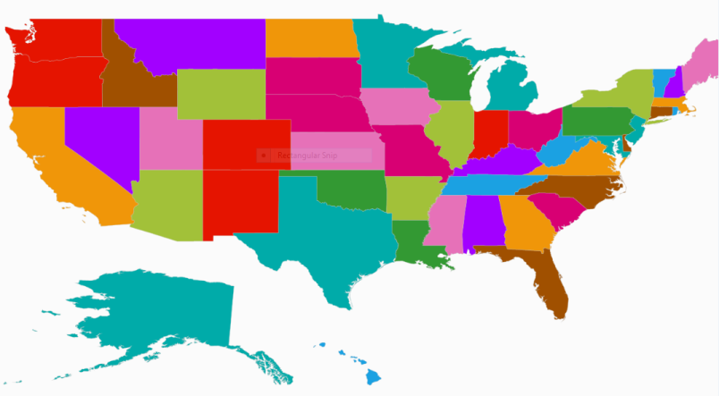
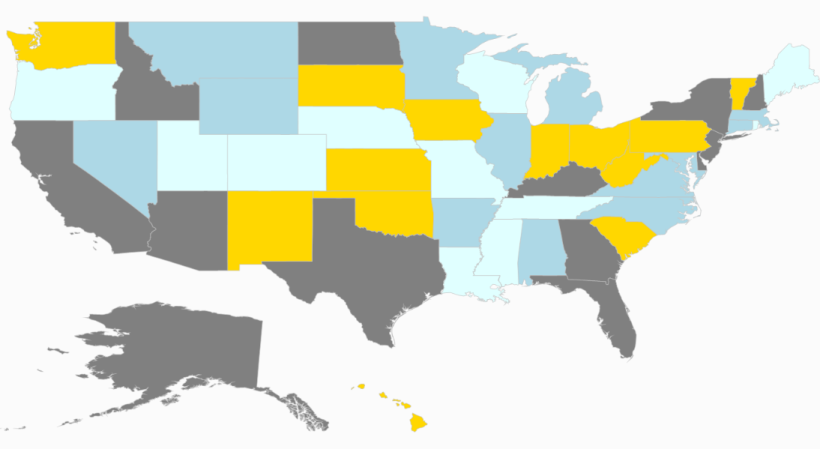

# Shapes Color Customization in UWP Map (SfMaps)

The [`SfMap`](https://help.syncfusion.com/cr/uwp/Syncfusion.UI.Xaml.Maps.SfMap.html) control provides extensive support for the customization of the shape's color. The shape's color can be customized using the following methods:

* Using the [`ShapeFill`](https://help.syncfusion.com/cr/uwp/Syncfusion.UI.Xaml.Maps.ShapeSetting.html#Syncfusion_UI_Xaml_Maps_ShapeSetting_ShapeFill), [`ShapeStroke`](https://help.syncfusion.com/cr/uwp/Syncfusion.UI.Xaml.Maps.ShapeSetting.html#Syncfusion_UI_Xaml_Maps_ShapeSetting_ShapeStroke), and [`ShapeStrokeThickness`](https://help.syncfusion.com/cr/uwp/Syncfusion.UI.Xaml.Maps.ShapeSetting.html#Syncfusion_UI_Xaml_Maps_ShapeSetting_ShapeStrokeThickness) properties.
* Using tree map-like support.
* Using the color palette.

The important property that makes an impact on shape colors is [`AutoFillColors`](https://help.syncfusion.com/cr/uwp/Syncfusion.UI.Xaml.Maps.ShapeFillSetting.html#Syncfusion_UI_Xaml_Maps_ShapeFillSetting_AutoFillColors). This is a Boolean type property. This property is available in the [`FillSetting`](https://help.syncfusion.com/cr/uwp/Syncfusion.UI.Xaml.Maps.ShapeSetting.html#Syncfusion_UI_Xaml_Maps_ShapeSetting_FillSetting). The use of this property is explained in the following sections.

## About ShapeFill, ShapeStroke, and ShapeStrokeThickness

The above mentioned properties are available in the [`ShapeSettings`](https://help.syncfusion.com/cr/uwp/Syncfusion.UI.Xaml.Maps.ShapeFileLayer.html#Syncfusion_UI_Xaml_Maps_ShapeFileLayer_ShapeSettings) property of the [`ShapeFileLayer`](https://help.syncfusion.com/cr/uwp/Syncfusion.UI.Xaml.Maps.ShapeFileLayer.html). [`ShapeSetting`](https://help.syncfusion.com/cr/uwp/Syncfusion.UI.Xaml.Maps.ShapeSetting.html) defines the basic customization settings of shapes in the map.

## ShapeFill

[`ShapeFill`](https://help.syncfusion.com/cr/uwp/Syncfusion.UI.Xaml.Maps.ShapeSetting.html#Syncfusion_UI_Xaml_Maps_ShapeSetting_ShapeFill) is a `Brush` type property that sets the fill color of the shapes in the map.

## ShapeStroke

[`ShapeStroke`](https://help.syncfusion.com/cr/uwp/Syncfusion.UI.Xaml.Maps.ShapeSetting.html#Syncfusion_UI_Xaml_Maps_ShapeSetting_ShapeStroke) is also a `Brush` type property that sets the border color of the shape in the map.

## ShapeStrokeThickness

[`ShapeStrokeThickness`](https://help.syncfusion.com/cr/uwp/Syncfusion.UI.Xaml.Maps.ShapeSetting.html#Syncfusion_UI_Xaml_Maps_ShapeSetting_ShapeStrokeThickness) is a `double` type property that sets the border thickness of the shape in the map.

N> These settings work only when [`AutoFillColors`](https://help.syncfusion.com/cr/uwp/Syncfusion.UI.Xaml.Maps.ShapeFillSetting.html#Syncfusion_UI_Xaml_Maps_ShapeFillSetting_AutoFillColors) is set to `false`.



<syncfusion:SfMap>
    <syncfusion:SfMap.Layers>
        <syncfusion:ShapeFileLayer Uri="MapApp.usa_st.shp">
            <syncfusion:ShapeFileLayer.ShapeSettings>
                <syncfusion:ShapeSetting ShapeFill="Gray" ShapeStroke="Black" ShapeStrokeThickness="1">
                    <syncfusion:ShapeSetting.FillSetting>
                        <syncfusion:ShapeFillSetting AutoFillColors="False"/>
                    </syncfusion:ShapeSetting.FillSetting>
                </syncfusion:ShapeSetting>
            </syncfusion:ShapeFileLayer.ShapeSettings>
        </syncfusion:ShapeFileLayer>
    </syncfusion:SfMap.Layers>
</syncfusion:SfMap>



## Tree map-like support

`ShapeFill` is set based on the underlying values of the shape. This provides a tree map-like impact on the map UI. The [`RangeColorMapping`](https://help.syncfusion.com/cr/uwp/Syncfusion.UI.Xaml.Maps.RangeColorMapping.html) property provides a tree map-like fill for the shapes.

## Range Color Mapping

Range color mapping is one of the features used to differentiate the shape's fill based on its underlying value and color ranges. Range color mapping contains the following properties:

<table>
<tr>
<th>
Property</th><th>
Type</th><th>
Description</th></tr>
<tr>
<td>
[Range](https://help.syncfusion.com/cr/uwp/Syncfusion.UI.Xaml.Maps.RangeColorMapping.html#Syncfusion_UI_Xaml_Maps_RangeColorMapping_Range)</td><td>
Double</td><td>
Gets or sets the value range of the bubble.</td></tr>
<tr>
<td>
[Color](https://help.syncfusion.com/cr/uwp/Syncfusion.UI.Xaml.Maps.ColorMapping.html#Syncfusion_UI_Xaml_Maps_ColorMapping_Color)</td><td>
Color</td><td>
Gets or sets the color values for the given range.</td></tr>
</table>

The fill color of a particular shape is determined by its underlying value and color range. To provide a tree map-like impact on the map, the data binding should work properly. For example, consider the following color ranges.



<syncfusion:ShapeSetting ShapeFill="#E5E5E5" ShapeStroke="#C1C1C1" ShapeStrokeThickness="0.5" ShapeValuePath="Population">
    <syncfusion:ShapeSetting.FillSetting>
        <syncfusion:ShapeFillSetting AutoFillColors="False">
            <syncfusion:ShapeFillSetting.ColorMappings>
                <syncfusion:RangeColorMapping To="1500000000" From="750000000" Color="#2A91CF"/>
                <syncfusion:RangeColorMapping To="750000000" From="0" Color="#3D9FD8"/>
                <syncfusion:RangeColorMapping To="0" From="0" Color="#C7E9FA"/>
            </syncfusion:ShapeFillSetting.ColorMappings>
        </syncfusion:ShapeFillSetting>
    </syncfusion:ShapeSetting.FillSetting>
</syncfusion:ShapeSetting>



[`AutoFillColors`](https://help.syncfusion.com/cr/uwp/Syncfusion.UI.Xaml.Maps.ShapeFillSetting.html#Syncfusion_UI_Xaml_Maps_ShapeFillSetting_AutoFillColors) must be set to `false` to enable the range color mapping.

N>  The shape's underlying object value must have a numeric property and should be mentioned in [`ShapeValuePath`](https://help.syncfusion.com/cr/uwp/Syncfusion.UI.Xaml.Maps.ShapeSetting.html#Syncfusion_UI_Xaml_Maps_ShapeSetting_ShapeValuePath) to work with this. The color between the given ranges is applied only to the shapes that have proper underlying values. The color for other shapes will be the `ShapeFill`'s color. 



<syncfusion:SfMap>
    <syncfusion:SfMap.DataContext>
        <local:ViewModel/>
    </syncfusion:SfMap.DataContext>
    <syncfusion:SfMap.Layers>
        <syncfusion:ShapeFileLayer ItemsSource="{Binding Countries}" Uri="App2.world1.shp" ShapeIDPath="Country" ShapeIDTableField="NAME">
            <syncfusion:ShapeFileLayer.ShapeSettings>
                <syncfusion:ShapeSetting ShapeValuePath="Population">
                    <syncfusion:ShapeSetting.FillSetting>
                        <syncfusion:ShapeFillSetting AutoFillColors="False">
                            <syncfusion:ShapeFillSetting.ColorMappings>
                                <syncfusion:RangeColorMapping To="1500000000" From="750000000" Color="#2A91CF"/>
                                <syncfusion:RangeColorMapping To="750000000" From="0" Color="#3D9FD8"/>
                                <syncfusion:RangeColorMapping To="0" From="0" Color="#C7E9FA"/>
                            </syncfusion:ShapeFillSetting.ColorMappings>
                        </syncfusion:ShapeFillSetting>
                    </syncfusion:ShapeSetting.FillSetting>
                </syncfusion:ShapeSetting>
            </syncfusion:ShapeFileLayer.ShapeSettings>
        </syncfusion:ShapeFileLayer>
    </syncfusion:SfMap.Layers>
</syncfusion:SfMap>



## ColorPalette

[`ColorPalette`](https://help.syncfusion.com/cr/uwp/Syncfusion.UI.Xaml.Maps.ShapeSetting.html#Syncfusion_UI_Xaml_Maps_ShapeSetting_ColorPalette) is a set of colors that are applied on the shapes. The map contains two built-in color palettes. They are:

* Metro
* CoolBlue
* CustomPalette

`ColorPalette` has to be set in the [`ShapeSetting`](https://help.syncfusion.com/cr/uwp/Syncfusion.UI.Xaml.Maps.ShapeSetting.html)'s [`ColorPalette`](https://help.syncfusion.com/cr/uwp/Syncfusion.UI.Xaml.Maps.ShapeSetting.html#Syncfusion_UI_Xaml_Maps_ShapeSetting_ColorPalette) property. `ColorPalette` is the enum property which accepts `Metro`, `CoolBlue`, and `CustomPalette`.



<syncfusion:SfMap>
    <syncfusion:SfMap.Layers>
        <syncfusion:ShapeFileLayer Uri="MapApp.usa_st.shp">
            <syncfusion:ShapeFileLayer.ShapeSettings>
                <syncfusion:ShapeSetting ColorPalette="Metro">
                    <syncfusion:ShapeSetting.FillSetting>
                        <syncfusion:ShapeFillSetting AutoFillColors="True"/>
                    </syncfusion:ShapeSetting.FillSetting>
                </syncfusion:ShapeSetting>
            </syncfusion:ShapeFileLayer.ShapeSettings>
        </syncfusion:ShapeFileLayer>
    </syncfusion:SfMap.Layers>
</syncfusion:SfMap>



## About CustomPalette

Besides the built-in color palettes, custom colors can be defined for the color palette. The custom colors are defined in the [`CustomColors`](https://help.syncfusion.com/cr/uwp/Syncfusion.UI.Xaml.Maps.ShapeSetting.html#Syncfusion_UI_Xaml_Maps_ShapeSetting_CustomColors) property in [`ShapeSetting`](https://help.syncfusion.com/cr/uwp/Syncfusion.UI.Xaml.Maps.ShapeSetting.html). `CustomColors` is the collection property which accepts the [`MapColorPalette`](https://help.syncfusion.com/cr/uwp/Syncfusion.UI.Xaml.Maps.MapColorPalette.html). To apply the custom colors, `ColorPalette` must be set to `CustomPalette` and `CustomColors` should be defined.

## About MapColorPalette

[`MapColorPalette`](https://help.syncfusion.com/cr/uwp/Syncfusion.UI.Xaml.Maps.MapColorPalette.html) contains a property named [`FillBrush`](https://help.syncfusion.com/cr/uwp/Syncfusion.UI.Xaml.Maps.MapColorPalette.html#Syncfusion_UI_Xaml_Maps_MapColorPalette_FillBrush). This property sets the fill color of the shape when the custom palette is set.



<syncfusion:SfMap>
    <syncfusion:SfMap.Layers>
        <syncfusion:ShapeFileLayer Uri="MapApp.usa_st.shp">
            <syncfusion:ShapeFileLayer.ShapeSettings>
                <syncfusion:ShapeSetting ColorPalette="CustomPalette">
                    <syncfusion:ShapeSetting.CustomColors>
                        <syncfusion:MapColorPalette FillBrush="Gray"/>
                        <syncfusion:MapColorPalette FillBrush="Gold"/>
                        <syncfusion:MapColorPalette FillBrush="LightBlue"/>
                        <syncfusion:MapColorPalette FillBrush="LightCyan"/>
                    </syncfusion:ShapeSetting.CustomColors>
                    <syncfusion:ShapeSetting.FillSetting>
                        <syncfusion:ShapeFillSetting AutoFillColors="True"/>
                    </syncfusion:ShapeSetting.FillSetting>
                </syncfusion:ShapeSetting>
            </syncfusion:ShapeFileLayer.ShapeSettings>
        </syncfusion:ShapeFileLayer>
    </syncfusion:SfMap.Layers>
</syncfusion:SfMap>



