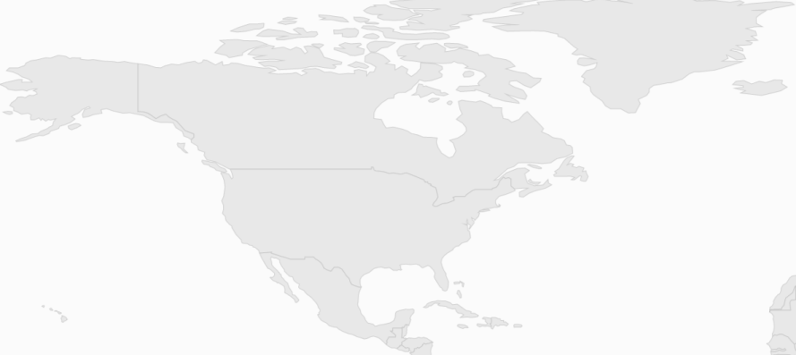
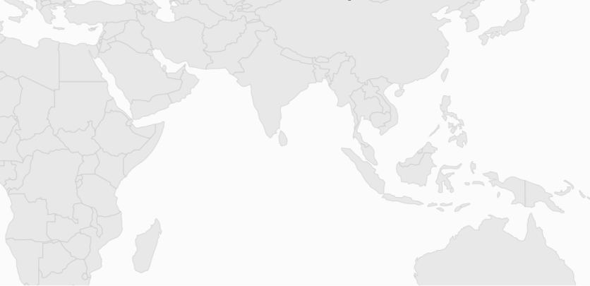

# Zooming and Panning in UWP Map (SfMaps)

The zooming and panning feature of the [`SfMap`](https://help.syncfusion.com/cr/uwp/Syncfusion.UI.Xaml.Maps.SfMap.html) control allows users to zoom in and out and navigate the map.

## Zooming

The zooming feature enables users to zoom in and out of the map to show in-depth information. It is controlled by the [`ZoomLevel`](https://help.syncfusion.com/cr/uwp/Syncfusion.UI.Xaml.Maps.SfMap.html#Syncfusion_UI_Xaml_Maps_SfMap_ZoomLevel) property of the map. When the zoom level of the map control is increased, the map is zoomed in. If the zoom level is decreased, then the map is zoomed out.

## Properties Related to Zooming

The following properties are related to the zooming feature of the Maps control:

* [ZoomLevel](https://help.syncfusion.com/cr/uwp/Syncfusion.UI.Xaml.Maps.SfMap.html#Syncfusion_UI_Xaml_Maps_SfMap_ZoomLevel)
* [EnableZoom](https://help.syncfusion.com/cr/uwp/Syncfusion.UI.Xaml.Maps.SfMap.html#Syncfusion_UI_Xaml_Maps_SfMap_EnableZoom)
* [MinZoom](https://help.syncfusion.com/cr/uwp/Syncfusion.UI.Xaml.Maps.SfMap.html#Syncfusion_UI_Xaml_Maps_SfMap_MinZoom)
* [MaxZoom](https://help.syncfusion.com/cr/uwp/Syncfusion.UI.Xaml.Maps.SfMap.html#Syncfusion_UI_Xaml_Maps_SfMap_MaxZoom)

## ZoomLevel

[`ZoomLevel`](https://help.syncfusion.com/cr/uwp/Syncfusion.UI.Xaml.Maps.SfMap.html#Syncfusion_UI_Xaml_Maps_SfMap_ZoomLevel) is the primary property of the zooming feature. It controls the map's scale size while zooming. Initially, the zoom level is 1. `ZoomLevel` cannot be less than 1.

## EnableZoom

The [`EnableZoom`](https://help.syncfusion.com/cr/uwp/Syncfusion.UI.Xaml.Maps.SfMap.html#Syncfusion_UI_Xaml_Maps_SfMap_EnableZoom) property enables or disables the zooming feature. A `true` value of this property enables the zooming feature and `false` disables the zooming feature.

## MinZoom

The [`MinZoom`](https://help.syncfusion.com/cr/uwp/Syncfusion.UI.Xaml.Maps.SfMap.html#Syncfusion_UI_Xaml_Maps_SfMap_MinZoom) property is used to set the minimum zoom level of the map.

## MaxZoom

The [`MaxZoom`](https://help.syncfusion.com/cr/uwp/Syncfusion.UI.Xaml.Maps.SfMap.html#Syncfusion_UI_Xaml_Maps_SfMap_MaxZoom) property is used to set the maximum zoom level of the [`SfMap`](https://help.syncfusion.com/cr/uwp/Syncfusion.UI.Xaml.Maps.SfMap.html) control.



<syncfusion:SfMap ZoomLevel="3" MinZoom="1" MaxZoom="20" EnableZoom="True"/>



## Methods to Zoom the Map

Maps can be zoomed using the following methods:

* By changing the [`ZoomLevel`](https://help.syncfusion.com/cr/uwp/Syncfusion.UI.Xaml.Maps.SfMap.html#Syncfusion_UI_Xaml_Maps_SfMap_ZoomLevel).
* Through the [`Zoom`](https://help.syncfusion.com/cr/uwp/Syncfusion.UI.Xaml.Maps.SfMap.html#Syncfusion_UI_Xaml_Maps_SfMap_Zoom_System_Double_) method.
* By pinching the map.
* Through the mouse scroll.
* By double-tapping on the map.

## Changing the ZoomLevel

A map can be zoomed by changing the zoom level of the [`SfMap`](https://help.syncfusion.com/cr/uwp/Syncfusion.UI.Xaml.Maps.SfMap.html) control. Incrementing the `ZoomLevel` will zoom in on the map and decrementing the `ZoomLevel` will zoom out of the map.

## Through the Zoom method

Maps can be zoomed through the [`Zoom`](https://help.syncfusion.com/cr/uwp/Syncfusion.UI.Xaml.Maps.SfMap.html#Syncfusion_UI_Xaml_Maps_SfMap_Zoom_System_Double_) method. The `Zoom` method has the parameter zoom value. The map can be zoomed or scaled with the zoom value parameter.



SfMap syncMap = new SfMap();
ShapeFileLayer shapeLayer = new ShapeFileLayer();
shapeLayer.Uri = "MapApp.ShapeFiles.world.shp";
syncMap.Layers.Add(shapeLayer);
syncMap.Zoom(5);



## By pinching the map

Since UWP fully supports touch interactions, the Maps control also supports touch interactions. Maps can be zoomed through pinching events. The scale value is determined by using the delta value of the pinch event.

## Through a mouse wheel event

In addition to the pinching event, the map can be zoomed with mouse events. When the mouse is scrolled up, the map is zoomed in. When the mouse is scrolled down, the map is zoomed out.

## Through a double-tapping event

When the map is double-tapped, the zooming operation is performed.

## Panning the map

The panning feature enables navigation through the map.

Properties related to panning are:

* [EnablePan](https://help.syncfusion.com/cr/uwp/Syncfusion.UI.Xaml.Maps.SfMap.html#Syncfusion_UI_Xaml_Maps_SfMap_EnablePan)

## Enable and disable pan

The [`EnablePan`](https://help.syncfusion.com/cr/uwp/Syncfusion.UI.Xaml.Maps.SfMap.html#Syncfusion_UI_Xaml_Maps_SfMap_EnablePan) property enables or disables the panning feature of the map. A `true` value enables the panning feature. A `false` value disables the panning feature of the map.



<syncfusion:SfMap ShowCoords="True" LatitudeLongitudeType="Decimal" EnablePan="True">
    <syncfusion:SfMap.Layers>
        <syncfusion:ShapeFileLayer Uri="MapApp.world1.shp"/>
    </syncfusion:SfMap.Layers>
</syncfusion:SfMap>



## Ways to pan the map

There are two methods for panning the map. They are:

* Through the [`Pan`](https://help.syncfusion.com/cr/uwp/Syncfusion.UI.Xaml.Maps.SfMap.html#Syncfusion_UI_Xaml_Maps_SfMap_Pan_System_Double_System_Double_) method.
* By dragging the map.

## Through the Pan method

The map can be panned with the [`Pan`](https://help.syncfusion.com/cr/uwp/Syncfusion.UI.Xaml.Maps.SfMap.html#Syncfusion_UI_Xaml_Maps_SfMap_Pan_System_Double_System_Double_) method in the [`SfMap`](https://help.syncfusion.com/cr/uwp/Syncfusion.UI.Xaml.Maps.SfMap.html) control. The `Pan` method has two parameters: x and y. The map is translated with respect to the x and y parameters.



SfMap syncMap = new SfMap();
syncMap.EnablePan = true;
ShapeFileLayer layer = new ShapeFileLayer();
layer.Uri = "App2.world1.shp";
syncMap.Layers.Add(layer);
syncMap.Pan(200, 200);



## Dragging the map

The map can be panned by dragging the map through mouse interactions. This works automatically for touch events.

N> The map can be panned only when some parts of the map are outside the view of the control.

