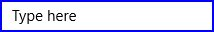

# Appearance in UWP Masked TextBox (SfMaskedEdit)

The appearance of the `SfMaskedEdit` control can be customized by using the `BorderBrush` and `ErrorBorderBrush` property

## Border

### BorderBrush

`BorderBrush` provides the border color for the `SfMaskedEdit`.

We can Customize the `BorderBrush` property as follows





<Input:SfMaskedEdit Width="255" Height="46" BorderBrush="Blue"/>





SfMaskedEdit maskededit = new SfMaskedEdit();
maskededit.BorderBrush = Brushes.Blue;





### ErrorBorderBrush

`ErrorBorderBrush` provide the border color for the `SfMaskedEdit` when validation becomes failed.

We can Customize the ErrorBorderBrush property as follows





<Input:SfMaskedEdit Width="255" Height="46" ErrorBorderBrush="DarkOrange"/>





SfMaskedEdit maskededit = new SfMaskedEdit();
maskededit.ErrorBorderBrush = Brushes.DarkOrange;





## ShowPromptOnFocus

When the `ShowPromptOnFocus` is set to true, prompt characters are ignored when control loses focus. Again, the prompt characters are restored when the control is focused

### Example





<Input:SfMaskedEdit Width="255" Height="46" MaskType="Simple" Mask="(000) 000-0000" ShowPromptOnFocus="True"/>





SfMaskedEdit maskededit = new SfMaskedEdit();
maskededit.MaskType = MaskType.Simple;
maskedEdit.Mask = "(000) 000-0000";
maskedEdit.ShowPromptOnFocus = true;





Control loses focus

Control gets focus

