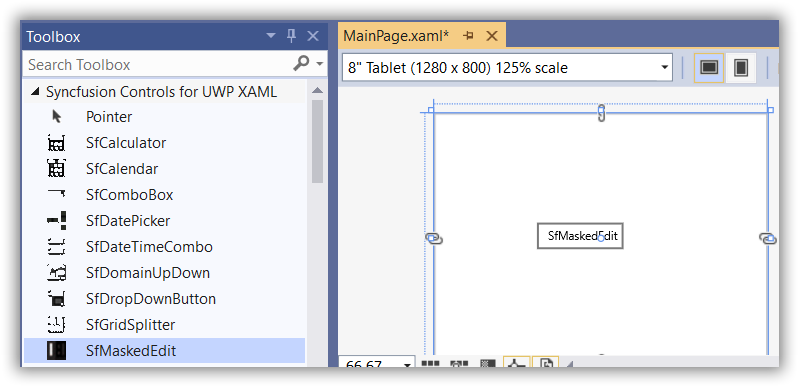
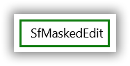
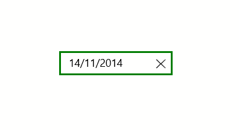
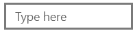

# Getting Started with UWP Masked TextBox (SfMaskedEdit)

This section explains how to create new project in Visual Studio using [SfMaskedEdit](https://help.syncfusion.com/cr/uwp/Syncfusion.UI.Xaml.Controls.Input.SfMaskedEdit.html) control.

## Assembly deployment
Refer to the [control dependencies](https://help.syncfusion.com/uwp/control-dependencies#sfmaskededit) section to get the list of assemblies or NuGet package that needs to be added as a reference to use the [SfMaskedEdit](https://help.syncfusion.com/cr/uwp/Syncfusion.UI.Xaml.Controls.Input.SfMaskedEdit.html) in any application.

You can refer this [documentation](https://help.syncfusion.com/uwp/visual-studio-integration/nuget-packages) to find more details about installing the NuGet package in a UWP application.

## Creating Application with SfMaskedEdit
In this walk through, user will create a UWP application that contains [SfMaskedEdit](https://help.syncfusion.com/cr/uwp/Syncfusion.UI.Xaml.Controls.Input.SfMaskedEdit.html).
1. [Creating project](#Creating-the-project)
2. [Adding control via designer](#Adding-control-via-designer)
3. [Adding control manually in XAML](#Adding-control-manually-in-XAML)
4. [Adding control manually in C#](#Adding-control-manually-in-C#)

## Creating project 
Below section provides detailed information to create new project in Visual Studio to display [SfMaskedEdit](https://help.syncfusion.com/cr/uwp/Syncfusion.UI.Xaml.Controls.Input.SfMaskedEdit.html).

## Adding control via designer
The [SfMaskedEdit](https://help.syncfusion.com/cr/uwp/Syncfusion.UI.Xaml.Controls.Input.SfMaskedEdit.html) can be added to the application by dragging it from Toolbox and dropping it in designer. The required assembles will be added automatically.

## Adding control manually in XAML

In order to add [SfMaskedEdit](https://help.syncfusion.com/cr/uwp/Syncfusion.UI.Xaml.Controls.Input.SfMaskedEdit.html) manually in XAML, do the below steps,

1. Add the below required assembly references to the project,

    * Syncfusion.SfInput.UWP
    * Syncfusion.SfShared.UWP

2. Include the namespace for Syncfusion.SfInput.UWP assembly in MainPage.XAML.




<Page xmlns="http://schemas.microsoft.com/winfx/2006/xaml/presentation"

xmlns:x="http://schemas.microsoft.com/winfx/2006/xaml"

xmlns:syncfusion="using:Syncfusion.UI.Xaml.Controls.SfInput">




3. Now add the [SfMaskedEdit](https://help.syncfusion.com/cr/uwp/Syncfusion.UI.Xaml.Controls.Input.SfMaskedEdit.html) in MainPage.XAML.




<syncfusion:SfMaskedEdit HorizontalAlignment="Center" VerticalAlignment="Center" Text="SfMaskedEdit" TextWrapping="Wrap" />




## Adding control manually in C#

In order to add [SfMaskedEdit](https://help.syncfusion.com/cr/uwp/Syncfusion.UI.Xaml.Controls.Input.SfMaskedEdit.html) manually in C#, do the below steps,

1. Add the below required assembly references to the project,

    * Syncfusion.SfInput.UWP
    * Syncfusion.SfShared.UWP

2. Import SfMaskedEdit namespace **Syncfusion.UI.Xaml.Controls.Input**.

3. Create SfMaskedEdit instance and add it to the page.




SfMaskedEdit sfMaskdeEdit1 = new SfMaskedEdit()
{
    HorizontalAlignment = HorizontalAlignment.Center,
    VerticalAlignment = VerticalAlignment.Center,
    Height = 30,
    Width = 175,
    Text = "SfMaskedEdit"
};




Dim sfMaskdeEdit1 As SfMaskedEdit = New SfMaskedEdit() With {
    .HorizontalAlignment = HorizontalAlignment.Center,
    .VerticalAlignment = VerticalAlignment.Center,
    .Height = 30,
    .Width = 175,
    .Text = "SfMaskedEdit"
}




## Adding Mask to the control

To mask the input of [SfMaskedEdit](https://help.syncfusion.com/cr/uwp/Syncfusion.UI.Xaml.Controls.Input.SfMaskedEdit.html),  we must set [MaskType](https://help.syncfusion.com/cr/uwp/Syncfusion.UI.Xaml.Controls.Input.MaskType.html) and [Mask](https://help.syncfusion.com/cr/uwp/Syncfusion.UI.Xaml.Controls.Input.SfMaskedEdit.html#Syncfusion_UI_Xaml_Controls_Input_SfMaskedEdit_Mask) property.

`MaskType` has different set of mask characters that are combined to form a mask expression. Based on the complexity and usage, mask types are classified as Simple, Regular and RegEx.

Using the `Mask` property, you can specify input without writing any custom validation logic in your application. Mask can be set based on `MaskType` elements. The `Mask` property may contain literals and special mask characters. You can use the back-slash character to escape any special mask characters so that they are displayed as literals.





<syncfusion:SfMaskedEdit MaskType="Simple" Mask="00/00/0000" Width="255" Height="46"/>





SfMaskedEdit maskededit = new SfMaskedEdit();
maskededit.MaskType=MaskType.Simple;
maskedEdit.Mask="00/00/0000";





N> [MaskType](https://help.syncfusion.com/cr/uwp/Syncfusion.UI.Xaml.Controls.Input.MaskType.html) property with `Simple` value allows only numeric inputs in the places of 0.

## Assigning Value to the control

Value of [SfMaskedEdit](https://help.syncfusion.com/cr/uwp/Syncfusion.UI.Xaml.Controls.Input.SfMaskedEdit.html) can be set by [Value](https://help.syncfusion.com/cr/uwp/Syncfusion.UI.Xaml.Controls.Input.SfMaskedEdit.html#Syncfusion_UI_Xaml_Controls_Input_SfMaskedEdit_Value) property. By default, the Value property of [SfMaskedEdit](https://help.syncfusion.com/cr/uwp/Syncfusion.UI.Xaml.Controls.Input.SfMaskedEdit.html) holds the characters without including the prompt characters and the literals defined in the mask. You can alter this and allow the value to hold literal and prompt characters by setting the [ValueMaskFormat](https://help.syncfusion.com/cr/uwp/Syncfusion.UI.Xaml.Controls.Input.SfMaskedEdit.html#Syncfusion_UI_Xaml_Controls_Input_SfMaskedEdit_ValueMaskFormat) property of the control.





<syncfusion:SfMaskedEdit MaskType="Simple" Mask="00/00/0000" Value="14/11/2014" ValueMaskFormat="ExcludePromptAndLiterals" Width="255" Height="46"/>





SfMaskedEdit maskededit = new SfMaskedEdit();
maskededit.MaskType=MaskType.Simple;
maskededit.ValueMaskFormat = MaskFormat.ExcludePromptAndLiterals;
maskedEdit.Mask="00/00/0000";
maskedEdit.Value="14/11/2014";





## Validation of Value

You can customize how [SfMaskedEdit](https://help.syncfusion.com/cr/uwp/Syncfusion.UI.Xaml.Controls.Input.SfMaskedEdit.html) should behave when invalid input is entered using [ValidationMode](https://help.syncfusion.com/cr/uwp/Syncfusion.UI.Xaml.Controls.Input.SfMaskedEdit.html#Syncfusion_UI_Xaml_Controls_Input_SfMaskedEdit_ValidationMode) property. The following values can be set to ValidationMode property,

* `KeyPress` - Validation of value takes places on every key press.
* `LostFocus` - validation of value takes place when focus is lost from SfMaskedEdit.




<syncfusion:SfMaskedEdit HorizontalAlignment="Center" VerticalAlignment="Center" Text="SfMaskedEdit" TextWrapping="Wrap" />




## Defining Watermark

You can set watermark for [SfMaskedEdit](https://help.syncfusion.com/cr/uwp/Syncfusion.UI.Xaml.Controls.Input.SfMaskedEdit.html)  control using [Watermark](https://help.syncfusion.com/cr/uwp/Syncfusion.UI.Xaml.Controls.Input.SfTextBoxExt.html#Syncfusion_UI_Xaml_Controls_Input_SfTextBoxExt_Watermark) property. Watermark will be shown in content of the control when it's not focused and no value is entered.





<syncfusion:SfMaskedEdit  MaskType="Simple" Mask="00/00/0000" Watermark="Type here" Width="255" Height="46"/>





SfMaskedEdit maskededit = new SfMaskedEdit();
maskededit.MaskType = MaskType.Simple;
maskedEdit.Mask = "00/00/0000";
maskedEdit.Watermark = "Type here";





View sample in [GitHub](https://github.com/SyncfusionExamples/SfMaskedEdit_GettingStarted_UWP).