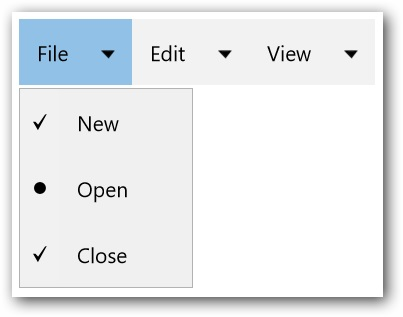

---
layout: post
title: CheckBox and RadioButton in UWP Menu control | Syncfusion®
description: Learn here all about CheckBox and RadioButton support in Syncfusion® UWP Menu (SfMenu) control and more.
platform: UWP
control: SfMenu
documentation: ug
--- 

# CheckBox and RadioButton in UWP Menu (SfMenu)

`SfMenu` provides a support for selecting several items. `SfMenuItem` can be changed as checkable by setting the `IsCheckable` property of the `SfMenuItem` to “true”. You can change the icon type (Check Box or Radio Button) by using the `CheckIconType` property, also it can be checked by using the `IsChecked` property.

## Add Check Box and Radio Button in SfMenuItem

`SfMenuItem’s` will be grouped based on the value of the GroupName property and it allows to select only one item from the group by setting the `CheckIconType` property of `SfMenuItem` to RadioButton. Similarly `SfMenuItem` can be checked and unchecked by set the `CheckIconType` property of `SfMenuItem` to CheckBox. The Check Box and Radio Button support can be used as shown in the following code snippet.





<menu:SfMenu  x:Name="Sfmenu"  ExpandMode="ExpandOnClick" Width="176">

<menu:SfMenuItem Header="File"   >

<menu:SfMenuItem  Header="New" IsCheckable="true"
                  CheckIconType="CheckBox" IsChecked="true"/>

<menu:SfMenuItem  Header="Open" IsCheckable="true"
                  CheckIconType="RadioButton" IsChecked="true"/>

<menu:SfMenuItem Header="Close"  IsCheckable="true"
                 CheckIconType="CheckBox" IsChecked="true"/>

</menu:SfMenuItem>

<menu:SfMenuItem Header="Edit">

<menu:SfMenuItem Header="Undo" IsCheckable="true"
                 CheckIconType="CheckBox" IsChecked="true"/>

<menu:SfMenuItem Header="Redo"  IsCheckable="true"
                 CheckIconType="RadioButton" IsChecked="true"/>

<menu:SfMenuItem Header="Cut"  IsCheckable="true"
                 CheckIconType="RadioButton" IsChecked="true"/>

<menu:SfMenuItem Header="Copy" IsCheckable="true"
                 CheckIconType="CheckBox" IsChecked="true"/>

</menu:SfMenuItem>

<menu:SfMenuItem Header="View">

<menu:SfMenuItem Header="Find Results" />

<menu:SfMenuItem Header="Other Windows" />

</menu:SfMenuItem>

</menu:SfMenu>





