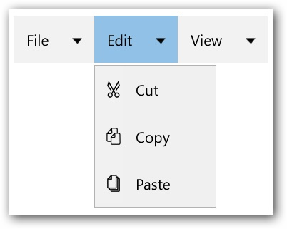

---
layout: post
title: Set Icons in UWP Menu control | Syncfusion
description: Learn here all about Set Icons support in Syncfusion UWP Menu (SfMenu) control and more.
platform: UWP
control: SfMenu
documentation: ug
--- 

# Set Icons in UWP Menu (SfMenu)

`SfMenuItem` allows to display an image on the left of the control. Icon for `SfMenuItem` can be set by providing the image source as a value for the `Icon` property of the `SfMenuItem`.

## Adding Icon to SfMenuItem

The Icon for `SfMenuItem` can be added by `Icon` property as shown in the following code snippet.





<menu:SfMenu  x:Name="Sfmenu"  >

<menu:SfMenuItem Header="File" >

<menu:SfMenuItem Header="New" />

<menu:SfMenuItem  Header="Open"/>

<menu:SfMenuItem Header="Close"/>

</menu:SfMenuItem>

<menu:SfMenuItem Header="Edit">

<menu:SfMenuItem Header="Delete" >

<menu:SfMenuItem.Icon>

<Image Source="delete.png"/>

</menu:SfMenuItem.Icon>

</menu:SfMenuItem>

<menu:SfMenuItem Header="New">

<menu:SfMenuItem.Icon>

<Image Source="new.png"/>

</menu:SfMenuItem.Icon>

</menu:SfMenuItem>

<menu:SfMenuItem Header="Cut">

<menu:SfMenuItem.Icon>

<Image Source="cut.png"/>

</menu:SfMenuItem.Icon>

</menu:SfMenuItem>

<menu:SfMenuItem Header="Copy">

<menu:SfMenuItem.Icon>

<Image Source="Copy.png"/>

</menu:SfMenuItem.Icon>

</menu:SfMenuItem>

</menu:SfMenuItem>

<menu:SfMenuItem Header="View">

<menu:SfMenuItem Header="Find Results" />

<menu:SfMenuItem Header="Other Windows" />

</menu:SfMenuItem>

</menu:SfMenu>





