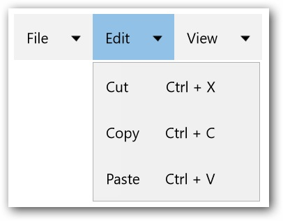

---
layout: post
title: Input Gesture Text in UWP Menu control | Syncfusion®
description: Learn here all about Input Gesture Text support in Syncfusion® UWP Menu (SfMenu) control and more.
platform: UWP
control: SfMenu
documentation: ug
--- 

# Input Gesture Text in UWP Menu (SfMenu)

`InputGestureText` is used to set `SfMenuItem` to display shortcut keys along with its Header. This support can be utilized by using the `InputGestureText` property. The value given by using this property will be displayed along with the Header of `SfMenuItem`.

## Adding the InputGestureText to SfMenuItem

The value assigned by `InputGestureText` property will be displayed in `SfMenuItem` along with the Header property value of `SfMenuItem`. The `InputGestureText` can be added to `SfMenuItem` as shown in the following code snippet.





<menu:SfMenu  x:Name="Sfmenu"  >

<menu:SfMenuItem Header="File"   >

<menu:SfMenuItem  Header="New"  InputGestureText="Ctrl + N"/>

<menu:SfMenuItem  Header="Open" InputGestureText="Ctrl + O"/>

<menu:SfMenuItem Header="Close"   InputGestureText="Alt + F4"/>

</menu:SfMenuItem>

<menu:SfMenuItem Header="Edit">

<menu:SfMenuItem Header="Undo" InputGestureText="Ctrl + Z"/>

<menu:SfMenuItem Header="Redo" InputGestureText="Ctrl + Y"/>

<menu:SfMenuItem Header="Cut" InputGestureText="Ctrl + X"/>

<menu:SfMenuItem Header="Copy" InputGestureText="Ctrl + C"/>

</menu:SfMenuItem>

<menu:SfMenuItem Header="View">

<menu:SfMenuItem Header="Find Results" />

<menu:SfMenuItem Header="Other Windows" />

</menu:SfMenuItem>

</menu:SfMenu>





