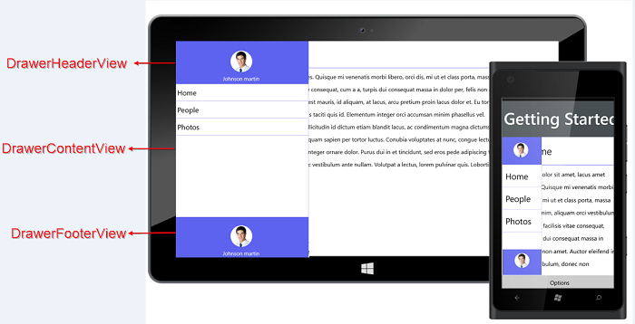

# Concepts and Features in UWP Navigation Drawer (SfNavigationDrawer)

## ContentView

ContentView is the main view of the NavigationDrawer where the desired items can be placed.



    <syncfusion:SfNavigationDrawer x:Name="drawer">
		<syncfusion:SfNavigationDrawer.ContentView>
			<Grid>
			<StackPanel Orientation="Horizontal">
				<Button x:Name="button"  Canvas.ZIndex="5" Grid.Column="0" BorderBrush="Transparent" Height="45" Width="50" Background="Transparent"     Click="ButtonBase_OnClick">
						<Path Data="M3.507019,20.166L28.493011,20.166C30.429993,20.166 32,21.734998 32,23.672008 32,25.609994 30.429993,27.180001 28.493011,27.180001L3.507019,27.180001C1.5710144,27.180001 0,25.609994 0,23.672008 0,21.734998 1.5710144,20.166 3.507019,20.166z M3.507019,10.082999L28.493011,10.082999C30.429993,10.082999 32,11.653006 32,13.590992 32,15.528002 30.429993,17.098985 28.493011,17.098985L3.507019,17.098985C1.5710144,17.098985 0,15.528002 0,13.590992 0,11.653006 1.5710144,10.082999 3.507019,10.082999z M3.507019,0L28.493011,0C30.429993,-8.7618901E-08 32,1.5710131 32,3.5080233 32,5.4460097 30.429993,7.0140015 28.493011,7.0140015L3.507019,7.0140015C1.5710144,7.0140015 0,5.4460097 0,3.5080233 0,1.5710131 1.5710144,-8.7618901E-08 3.507019,0z" Stretch="Uniform" Fill="#FF262626" Width="26" Height="26" Margin="0,0,0,0" RenderTransformOrigin="0.5,0.5"/>
					</Button>
				<TextBlock Text="Home" FontSize="27" Margin="10,0,0,0"  Foreground="Black" Grid.Column="1" HorizontalAlignment="Left" VerticalAlignment="Center" />
			</StackPanel>
			<Border BorderBrush="#FF5D63EE" Grid.Row="1" BorderThickness="1" VerticalAlignment="Top" Background="#FF5D63EE"/>
			<StackPanel Grid.Row="2" Orientation="Vertical"  Background="white" Margin="10" VerticalAlignment="Top">
				<TextBlock TextWrapping="Wrap" Foreground="black" LineHeight="35" FontSize="16" HorizontalAlignment="Left">
					<TextBlock.Text>
						HomePage ContentView
					</TextBlock.Text>
				</TextBlock>
			</StackPanel>
			</Grid>
		</syncfusion:SfNavigationDrawer.ContentView>
	</syncfusion:SfNavigationDrawer>



  

## DrawerContentView

The SfNavigationDrawer control contains the DrawerContentView, a part of the DrawerView panel. The DrawerContentView displays the navigation items that you need to jump to.



    <syncfusion:SfNavigationDrawer.DrawerContentView>
			<Grid Background="Black">
				<ListBox x:Name="list" ItemsSource="{Binding Contents}">
					<ListBox.ItemTemplate>
						<DataTemplate>
							<TextBlock  Text="{Binding Name}" Padding="15" TextAlignment="Center" FontSize="23" Foreground="White"/>
						</DataTemplate>
					</ListBox.ItemTemplate>
				</ListBox>
			</Grid>
		</syncfusion:SfNavigationDrawer.DrawerContentView>



## DrawerFooterView

Gets or sets the footer for the DrawerView panel in the SfNavigationDrawer control.  



    <syncfusion:SfNavigationDrawer.DrawerFooterView>
			<StackPanel Orientation="Vertical" VerticalAlignment="Center" HorizontalAlignment="Center">
				<Image Source="/Assets/NavigationDrawer/User.png" Height="80" Width="100"/>
				<TextBlock HorizontalAlignment="Center" Margin="0 10 0 0" Text="James Pollock"/>
		    </StackPanel>
		</syncfusion:SfNavigationDrawer.DrawerFooterView>



 

## DrawerHeaderView

Gets or sets the DrawerHeaderView of the DrawerView panel in the SfNavigationDrawer control.


	
    <syncfusion:SfNavigationDrawer.DrawerHeaderView>
          <StackPanel Orientation="Vertical" VerticalAlignment="Center" HorizontalAlignment="Center">
						<Image Source="/Assets/NavigationDrawer/User.png" Height="80" Width="100"/>
						<TextBlock HorizontalAlignment="Center" Margin="0 10 0 0" Text="James Pollock"/>
					</StackPanel>
		  </syncfusion:SfNavigationDrawer.DrawerHeaderView>



## DrawerHeight

Gets or sets the height for the DrawerView panel in the NavigationDrawer control.




	<syncfusion:SfNavigationDrawer x:Name="drawer" DrawerHeight="400"/>





	drawer.DrawerHeight = 400d;
	




## DrawerWidth

Gets or sets the width for the DrawerView panel in the NavigationDrawer control.




	<syncfusion:SfNavigationDrawer x:Name="drawer" DrawerWidth="200"/>





	drawer.DrawerWidth = 200d;
	




## TouchThreshold

Gets or sets the threshold value from the edges for easy panning from the edges. The default value of TouchThreshold is 15.




	<syncfusion:SfNavigationDrawer x:Name="drawer" TouchThreshold="25"/>




	drawer.TouchThreshold = 25d;




## Animation Duration

Gets or sets the TimeSpan value, by which the DrawerContent can be brought to view.




	<syncfusion:SfNavigationDrawer x:Name="drawer" AnimationDuration="100"/>




	drawer.AnimationDuration = 100;




## Position

The Position property specifies the position of the DrawerView panel. The Position property has the following four options:

* Left
* Right
* Top
* Bottom

The default position is Left.  





	<syncfusion:SfNavigationDrawer x:Name="drawer" Position="Left" ></syncfusion:SfNavigationDrawer>





	drawer.Position = Position.Left;





                                            

The following code example shows how to set the SfNavigationDrawer to the right.  




	<syncfusion:SfNavigationDrawer x:Name="drawer" Position="Right" ></syncfusion:SfNavigationDrawer>





	drawer.Position = Position.Right;





The following code example shows how to set the SfNavigationDrawer at the top.  




	<syncfusion:SfNavigationDrawer x:Name="drawer" Position="Top" ></syncfusion:SfNavigationDrawer>





	drawer.Position = Position.Top;





                                           

The following code example shows how to set the SfNavigationDrawer at the bottom.  




	<syncfusion:SfNavigationDrawer x:Name="drawer" Position="Bottom" ></syncfusion:SfNavigationDrawer>





	drawer.Position = Position.Bottom;





## Transition

The Transition property specifies the animations for the DrawerView panel. The Transition property has the following options:

* SlideOnTop
* Push
* Reveal

The default transition is SlideOnTop. That draws the DrawerContent on top of the main content.




	<syncfusion:SfNavigationDrawer x:Name="drawer" Transition="SlideOnTop" ></syncfusion:SfNavigationDrawer>





	drawer.Transition = Transition.SlideOnTop;





                                           

The following code example shows how to set Transition as Push to SfNavigationDrawer. This transition moves the Drawer and main content simultaneously.




	<syncfusion:SfNavigationDrawer x:Name="drawer" Transition="Push" ></syncfusion:SfNavigationDrawer>





	drawer.Transition = Transition.Push;





                                              

The following code example shows how to set Transition as Reveal to SfNavigationDrawer. In this transition, the Drawer content is stable and the main content is moved to reveal the drawer content.




	<syncfusion:SfNavigationDrawer x:Name="drawer" Transition="Reveal" ></syncfusion:SfNavigationDrawer>





	drawer.Transition = Transition.Reveal;





                                         
