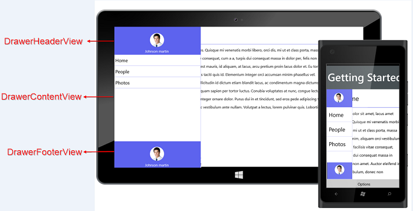

# UWP Navigation Drawer (SfNavigationDrawer) Overview

NavigationDrawer is a sliding panel menu that allows you to navigate between major modules of the application. The Navigation Drawer is usually hidden and it appears when you swipe the screen from any of the four edges or by tapping the app icon, if available.

 
                                              
SfNavigationDrawer
{:.caption}

### Use Case Scenarios

Navigation Drawers are used in applications where navigating to the major module or page is a basic requirement. The Navigation Drawer is available in the following apps that signify the importance of navigating through pages:

1. Facebook
2. Play Store
3. e-Commerce Apps
4. Banking Apps

### Key Features

* Position - Specifies the rendering position for the Navigation Drawer, that is, you can display it from left or right or top or bottom edges
* Transition - Specifies the transition type of the Navigation Drawer. 
