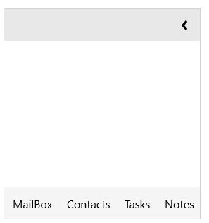
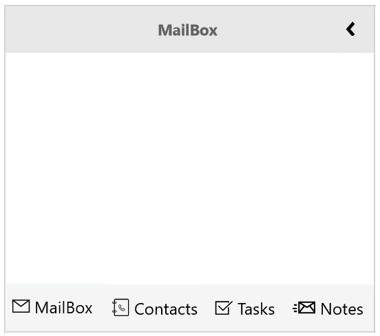

# Getting Started with UWP Navigation Pane (SfGroupBar)

This section explains how to add `SfGroupBarItem` and set it’s content in `SfGroupBar`. 

## Adding SfGroupBar Control

Create a Universal Windows Platform project in Visual Studio and refer to the `Syncfusion.SfGroupBar.UWP` assembly.

1.Include the namespace Syncfusion.UI.Xaml.Controls.Navigation for `Syncfusion.SfGroupBar.UWP` assembly in MainPage.xaml





<Page xmlns="http://schemas.microsoft.com/winfx/2006/xaml/presentation"

xmlns:x="http://schemas.microsoft.com/winfx/2006/xaml"

xmlns:navigation="using:Syncfusion.UI.Xaml.Controls.Navigation">





2.Now add the `SfGroupBar` control with a required optimal name using the included namespace





<navigation:SfGroupBar x:Name="groupBar"/>





This will just display GroupBar with Collapse button.

## Adding Items to SfGroupBar

Add items `SfGroupBarItem` as given below. Use the property `Header` to set display headers for group bar item.





<navigation:SfGroupBar>

<navigation:SfGroupBarItem Header="MailBox"/>

<navigation:SfGroupBarItem Header="Contacts"/>

<navigation:SfGroupBarItem Header="Tasks"/>

<navigation:SfGroupBarItem Header="Notes"/>

</navigation:SfGroupBar>





## Setting Icon for SfGroupBar Items

Use the property `ImagePath` to set image as Path elements. It can be set as follows:





<navigation:SfGroupBar Margin="5 0 0 5">

<navigation:SfGroupBarItem Header="MailBox">

<syncfusion:SfGroupBarItem.ImagePath>

<Path Data="M0,0.85201934L0.024002075,0.85201934 7.5710008,8.2449855 15.976002,16.49699 24.381009,8.2449855 31.928008,0.85201934 32.000001,0.85201934 32.000001,23.452 0,23.452z M1.902001,0L16.000003,0 30.096999,0 23.049009,5.9290093 16.000003,11.858019 8.9509985,5.9290093z" Stretch="Uniform" Fill="Black" Width="18" Height="18" Margin="0,0,0,0" RenderTransformOrigin="0.5,0.5">

<Path.RenderTransform>

<TransformGroup>

<TransformGroup.Children>

<RotateTransform Angle="0" />

<ScaleTransform ScaleX="1" ScaleY="1" />

</TransformGroup.Children>

</TransformGroup>

</Path.RenderTransform>

</Path>

</syncfusion:SfGroupBarItem.ImagePath>

</navigation:SfGroupBarItem>

<navigation:SfGroupBarItem Header="Contacts">

<syncfusion:SfGroupBarItem.ImagePath>

<Path Data="M6.4000244,1.8999943L6.4000244,4.3999952 7.8000488,4.3999952 7.8000488,8.2999895 6.4000244,8.2999895 6.4000244,10.79999 8,10.79999 8,14.700001 6.4000244,14.700001 6.4000244,17.200001 8.1000366,17.200001 8.1000366,21.000006 6.4000244,21.000006 6.4000244,23.500006 8.3000488,23.500006 8.3000488,27.400001 6.4000244,27.400001 6.4000244,29.900001 10,29.900001 10,1.8999943z M4.2000122,0L27.5,0 29.200012,0 29.900024,0C31,1.7070852E-07,32,1.0999913,32,2.3999949L32,29.500007C32,30.799995,31,31.900001,29.900024,31.900001L29.200012,31.900001 27.5,31.900001 4.2000122,31.900001 4.2000122,27.299995 0.40002441,27.299995 0.40002441,23.399999 4.2000122,23.399999 4.2000122,21.000006 0.30004883,21.000006 0.30004883,17.099994 4.2000122,17.099994 4.2000122,14.599994 0.10003662,14.599994 0.10003662,10.7 4.2000122,10.7 4.2000122,8.2999895 0,8.2999895 0,4.3999952 4.2000122,4.3999952z" Stretch="Uniform" Fill="#FF000000" Width="18" Height="18" Margin="0,0,0,0" RenderTransformOrigin="0.5,0.5">

<Path.RenderTransform>

<TransformGroup>

<TransformGroup.Children>

<RotateTransform Angle="0" />

<ScaleTransform ScaleX="1" ScaleY="1" />

</TransformGroup.Children>

</TransformGroup>

</Path.RenderTransform>

</Path>

</syncfusion:SfGroupBarItem.ImagePath>

</navigation:SfGroupBarItem>

<navigation:SfGroupBarItem Header="Tasks">

<syncfusion:SfGroupBarItem.ImagePath>

<Path Data="M0,1.0890305L24.093,1.0890305 23,2.9990282 2.0000002,2.9990282 2.0000002,27.999 26,27.999 26,14.999014 28,12.027018 28,29.998996 0,29.998996z M28.298923,0L31.999965,3.1739469 15.289973,25.129001 3.449967,12.484971 7.0219822,8.6979885 15.116939,17.278911z" Stretch="Uniform" Fill="#FF000000" Width="18" Height="18" Margin="0,0,0,0" RenderTransformOrigin="0.5,0.5">

<Path.RenderTransform>

<TransformGroup>

<TransformGroup.Children>

<RotateTransform Angle="0" />

<ScaleTransform ScaleX="1" ScaleY="1" />

</TransformGroup.Children>

</TransformGroup>

</Path.RenderTransform>

</Path>

</syncfusion:SfGroupBarItem.ImagePath>

</navigation:SfGroupBarItem>

<navigation:SfGroupBarItem Header="Notes">

<syncfusion:SfGroupBarItem.ImagePath>

<Path Data="M2,12.999989L6,12.999989 6,14.999989 2,14.999989z M0,8.9999886L6,8.9999886 6,10.999989 0,10.999989z M23.793099,7.2373982L20.326,9.4339848 17.016823,7.3685198 11.073675,15 29.839104,15z M2,3.999989L6,3.999989 6,5.999989 2,5.999989z M30,3.3050056L25.490654,6.1619091 30,11.951561z M10,2.9888811L10,13.123397 15.310914,6.3037553z M12.192679,2L20.318,7.0709911 28.323534,2z M8,0L32,0 32,17 8,17z" Stretch="Uniform" Fill="#FF000000" Width="23" Height="23" Margin="0,0,0,0" RenderTransformOrigin="0.5,0.5">

<Path.RenderTransform>

<TransformGroup>

<TransformGroup.Children>

<RotateTransform Angle="0" />

<ScaleTransform ScaleX="1" ScaleY="1" />

</TransformGroup.Children>

</TransformGroup>

</Path.RenderTransform>

</Path>

</syncfusion:SfGroupBarItem.ImagePath>

</navigation:SfGroupBarItem>

</navigation:SfGroupBar>





## Setting Content

Set Content for SfGroupBarItems using `Content` property. 





<navigation:SfGroupBar Margin="5 0 0 5">

<navigation:SfGroupBarItem Header="MailBox" Content="This is MailBox." IsSelected="True">

<syncfusion:SfGroupBarItem.ImagePath>

<Path Data="M0,0.85201934L0.024002075,0.85201934 7.5710008,8.2449855 15.976002,16.49699 24.381009,8.2449855 31.928008,0.85201934 32.000001,0.85201934 32.000001,23.452 0,23.452z M1.902001,0L16.000003,0 30.096999,0 23.049009,5.9290093 16.000003,11.858019 8.9509985,5.9290093z" Stretch="Uniform" Fill="Black" Width="18" Height="18" Margin="0,0,0,0" RenderTransformOrigin="0.5,0.5">

<Path.RenderTransform>

<TransformGroup>

<TransformGroup.Children>

<RotateTransform Angle="0" />

<ScaleTransform ScaleX="1" ScaleY="1" />

</TransformGroup.Children>

</TransformGroup>

</Path.RenderTransform>

</Path>

</syncfusion:SfGroupBarItem.ImagePath>

</navigation:SfGroupBarItem>

<navigation:SfGroupBarItem Header="Contacts">

<syncfusion:SfGroupBarItem.ImagePath>

<Path Data="M6.4000244,1.8999943L6.4000244,4.3999952 7.8000488,4.3999952 7.8000488,8.2999895 6.4000244,8.2999895 6.4000244,10.79999 8,10.79999 8,14.700001 6.4000244,14.700001 6.4000244,17.200001 8.1000366,17.200001 8.1000366,21.000006 6.4000244,21.000006 6.4000244,23.500006 8.3000488,23.500006 8.3000488,27.400001 6.4000244,27.400001 6.4000244,29.900001 10,29.900001 10,1.8999943z M4.2000122,0L27.5,0 29.200012,0 29.900024,0C31,1.7070852E-07,32,1.0999913,32,2.3999949L32,29.500007C32,30.799995,31,31.900001,29.900024,31.900001L29.200012,31.900001 27.5,31.900001 4.2000122,31.900001 4.2000122,27.299995 0.40002441,27.299995 0.40002441,23.399999 4.2000122,23.399999 4.2000122,21.000006 0.30004883,21.000006 0.30004883,17.099994 4.2000122,17.099994 4.2000122,14.599994 0.10003662,14.599994 0.10003662,10.7 4.2000122,10.7 4.2000122,8.2999895 0,8.2999895 0,4.3999952 4.2000122,4.3999952z" Stretch="Uniform" Fill="#FF000000" Width="18" Height="18" Margin="0,0,0,0" RenderTransformOrigin="0.5,0.5">

<Path.RenderTransform>

<TransformGroup>

<TransformGroup.Children>

<RotateTransform Angle="0" />

<ScaleTransform ScaleX="1" ScaleY="1" />

</TransformGroup.Children>

</TransformGroup>

</Path.RenderTransform>

</Path>

</syncfusion:SfGroupBarItem.ImagePath>

</navigation:SfGroupBarItem>

<navigation:SfGroupBarItem Header="Tasks">

<syncfusion:SfGroupBarItem.ImagePath>

<Path Data="M0,1.0890305L24.093,1.0890305 23,2.9990282 2.0000002,2.9990282 2.0000002,27.999 26,27.999 26,14.999014 28,12.027018 28,29.998996 0,29.998996z M28.298923,0L31.999965,3.1739469 15.289973,25.129001 3.449967,12.484971 7.0219822,8.6979885 15.116939,17.278911z" Stretch="Uniform" Fill="#FF000000" Width="18" Height="18" Margin="0,0,0,0" RenderTransformOrigin="0.5,0.5">

<Path.RenderTransform>

<TransformGroup>

<TransformGroup.Children>

<RotateTransform Angle="0" />

<ScaleTransform ScaleX="1" ScaleY="1" />

</TransformGroup.Children>

</TransformGroup>

</Path.RenderTransform>

</Path>

</syncfusion:SfGroupBarItem.ImagePath>

</navigation:SfGroupBarItem>

<navigation:SfGroupBarItem Header="Notes">

<syncfusion:SfGroupBarItem.ImagePath>

<Path Data="M2,12.999989L6,12.999989 6,14.999989 2,14.999989z M0,8.9999886L6,8.9999886 6,10.999989 0,10.999989z M23.793099,7.2373982L20.326,9.4339848 17.016823,7.3685198 11.073675,15 29.839104,15z M2,3.999989L6,3.999989 6,5.999989 2,5.999989z M30,3.3050056L25.490654,6.1619091 30,11.951561z M10,2.9888811L10,13.123397 15.310914,6.3037553z M12.192679,2L20.318,7.0709911 28.323534,2z M8,0L32,0 32,17 8,17z" Stretch="Uniform" Fill="#FF000000" Width="23" Height="23" Margin="0,0,0,0" RenderTransformOrigin="0.5,0.5">

<Path.RenderTransform>

<TransformGroup>

<TransformGroup.Children>

<RotateTransform Angle="0" />

<ScaleTransform ScaleX="1" ScaleY="1" />

</TransformGroup.Children>

</TransformGroup>

</Path.RenderTransform>

</Path>

</syncfusion:SfGroupBarItem.ImagePath>

</navigation:SfGroupBarItem>

</navigation:SfGroupBar>





## Selecting SfGroupBar Items

`SfGroupBarItem` can be selected either by directly clicking on item header or programmatically using the `IsSelected` property. 





<navigation:SfGroupBar Margin="5 0 0 5">

<navigation:SfGroupBarItem Header="MailBox" Content="This is MailBox." IsSelected="True">

<syncfusion:SfGroupBarItem.ImagePath>

<Path Data="M0,0.85201934L0.024002075,0.85201934 7.5710008,8.2449855 15.976002,16.49699 24.381009,8.2449855 31.928008,0.85201934 32.000001,0.85201934 32.000001,23.452 0,23.452z M1.902001,0L16.000003,0 30.096999,0 23.049009,5.9290093 16.000003,11.858019 8.9509985,5.9290093z" Stretch="Uniform" Fill="Black" Width="18" Height="18" Margin="0,0,0,0" RenderTransformOrigin="0.5,0.5">

<Path.RenderTransform>

<TransformGroup>

<TransformGroup.Children>

<RotateTransform Angle="0" />

<ScaleTransform ScaleX="1" ScaleY="1" />

</TransformGroup.Children>

</TransformGroup>

</Path.RenderTransform>

</Path>

</syncfusion:SfGroupBarItem.ImagePath>

</navigation:SfGroupBarItem>

<navigation:SfGroupBarItem Header="Contacts">

<syncfusion:SfGroupBarItem.ImagePath>

<Path Data="M6.4000244,1.8999943L6.4000244,4.3999952 7.8000488,4.3999952 7.8000488,8.2999895 6.4000244,8.2999895 6.4000244,10.79999 8,10.79999 8,14.700001 6.4000244,14.700001 6.4000244,17.200001 8.1000366,17.200001 8.1000366,21.000006 6.4000244,21.000006 6.4000244,23.500006 8.3000488,23.500006 8.3000488,27.400001 6.4000244,27.400001 6.4000244,29.900001 10,29.900001 10,1.8999943z M4.2000122,0L27.5,0 29.200012,0 29.900024,0C31,1.7070852E-07,32,1.0999913,32,2.3999949L32,29.500007C32,30.799995,31,31.900001,29.900024,31.900001L29.200012,31.900001 27.5,31.900001 4.2000122,31.900001 4.2000122,27.299995 0.40002441,27.299995 0.40002441,23.399999 4.2000122,23.399999 4.2000122,21.000006 0.30004883,21.000006 0.30004883,17.099994 4.2000122,17.099994 4.2000122,14.599994 0.10003662,14.599994 0.10003662,10.7 4.2000122,10.7 4.2000122,8.2999895 0,8.2999895 0,4.3999952 4.2000122,4.3999952z" Stretch="Uniform" Fill="#FF000000" Width="18" Height="18" Margin="0,0,0,0" RenderTransformOrigin="0.5,0.5">

<Path.RenderTransform>

<TransformGroup>

<TransformGroup.Children>

<RotateTransform Angle="0" />

<ScaleTransform ScaleX="1" ScaleY="1" />

</TransformGroup.Children>

</TransformGroup>

</Path.RenderTransform>

</Path>

</syncfusion:SfGroupBarItem.ImagePath>

</navigation:SfGroupBarItem>

<navigation:SfGroupBarItem Header="Tasks">

<syncfusion:SfGroupBarItem.ImagePath>

<Path Data="M0,1.0890305L24.093,1.0890305 23,2.9990282 2.0000002,2.9990282 2.0000002,27.999 26,27.999 26,14.999014 28,12.027018 28,29.998996 0,29.998996z M28.298923,0L31.999965,3.1739469 15.289973,25.129001 3.449967,12.484971 7.0219822,8.6979885 15.116939,17.278911z" Stretch="Uniform" Fill="#FF000000" Width="18" Height="18" Margin="0,0,0,0" RenderTransformOrigin="0.5,0.5">

<Path.RenderTransform>

<TransformGroup>

<TransformGroup.Children>

<RotateTransform Angle="0" />

<ScaleTransform ScaleX="1" ScaleY="1" />

</TransformGroup.Children>

</TransformGroup>

</Path.RenderTransform>

</Path>

</syncfusion:SfGroupBarItem.ImagePath>

</navigation:SfGroupBarItem>

<navigation:SfGroupBarItem Header="Notes">

<syncfusion:SfGroupBarItem.ImagePath>

<Path Data="M2,12.999989L6,12.999989 6,14.999989 2,14.999989z M0,8.9999886L6,8.9999886 6,10.999989 0,10.999989z M23.793099,7.2373982L20.326,9.4339848 17.016823,7.3685198 11.073675,15 29.839104,15z M2,3.999989L6,3.999989 6,5.999989 2,5.999989z M30,3.3050056L25.490654,6.1619091 30,11.951561z M10,2.9888811L10,13.123397 15.310914,6.3037553z M12.192679,2L20.318,7.0709911 28.323534,2z M8,0L32,0 32,17 8,17z" Stretch="Uniform" Fill="#FF000000" Width="23" Height="23" Margin="0,0,0,0" RenderTransformOrigin="0.5,0.5">

<Path.RenderTransform>

<TransformGroup>

<TransformGroup.Children>

<RotateTransform Angle="0" />

<ScaleTransform ScaleX="1" ScaleY="1" />

</TransformGroup.Children>

</TransformGroup>

</Path.RenderTransform>

</Path>

</syncfusion:SfGroupBarItem.ImagePath>

</navigation:SfGroupBarItem>

</navigation:SfGroupBar>





