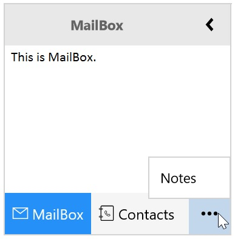

---
layout: post
title: Overflow Popup in UWP Navigation Pane control | Syncfusion
description: Learn here all about Overflow Popup support in Syncfusion UWP Navigation Pane (SfGroupBar) control and more.
platform: UWP
control: SfGroupBar
documentation: ug
--- 

# Overflow Popup in UWP Navigation Pane (SfGroupBar)

When SfGroupBar Items overflow in the items panel, those overflown items are displayed in the overflow popup. Overflow popup is placed at right bottom in Expanded mode and placed at bottom in Collapsed mode. `SfGroupBarItem` which overflow out of viewport panel can be set as SelectedItem by selecting item from the Overflow Popup.

