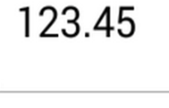
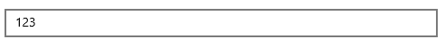

# Decimal Digits in UWP Numeric Entry

## Set Maximum Number of Decimal Digits in UWP Numeric Entry

The maximum number of digits to be displayed after the decimal point can be specified by using [`MaximumNumberDecimalDigits`](https://help.syncfusion.com/cr/uwp/Syncfusion.UI.Xaml.Controls.Input.SfNumericTextBox.html#Syncfusion_UI_Xaml_Controls_Input_SfNumericTextBox_MaximumNumberDecimalDigits) property. 

N> The `MaximumNumberDecimalDigits` property can be provided with positive value only.





	<syncfusion:SfNumericTextBox x:Name="numericTextBox" Value="123.456" MaximumNumberDecimalDigits="2" />
	




SfNumericTextBox numericTextBox=new SfNumericTextBox();
numericTextBox.Value = 123.456;
numericTextBox.MaximumNumberDecimalDigits=2;
this.Content = numericTextBox;
  




## Remove Default Decimal Digits in UWP Numeric Entry

The default number of decimal digits displayed based on [`MaximumNumberDecimalDigits`](https://help.syncfusion.com/cr/uwp/Syncfusion.UI.Xaml.Controls.Input.SfNumericTextBox.html#Syncfusion_UI_Xaml_Controls_Input_SfNumericTextBox_MaximumNumberDecimalDigits) property. Those default digits to be removed from numeric entry view by specified by using `AllowDefaultDecimalDigits` property. 





	<syncfusion:SfNumericTextBox x:Name="numericTextBox" Value="123" AllowDefaultDecimalDigits="False" MaximumNumberDecimalDigits="2" />
	




            SfNumericTextBox numericTextBox = new SfNumericTextBox();
            numericTextBox.Value = 123;
            numericTextBox.MaximumNumberDecimalDigits = 2;
            numericTextBox.AllowDefaultDecimalDigits = false;
            this.Content = numericTextBox;
  




