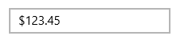

# Number Formatting

Number formatting functionality allows formatting the text based on the FormatString of the control. The control will format the display text on lost focus. 

## Format String

The FormatString property determines the format specifier by which the display text has to be formatted.

Default Value of FormatString is N. 

The following code sample shows how to display numeric text with currency format.





<Page xmlns:editors="using:Syncfusion.UI.Xaml.Controls.Input">

    <Grid Background="{StaticResource ApplicationPageBackgroundThemeBrush}">

        <editors:SfNumericTextBox HorizontalAlignment="Center"

                               VerticalAlignment="Center"

                               Width="200" x:Name="numericTextBox"

FormatString="C"

                               Value="123.45"/>

    </Grid>

</Page>









 numericTextBox.FormatString = "C";





 numericTextBox.FormatString = "C"





N>  A detailed explanation of Numeric formatting is available [here](http://msdn.microsoft.com/en-us/library/dwhawy9k.aspx). 
The result string produced by these format specifiers are influenced by the settings in the Regional Options control panel. Computers with different cultures or different numeric settings will generate different result strings.

## Group separator modes

[`GroupSeparatorMode`](https://help.syncfusion.com/cr/uwp/Syncfusion.UI.Xaml.Controls.Input.SfNumericTextBox.html#Syncfusion_UI_Xaml_Controls_Input_SfNumericTextBox_GroupSeparatorMode) provides 2 states to display the group separator. 
When the mode is set as `Always`, it will display separator while typing itself on the other hand when the mode is set as `LostFocus` it will enable the separator when the control lost its focus.

N> [`EnableGroupSeparator`](https://help.syncfusion.com/cr/uwp/Syncfusion.UI.Xaml.Controls.Input.SfNumericTextBox.html#Syncfusion_UI_Xaml_Controls_Input_SfNumericTextBox_EnableGroupSeparator) property must be enabled to use the [`GroupSeparatorMode`](https://help.syncfusion.com/cr/uwp/Syncfusion.UI.Xaml.Controls.Input.SfNumericTextBox.html#Syncfusion_UI_Xaml_Controls_Input_SfNumericTextBox_GroupSeparatorMode).




 
  <numeric:SfNumericTextBox Value="123456" FormatString="n" GroupSeparatorMode="Always"
                                  EnableGroupSeparator="True">
            
        </numeric:SfNumericTextBox>





     SfNumericTextBox numericTextBox = new SfNumericTextBox();
            numericTextBox.Value = 123456;
            numericTextBox.FormatString = "n";
            numericTextBox.GroupSeparatorMode = GroupSeparatorMode.Always;
            numericTextBox.EnableGroupSeparator = true;
            this.Content = numericTextBox;





