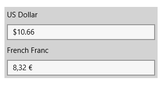

# UWP Numeric TextBox (SfNumericTextBox) Overview

SfNumericTextBox is an advanced version of the TextBox control which restricts input to numeric values. The control respects the UI culture and can be configured to display different formats like currency format, scientific format, etc.

### Key Features

* Number Formatting – Input string can be formatted using format strings. 
* Culture – Number format can be localized to any specific culture.
* Null Value – The control will allow the user to set null value.
* Parsing Mode – Value gets parsed based on this property.
