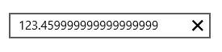

# ParsingMode in UWP Numeric TextBox (SfNumericTextBox)

Value of the SfNumericTextBox gets parsed based on ParsingMode property. ParsingMode is of type Parsers which is enum of Double and Decimal. DefaultValue for ParsingMode is Double.




<Page xmlns:editors="using:Syncfusion.UI.Xaml.Controls.Input">

    <Grid Background="{StaticResource ApplicationPageBackgroundThemeBrush}">

        <editors:SfNumericTextBox x:Name="numericTextBox"

                               HorizontalAlignment="Center"

                               VerticalAlignment="Center"

                               Width="250" 

                               ParsingMode="Decimal"

                               Value="123.459999999999999999"/>

    </Grid>

</Page>









 numericTextBox.ParsingMode = Syncfusion.UI.Xaml.Controls.Input.Parsers.Decimal;





 numericTextBox.ParsingMode = Syncfusion.UI.Xaml.Controls.Input.Parsers.Decimal





N>The `ParsingMode` should be set based on the data type. For example, if a `Decimal` type property is bound to Value property of SfNumericTextBox, then the `ParsingMode` should be set as `Decimal`.

