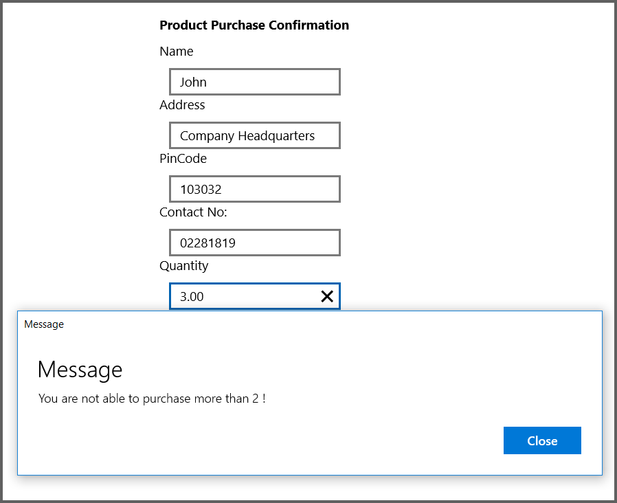
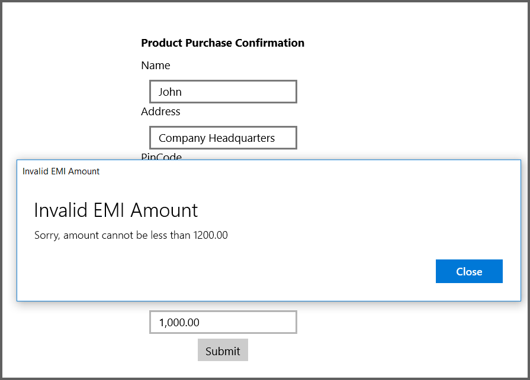

# Value Change Mode in UWP Numeric TextBox (SfNumericTextBox)

The ValueChangeMode property is used to mention when the validation need to take place, either in key pressed or in focus lost. When ValueChangeMode is set to OnKeyFocus, the validation will be carried out for each key press. When ValueChangeMode is OnLostFocus, the validation occur when the control lost the focus or the focus move to next control. ValueChangeMode includes the following options:

1. OnKeyFocus
2. OnLostFocus

In below code sample, the control with name "Quantity_sfNumericTextBox" for Quantity has explained `OnKeyFocus` mode of `ValueChangedMode` and "EMI_sfNumericTextBox1" explained `OnLostFocus` mode of `ValueChangedMode` The following code samples show how to use the ValueChangeMode property. 



   <Grid Background="{ThemeResource ApplicationPageBackgroundThemeBrush}" >
      
        <StackPanel VerticalAlignment="Center" HorizontalAlignment="Center">
 
        <TextBlock Text="Product Purchase Confirmation" Height="30" FontWeight="Bold"/>
 
        <TextBlock Text="Name" Height="30"/>
        <TextBox Height="30"  Width="200" HorizontalAlignment="Center"/>
 
        <TextBlock  Text="Address" Height="30"/>
        <TextBox  Height="30" Width="200" TextWrapping="Wrap" HorizontalAlignment="Center"/>
 
        <TextBlock  Text="PinCode" Height="30"/>
        <TextBox  Height="30" Width="200" InputScope="Number" MaxLength="6" HorizontalAlignment="Center"/>
        <TextBlock  Text="Contact No:" Height="30"/>
        <TextBox  Height="30" Width="200" InputScope="TelephoneNumber" MaxLength="10" HorizontalAlignment="Center"/>
 
        <TextBlock Text="Quantity" Height="30"/>
        <syncfusion:SfNumericTextBox x:Name="Quantity_sfNumericTextBox" Width="200" Height="30" HorizontalAlignment="Center" ValueChangedMode="OnKeyFocus" ValueChanged="sfNumericTextBox_ValueChanged" />
 
        <TextBlock Text="Enter the amount for EMI" Height="30"/>
        <syncfusion:SfNumericTextBox Width="200" x:Name="EMI_sfNumericTextBox1" Height="30" HorizontalAlignment="Center" ValueChangedMode="OnLostFocus" ValueChanged="sfNumericTextBox1_ValueChanged"/>
 
        <Button Height="30" Margin="0,6,0,0" HorizontalAlignment="Center" Content="Submit"/>
 
        </StackPanel>
 </Grid>





        private void sfNumericTextBox_ValueChanged(object sender, Syncfusion.UI.Xaml.Controls.Input.ValueChangedEventArgs e)
        {
            var numericTextBox = (sender as SfNumericTextBox).Value.ToString();

            decimal value = Convert.ToDecimal(numericTextBox);
            if (value > 2)
            {
                var dialog = new MessageDialog("You are not able to purchase more than 2 !", "Message");
                dialog.ShowAsync();
            }
            
        }

        private void sfNumericTextBox1_ValueChanged(object sender, ValueChangedEventArgs e)
        {
            var numericTextBox = (sender as SfNumericTextBox).Value.ToString();

            decimal value = Convert.ToDecimal(numericTextBox);
            if (value < 1200)
            {
                var dialog = new MessageDialog("Sorry, amount cannot be less than 1200.00", "Invalid EMI Amount");
                dialog.ShowAsync();
            }
        }



###OnKeyFocus

###OnLostFocus

## See also

[What is the purpose of value change mode in SfNumericTextBox](https://www.syncfusion.com/kb/6960/what-is-the-purpose-of-valuechangemode-in-sfnumerictextbox)
