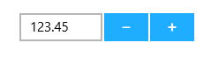
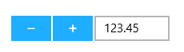
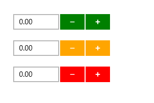

# Appearance and Styling in UWP Numeric UpDown (SfNumericUpDown)

## Spin Buttons Alignment

Spin Button position in the SfNumericUpDown control can be changed relative to the TextBox based on SpinButtonsAlignment. There are three built-in modes.

1. Right
2. Left
3. Both

### Right

Spin Buttons will get aligned to the right side of the control.





<Page xmlns:editors="using:Syncfusion.UI.Xaml.Controls.Input">

    <Grid Background="{StaticResource ApplicationPageBackgroundThemeBrush}">

        <editors:SfNumericUpDown x:Name="numericUpDown"

                               HorizontalAlignment="Center"

                               VerticalAlignment="Center"

                               Width="200" 

SpinButtonsAlignment="Right"

                               Value="123.45"/>

    </Grid>

</Page>









numericUpDown.SpinButtonsAlignment = Syncfusion.UI.Xaml.Controls.SpinButtonsAlignment.Right;





numericUpDown.SpinButtonsAlignment = Syncfusion.UI.Xaml.Controls.SpinButtonsAlignment.Right





### Left

Spin Buttons will get aligned to the left side of the control.





<Page xmlns:editors="using:Syncfusion.UI.Xaml.Controls.Input">

    <Grid Background="{StaticResource ApplicationPageBackgroundThemeBrush}">

        <editors:SfNumericUpDown x:Name="numericUpDown"

                               HorizontalAlignment="Center"

                               VerticalAlignment="Center"

                               Width="200" 

SpinButtonsAlignment="Left"

                               Value="123.45"/>

    </Grid>

</Page>









 numericUpDown.SpinButtonsAlignment = Syncfusion.UI.Xaml.Controls.SpinButtonsAlignment.Left;





 numericUpDown.SpinButtonsAlignment = Syncfusion.UI.Xaml.Controls.SpinButtonsAlignment.Left





### Both

 Spin Buttons will get aligned to the both sides of the control.





<Page xmlns:editors="using:Syncfusion.UI.Xaml.Controls.Input">

    <Grid Background="{StaticResource ApplicationPageBackgroundThemeBrush}">

        <editors:SfNumericUpDown x:Name="numericUpDown"

                               HorizontalAlignment="Center"

                               VerticalAlignment="Center"

                               Width="200" 

SpinButtonsAlignment="Both"

                               Value="123.45"/>

    </Grid>

</Page>









numericUpDown.SpinButtonsAlignment = Syncfusion.UI.Xaml.Controls.SpinButtonsAlignment.Both;





numericUpDown.SpinButtonsAlignment = Syncfusion.UI.Xaml.Controls.SpinButtonsAlignment.Both





## Accent Brush

Accent Brush property is used to decorate the hot spots of a control with a solid color. 





<Grid Background="{StaticResource ApplicationPageBackgroundThemeBrush}">

        <syncfusion:SfNumericUpDown VerticalAlignment="Center"

                                  HorizontalAlignment="Center"

                                  Width="200" 

AccentBrush="Green"/>

</Grid>









 numericUpDown.AccentBrush = new SolidColorBrush(Colors.Green);





 numericUpDown.AccentBrush = New SolidColorBrush(Colors.Green)





The following image shows the control with various accent brushes.

