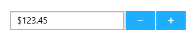
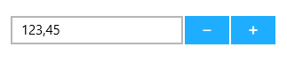
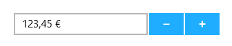

# Number Formatting in UWP Numeric UpDown (SfNumericUpDown)

Number formatting functionality allows to format the text based on the FormatString of the control. The control will format the display text on lost focus. 

## FormatString

The FormatString property determines the format specifier by which the display text has to be formatted.

Default Value of FormatString is N. 





<Page xmlns:editors="using:Syncfusion.UI.Xaml.Controls.Input">

    <Grid Background="{StaticResource ApplicationPageBackgroundThemeBrush}">

        <editors:SfNumericUpDown x:Name="numericUpDown"

                               HorizontalAlignment="Center"

                               VerticalAlignment="Center"

                               Width="200" 

FormatString="C"

                               Value="123.45"/>

    </Grid>

</Page>









  numericUpDown.FormatString = "C";





 numericUpDown.FormatString = "C"





N>  A detailed explanation of Numeric formatting is available here. The result string produced by these format specifiers are influenced by the settings in the Regional Options control panel. Computers with different cultures or different numeric settings will generate different result strings.
 

## Culture

The Culture property helps to localize the SfNumericUpDown control. Culture property is of type CultureInfo. Text will be formatted based on the specified Culture. Default Value is the Current UI Culture.





SfNumericUpDown updown = new SfNumericUpDown();

updown.Value = 123.45;

updown.Culture = new CultureInfo("de-DE");





Dim updown As New SfNumericUpDown()

updown.Value = 123.45

updown.Culture = New CultureInfo("de-DE")





N> Note that the decimal separator and group separator are affected by the culture in this case.

N>  Since CultureInfo type does not contain a default constructor, it is not possible to set this property from XAML.

## Culture with formatting

SfNumericUpDown which respects both Culture and FormatString while formatting Text. In the below Code snippet, German Culture and Currency format specifier have been set for Culture and FormatString properties respectively.




<Page xmlns:editors="using:Syncfusion.UI.Xaml.Controls.Input">

    <Grid Background="{StaticResource ApplicationPageBackgroundThemeBrush}">

        <editors:SfNumericUpDown x:Name="numericUpDown"

                               HorizontalAlignment="Center"

                               VerticalAlignment="Center"

                               Width="200" 

FormatString="C"

                               Value="123.45"/>

    </Grid>

</Page>









numericUpDown.Culture = new System.Globalization.CultureInfo("de-DE");





numericUpDown.Culture = New System.Globalization.CultureInfo("de-DE")





## See also

[How to format the display text as currency in SfNumericUpDown](https://www.syncfusion.com/kb/6959/how-to-format-the-display-text-as-currency-in-sfnumericupdown)
