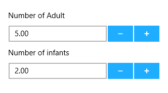

# UWP Numeric UpDown (SfNumericUpDown) Overview

SfNumericUpDown is an editor control which provides up and down repeat buttons to increment and decrement the values. The control respects the UI culture and can be configured to display different formats like currency format, scientific format, etc.

### Key Features

* Number Formatting – Number can be formatted by setting the Format String for the control. 
* Culture – Number can be localized by setting Culture property of the control.
* Null Value – The control will allow the user to set Null Value for the control.
* Range – User can restrict the Values between a specific range by setting Maximum and Minimum value.
* Auto Reverse – When the Value reaches either Maximum or Minimum value, it automatically reverses the value from the Maximum or Minimum value.
* Parsing Mode – Value gets parsed based on this property.
* Spin Buttons Alignment – The alignment of Up and Down repeat buttons can be customized.
