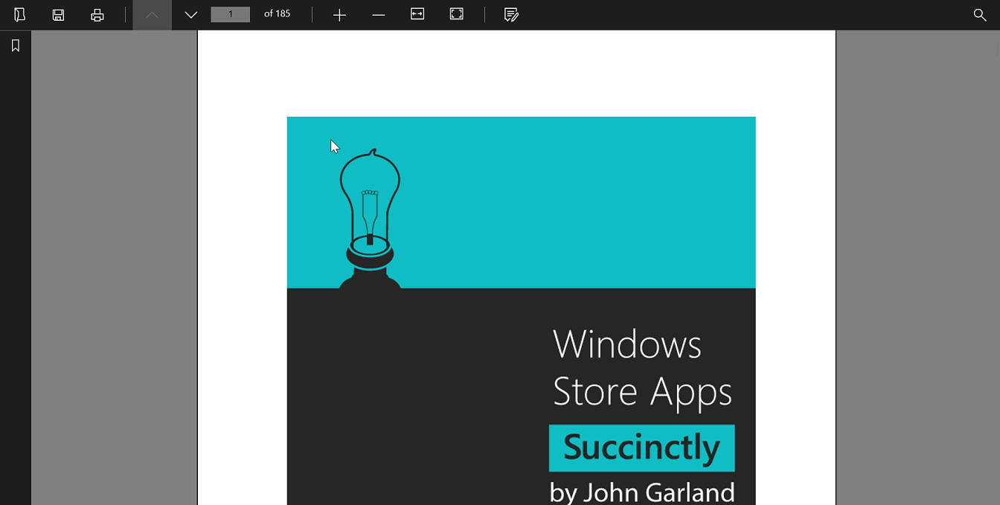
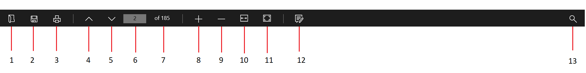
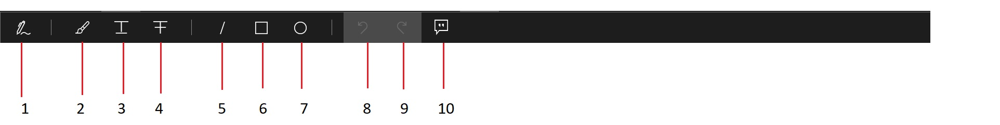
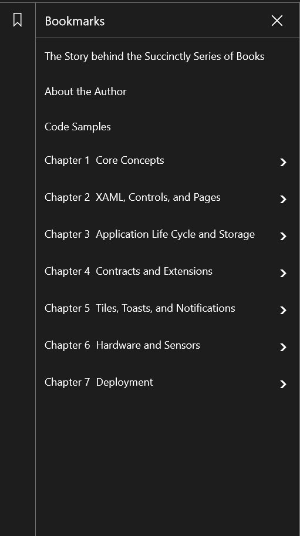

# Desktop in UWP Pdf Viewer (SfPdfViewer)

In desktop the custom toolbar application has the following toolbars.

1.	Top toolbar
2.	Annotation toolbar
3.	Search toolbar
4.	Bookmark toolbar

All the four toolbars will not be always visible. Some of the toolbars will be visible only when required. For instance, the search toolbar will appear only when the search button is clicked. Toolbars in the custom toolbar application are designed in such a way that multiple toolbars will share a row or column. Their visibility will be toggled based on the requirement of the toolbars. When one toolbar is visible, others will be hidden. 

The code snippets provided in this whole section are basic and are only given as examples. Do not copy and paste them as such in your sample. For working code refer the complete sample attached at the bottom of this page. This sample is the same as in the &#34;UI design for mobile&#34; page. 

## PdfViewer

Add a Grid to the desktop XAML page and name it as &#34;parentGrid&#34; and add rows and columns as shown below. This Grid will act as the parent of all elements in the sample. Define an event handler for the Loaded method of the Grid. 




<Grid x:Name="parentGrid" Loaded="PageLoaded" >
<Grid.ColumnDefinitions>
            <ColumnDefinition Width="40" />
            <ColumnDefinition Width="*" />
        </Grid.ColumnDefinitions>

        <Grid.RowDefinitions>
            <RowDefinition Height="40" />
            <RowDefinition Height="*" />
        </Grid.RowDefinitions>
</Grid>




Add PdfViewer to the main Grid parentGrid. 




<cc:SfPdfViewerControl Name="pdfViewer" Grid.Row="1" Grid.ColumnSpan="2"/>




In the PageLoaded method, load a PDF from the Assets folder. Set the text of the PageCountText textbox to the page count of the PDF. The PageCountText textbox will be described later in the &#34;Top Toolbar&#34; section




private async void PageLoaded(object sender, RoutedEventArgs e)
{
    Assembly assembly = typeof(MainPage).GetTypeInfo().Assembly;
    Stream fileStream = assembly.GetManifestResourceStream("PdfViewerCustomToolbar.Assets.WindowsStoreApps_Succinctly.pdf");
    byte[] buffer = new byte[fileStream.Length];
    fileStream.Read(buffer, 0, buffer.Length);
    PdfLoadedDocument loadedDocument = new PdfLoadedDocument(buffer);
    BookmarkButton.IsEnabled = false;
    pdfViewer.PageChanged += PdfViewer_PageChanged;
    pdfViewer.LoadDocument(loadedDocument);
    if (PageCountText != null)
       PageCountText.Text = string.Format("of {0}", pdfViewer.PageCount.ToString());

    if (loadedDocument.Bookmarks.Count > 0)
       BookmarkButton.IsEnabled = true;

    LoadNavigator(loadedDocument);
}




## Top toolbar

The top toolbar will have buttons and other UI elements which will do the following operations. 

1.	Open a PDF
2.	Save the PDF
3.	Print 
4.	Go to previous page
5.	Go to next page
6.	Input page number
7.	Display total page count 
8.	Zoom in 
9.	Zoom out
10.	Fit the PDF to the width of PdfViewer
11.	Fit the PDF so that a whole page is visible
12.	Add annotations
13.	Search a given text

Add a Grid to the parentGrid and add the listed UI elements in successive columns. 




<Grid IsTapEnabled="False" Grid.Column="0" Grid.Row="0" Grid.ColumnSpan="2">
<Grid x:Name="topToolbar" Background="#1d1d1d">

	<Grid.ColumnDefinitions>
		<ColumnDefinition Width="50" />
		<ColumnDefinition Width="50" />
		<ColumnDefinition Width="50" />
		<ColumnDefinition Width="20" />
		<ColumnDefinition Width="50" />
		<ColumnDefinition Width="50" />
		<ColumnDefinition Width="50" />
		<ColumnDefinition Width="70" />
		<ColumnDefinition Width="20" />
		<ColumnDefinition Width="50" />
		<ColumnDefinition Width="50" />
		<ColumnDefinition Width="50" />
		<ColumnDefinition Width="50" />
		<ColumnDefinition Width="20" />
		<ColumnDefinition Width="50" />
		<ColumnDefinition Width="*" />
		<ColumnDefinition Width="50" />
	</Grid.ColumnDefinitions>




## Opening and saving

Add buttons with names &#34;Open&#34; and &#34;Save&#34;. 




<Button x:Name="OpenButton" Grid.Column="0" Click="OpenButton_Click">
<Button x:Name="SaveButton" Grid.Column="1" Click="SaveButton_Click"/>




In the click event handler of the open button read a new PDF using FileOpenPicker into a Stream and load it into PdfViewer. 




async private void OpenButton_Click(object sender, RoutedEventArgs e)
{
    var picker = new FileOpenPicker();
    picker.SuggestedStartLocation = PickerLocationId.DocumentsLibrary;
    picker.ViewMode = PickerViewMode.List;
    picker.FileTypeFilter.Add(".pdf");
    var file = await picker.PickSingleFileAsync();
    if (file == null) return;
       var stream = await file.OpenAsync(Windows.Storage.FileAccessMode.Read);

    Stream fileStream = stream.AsStreamForRead();
    byte[] buffer = new byte[fileStream.Length];
    fileStream.Read(buffer, 0, buffer.Length);
    PdfLoadedDocument loadedDocument = new PdfLoadedDocument(buffer);
    pdfViewer.LoadDocument(loadedDocument);
    if (PageCountText != null)
       PageCountText.Text = string.Format("of {0}", pdfViewer.PageCount.ToString());
    //Fill the bookmark tree with the bookmarks available in the PDF
    LoadNavigator(loadedDocument);
}




The LoadNavigator method is used to populate the bookmark pane with the bookmarks. This method is explained further in the bookmarks section. 
In the event handler of the save button save the PDF at a location picked by the user using FileSavePicker. 




private void SaveButton_Click(object sender, RoutedEventArgs e)
{
    string filename = "output.pdf";
    Stream stream = pdfViewer.Save();
    stream.Position = 0;

    FileSavePicker savePicker = new FileSavePicker();
    savePicker.DefaultFileExtension = ".pdf";
    savePicker.SuggestedFileName = filename;
    savePicker.FileTypeChoices.Add("Adobe PDF Document", new List<string>() { ".pdf" });
    StorageFile stFile = await savePicker.PickSaveFileAsync();
    if (stFile != null)
    {
       Windows.Storage.Streams.IRandomAccessStream fileStream = await stFile.OpenAsync(FileAccessMode.ReadWrite);
       Stream st = fileStream.AsStreamForWrite();
       st.SetLength(0);
       st.Write((stream as MemoryStream).ToArray(), 0, (int)stream.Length);
       st.Flush();
       st.Dispose();
       fileStream.Dispose();
    }
}




## Printing and page navigation

Add buttons with names &#34;PrintButton&#34;, &#34;PrevPageButton&#34;,&#34;NextPageButton&#34;. Set the Command properties of the buttons to PrintCommand, PreviousPageCommand and NextPageCommand respectively. 

Remember that the DataContext of the MainPage is PdfViewer. 

In the next column add a text box which accepts the page number to go to. 




<Button x:Name="PrintButton" Grid.Column="2" Command="{Binding PrintCommand}" />
<Button Name="PrevPageButton" Grid.Column="4" Command="{Binding PreviousPageCommand}" />
<Button Name="NextPageButton" Grid.Column="5" Command="{Binding NextPageCommand}" />
<TextBox x:Name="PageDestinationTextBox" Grid.Column="6" KeyDown="PageDestinationTextBox_KeyDown"/>




In the KeyDown event handler of the textbox get the input page number from the textbox and navigate to the page using GoToPage method. 




private async void PageDestinationTextBox_KeyDown(object sender, KeyRoutedEventArgs e)
{
    if (!string.IsNullOrEmpty(PageDestinationTextBox.Text))
    {
         bool result = int.TryParse(PageDestinationTextBox.Text, out destinationPage);
         if (e.Key == VirtualKey.Enter && result)
         {
             if (destinationPage > 0 && destinationPage <= pdfViewer.PageCount)
             {
                 pdfViewer.GotoPage(destinationPage);
                 e.Handled = true;
             }     
         }
    }
}




## Display total number of pages

Add a text block with name &#34;PageCountText&#34;.




<TextBlock x:Name="PageCountText " Grid.Column="7" />




## Magnification and view mode

Add buttons with names &#34;ZoomInButton&#34; and &#34;ZoomOutButton&#34; and set the Command properties to IncreaseZoomCommand and DecreaseZoomCommand. 
Then add buttons with names &#34;FitWidthButton&#34; and &#34;OnePageButton&#34;.   




<Button x:Name="ZoomInButton" Grid.Column="9" Command="{Binding IncreaseZoomCommand}" />
<Button x:Name="ZoomOutButton" Grid.Column="10" Command="{Binding DecreaseZoomCommand}" />
<Button x:Name="FitWidthButton" Grid.Column="11" Click="FitWidthButtonClicked"/>
<Button x:Name="OnePageButton" Grid.Column="12" Click="OnePageButtonClicked" />




In the click event handlers of the buttons set the &#34;ViewMode&#34; of the PdfViewer.




private void FitWidthButtonClicked(object sender, RoutedEventArgs e)
{
    pdfViewer.ViewMode = PageViewMode.FitWidth;
}

private void OnePageButtonClicked(object sender, RoutedEventArgs e)
{
    pdfViewer.ViewMode = PageViewMode.OnePage;
}




## Add annotations 

Add a button with name &#34;AnnotationButton&#34;.



<Button Name="AnnotationButton" Grid.Column="14" Click="AnnotationButton_Click" />




In the click event handler toggle the visibility of the annotation toolbar. Creation of the annotation toolbar will be described shortly.




private void AnnotationButton_Click(object sender, RoutedEventArgs e)
{
   if (!isAnnotationTabVisible)
   {
      AnnotationTab.Visibility = Visibility.Visible;
      isAnnotationTabVisible = true;
   }
   else
   {
      AnnotationTab.Visibility = Visibility.Collapsed;
      isAnnotationTabVisible = false;
   }
}




## Search a given text

Add a button with name &#34;SearchButton&#34;. 




<Button Name="SearchButton" Grid.Column="16" Click="SearchButton_Click" />




In the click event handler toggle the visibility of the search toolbar. Search toolbar will be describer later. 




private void SearchButton_Click(object sender, RoutedEventArgs e)
{
    if (!isSearchTabVisible)
    {
        SearchTab.Visibility = Visibility.Visible;
        isSearchTabVisible = true;
    }
    else
    {
        SearchTab.Visibility = Visibility.Collapsed;
        isSearchTabVisible = false;
    }
}




## Annotation toolbar

The annotation toolbar will have buttons for the following operations. 

1.	Add ink annotations
2.	Add text highlights
3.	Add text underlines
4.	Add text strikethrough
5.	Add Lines
6.	Add Rectangles
7.	Add ellipses
8.	Undo the annotation changes
9.	Redo the annotation changes
10.	Add popup annotations

Add a Grid to the desktop xaml with name &#34;AnnotationToolbar&#34; and add the listed elements in successive columns. 




<Grid Grid.Row="0" x:Name="AnnotationToolbar">
    <Grid.ColumnDefinitions>
       <ColumnDefinition Width="50" />
       <ColumnDefinition Width="30" />
       <ColumnDefinition Width="50" />
       <ColumnDefinition Width="50" />
       <ColumnDefinition Width="50" />
       <ColumnDefinition Width="30" />
       <ColumnDefinition Width="50" />
       <ColumnDefinition Width="50" />
       <ColumnDefinition Width="50" />
       <ColumnDefinition Width="30" />
       <ColumnDefinition Width="50" />
       <ColumnDefinition Width="50" />
       <ColumnDefinition Width="50" />
       <ColumnDefinition Width="*" />
       <ColumnDefinition Width="50" />
     </Grid.ColumnDefinitions>




## Add annotations

Add a toggle buttons with names &#34;InkButton&#34;, &#34;HighlightButton&#34;, &#34;UnderlineButton&#34;, &#34;StrikethroughButton&#34;, &#34;LineButton&#34;,&#34;RectangleButton&#34;, &#34;EllipseButton&#34; and &#34;PopupButton&#34;. 




<ToggleButton Name="InkButton" Grid.Column="0" Checked="InkButton_Checked" Unchecked="InkButton_Unchecked" />

<ToggleButton Name="HighlightButton" Grid.Column="2" Checked="HighlightButton_Checked" Unchecked="HighlightButton_Unchecked" />

<ToggleButton Name="UnderlineButton" Grid.Column="3" Checked="UnderlineButton_Checked" Unchecked="UnderlineButton_Unchecked" />

<ToggleButton Name="StrikethroughButton" Grid.Column="4" Checked="StrikethroughButton_Checked" Unchecked="StrikethroughButton_Unchecked" />

<ToggleButton Name="LineButton" Grid.Column="6" Checked="LineButton_Checked" Unchecked="LineButton_Unchecked" />

<ToggleButton Name=" RectangleButton" Grid.Column="7" Checked=" RectangleButton_Checked" Unchecked=" RectangleButton_Unchecked" /> 

<ToggleButton Name="EllipseButton" Grid.Column="8" Checked="EllipseButton_Checked" Unchecked="EllipseButton_Unchecked" /> 

<ToggleButton Name="PopupButton" Grid.Column="12" Checked="PopupButton_Checked" Unchecked="PopupButton_Unchecked" />




In the Checked event handlers of the toggle buttons enable the annotations 




private void InkButton_Checked(object sender, RoutedEventArgs e)
{
    pdfViewer.InkAnnotationCommand.Execute(true);
} 

private void HighlightButton_Checked(object sender, RoutedEventArgs e)
{
    pdfViewer.HighlightAnnotationCommand.Execute(true);
}

private void UnderlineButton_Checked(object sender, RoutedEventArgs e)
{
     pdfViewer.UnderlineAnnotationCommand.Execute(true);
}

private void StrikethroughButton_Checked(object sender, RoutedEventArgs e)
{
     pdfViewer.StrikeoutAnnotationCommand.Execute(true);
}

private void LineButton_Checked(object sender, RoutedEventArgs e)
{
    pdfViewer.LineAnnotationCommand.Execute(true);
}

private void RectangleButton_Checked (object sender, RoutedEventArgs e)
{
    pdfViewer. RectangleAnnotationCommand.Execute(true);
}

private void EllipseButton_Checked(object sender, RoutedEventArgs e)
{
    pdfViewer.EllipseAnnotationCommand.Execute(true);
}

private void PopupButton_Checked(object sender, RoutedEventArgs e)
{
     pdfViewer.PopupAnnotationCommand.Execute(true);
}




In the Unchecked event handlers disable the annotations. 




private void InkButton_Unchecked(object sender, RoutedEventArgs e)
{
    pdfViewer.InkAnnotationCommand.Execute(false);
}

private void HighlightButton_Unchecked(object sender, RoutedEventArgs e)
{
    pdfViewer.HighlightAnnotationCommand.Execute(false);
}

private void UnderlineButton_Unchecked(object sender, RoutedEventArgs e)
{
     pdfViewer.UnderlineAnnotationCommand.Execute(false);
}

private void StrikethroughButton_Unchecked(object sender, RoutedEventArgs e)
{
     pdfViewer.StrikeoutAnnotationCommand.Execute(false);
}

private void LineButton_Unchecked(object sender, RoutedEventArgs e)
{
    pdfViewer.LineAnnotationCommand.Execute(false);
}

private void RectangleButton_Unchecked (object sender, RoutedEventArgs e)
{
    pdfViewer. RectangleAnnotationCommand.Execute(false);
}

private void EllipseButton_Unchecked(object sender, RoutedEventArgs e)
{
    pdfViewer.EllipseAnnotationCommand.Execute(false);
    m_isButtonClicked = true;
}

private void PopupButton_Unchecked(object sender, RoutedEventArgs e)
{
     pdfViewer.PopupAnnotationCommand.Execute(false);
}




## Undo and redo annotation changes

Add two buttons set their Command properties to UndoCommand and RedoCommand respectively. 




<Button Grid.Column="10" Command="{Binding ElementName=pdfViewer, Path=UndoCommand, Mode=TwoWay}" />
<Button Grid.Column="11" Command="{Binding ElementName=pdfViewer, Path=RedoCommand, Mode=TwoWay}" />




## Search toolbar

The search toolbar will have the UI elements listed below. 

1.	Text box to get the input text
2.	Button to go to the next instance
3.	Button to go to the previous instance

Add a Grid with name &#34;SearchToolbar&#34;. In this Grid add a textbox with name &#34;SearchTextBox&#34; and two buttons with names &#34;NextButton&#34; and &#34;PreviousButton&#34; in successive columns. 
Set the Command properties of the buttons to SearchNextCommand and SearchPreviousCommand respectively.




<Grid Grid.Row="0" x:Name=" SearchToolbar" >
   <Grid.ColumnDefinitions>
      <ColumnDefinition Width="260" />
      <ColumnDefinition Width="50" />
      <ColumnDefinition Width="50" />
    </Grid.ColumnDefinitions>

<TextBox Name="SearchTextBox" FontSize="12" Grid.Column="0" PlaceholderText="   Enter text to search" KeyDown="SearchTextBox_KeyDown" />

<Button x:Name="NextButton" Grid.Column="3" Command="{Binding SearchNextCommand}" CommandParameter="{Binding Text, ElementName=SearchTextBox}" />

<Button x:Name="PrevButton" Grid.Column="2" Command="{Binding SearchPreviousCommand}" CommandParameter="{Binding Text, ElementName=SearchTextBox}" />
                </Grid>




## Bookmark toolbar

Bookmark toolbar consists of a button which when clicked shows the bookmarks available in the PDF. 
Add a Grid with name &#34;BookmarkToolbar&#34; to the parentGrid. Add a button with name &#34;BookmarkButton&#34; to this grid. 




<Grid x:Name="BookmarkToolbar" Grid.Row="1" Grid.Column="0">
<Button x:Name="BookmarkButton" Click="Bookmark_Click"/>        
</Grid>




In the Click event handler of the bookmark button toggle the visibility of the bookmark grid which will show the available bookmarks. The bookmark grid will be described shortly. 




private void Bookmark_Click(object sender, RoutedEventArgs e)
{

    if (!isBookmarkClicked)
    {
        BookmarkGrid.Visibility = Visibility.Visible;
        isBookmarkClicked = true;
    }
    else
    {
        BookmarkGrid.Visibility = Visibility.Collapsed;
        isBookmarkClicked = false;
    }

}




Add another grid to the parentGrid. This grid will have the following UI elements. 

1.	Button to close the bookmarks
2.	Syncfusion&#39;s SfTreeNavigator control to show the bookmarks




<Grid Grid.Column="0" x:Name="BookmarkGrid" Visibility="Collapsed" Width="300" >
    <Grid.RowDefinitions>
        <RowDefinition Height="40" />
        <RowDefinition Height="*" />
    </Grid.RowDefinitions>

<Grid Grid.Row="0">

<Button x:Name="closeBookmarkButton" Click="closeBookmarkButton_Click" HorizontalAlignment="Right"/>

</Grid>

<tn:SfTreeNavigator x:Name="treeNavigator" Grid.Row="1" Width="300" NavigationMode="Extended" />
</Grid>




In the Click event handler of the close button hide the bookmark grid. 




private void closeBookmarkButton_Click(object sender, RoutedEventArgs e)
{
    BookmarkGrid.Visibility = Visibility.Collapsed;
}




Implement the LoadNavigator method which is called when a PDF is loaded as mentioned in the &#34;open and save&#34; section. Iterate through all the bookmarks available in the PDF and populate the SfTreeNavigator with NavigatorItems with bookmarks&#39; names as title in a tree structure. 




private void LoadNavigator(PdfLoadedDocument loadedDocument)
{
    PdfBookmarkBase bookmarkBase = loadedDocument.Bookmarks;
    PdfBookmark bookmark;
    SfTreeNavigatorItem navigatorItem;

    treeNavigator.Items.Clear();

    for (int i = 0; i < bookmarkBase.Count; i++)
    {
        bookmark = bookmarkBase[i] as PdfLoadedBookmark;
        navigatorItem = AddChildBookmarks(bookmark);
        navigatorItem.ItemClicked += NavigatorItem_ItemClicked;
                  
        treeNavigator.Items.Add(navigatorItem);
    }
}

private SfTreeNavigatorItem AddChildBookmarks(PdfBookmark bookmark)
{
    if (bookmark != null)
    {
       SfTreeNavigatorItem child = new SfTreeNavigatorItem() { Padding = new Thickness(10) };

       string header = bookmark.Title;
       child.Header = header;
       child.ItemClicked += NavigatorItem_ItemClicked;
       
       child.Tag = bookmark;

        if (bookmark.Count != 0)
        {
            for (int i = 0; i < bookmark.Count; i++)
            {
                SfTreeNavigatorItem innerChild = new SfTreeNavigatorItem();
                string innerHeader = bookmark.Title;
        

                child.Header = innerHeader;
                innerChild.ItemClicked += NavigatorItem_ItemClicked;
        
                innerChild.Tag = bookmark[i];
                child.Items.Add(innerChild);
            }
         }

         if (child.Items != null)
         {
             for (int i = 0; i < child.Items.Count; i++)
                 child.Items[i] = AddChildBookmarks(bookmark[i]);
         }
         return child;
    }
    else
        return null;
}




When a NavigatorItem is clicked the bookmark is retrieved from its Tag property and PdfViewer is programmatically scrolled through the bookmark&#39;s destination using the GoToBookmark method. 




private void NavigatorItem_ItemClicked(object Sender, Syncfusion.UI.Xaml.Controls.Navigation.ItemClickEventArgs args)
{
    SfTreeNavigatorItem item = Sender as SfTreeNavigatorItem;
    PdfBookmark bookmark = item.Tag as PdfBookmark;
    if(bookmarkScroller != null)
    {
         if (bookmark.Count > 0)
             bookmarkScroller.ChangeView(null, 0, null);
    }
    pdfViewer.GoToBookmark(bookmark);
}




Sample:

<http://www.syncfusion.com/downloads/support/directtrac/general/ze/PdfViewerCustomToolbar154257435>

Note that this sample is common to both mobile design and desktop design. 

