# UI design for mobile in UWP Pdf Viewer

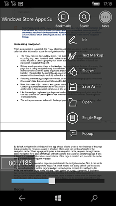

PdfViewer does not have a toolbar by default. But a custom toolbar can be designed at the sample with its buttons wired to the PdfViewer APIs. 

In mobile the custom toolbar application has the following toolbars. 

1.	Top toolbar
2.	More options toolbar
3.	Common annotation bottom toolbar
4.	Shape annotation top toolbar
5.	Text markup annotation top toolbar
6.	Ink annotation top toolbar
7.	Popup annotation top toolbar
8.	Search top toolbar
9.	Search bottom toolbar
10.	Bookmark toolbar
11.	Page number panel
12.	Page slider

By default, only the PDF will be displayed along with the page number text box at the left bottom corner. The toolbars will appear only if the PDF is tapped. They will disappear if the PDF is tapped again. Not all the toolbars will be visible when the PDF is tapped. Some toolbars will appear only when necessary. For instance, search toolbars will appear only when the search button is clicked.  

Also, multiple toolbars occupy same row or column and their visibility are toggled based on necessity. Among multiple toolbars that occupy same column or row only one is visible at a time. 
The code snippets provided in this whole section are basic and are only given as examples. Do not copy and paste them as such in your sample. For working code refer the complete sample attached at the bottom of this page. 

### Performing mobile specific operations in the common code behind

The code behind file MainPage.xaml.cs file is common as mentioned earlier. However, the code snippets are repeated here for convenience. 
Since a common code behind file is used and there are a few differences between mobile and desktop UI designs, we need to identify at some times, whether the application is running on desktop or mobile. In mobile the following condition will be true. 

Windows.Foundation.Metadata.ApiInformation.IsTypePresent(&#34;Windows.Phone.UI.Input.HardwareButtons&#34;) 

In the code snippets below, the code found under an if statement with the above condition are only meant to run in mobile.  

### PdfViewer

Add a Grid with name &#34;parentGrid&#34; to the mobile xaml page. This Grid will act as the parent of all elements in the sample. 




<Grid Loaded="PageLoaded" x:Name="parentGrid">
   <Grid.RowDefinitions>
       <RowDefinition Height="*"/>
   </Grid.RowDefinitions>




Add the PdfViewer to the parent Grid. 




<cc:SfPdfViewerControl Name="pdfViewer"></cc:SfPdfViewerControl>




In the Loaded event handler of the parentGrid load the default PDF from the assets folder. 




private async void PageLoaded(object sender, RoutedEventArgs e)
{
    Assembly assembly = typeof(MainPage).GetTypeInfo().Assembly;
    Stream fileStream = assembly.GetManifestResourceStream("PdfViewerCustomToolbar.Assets.WindowsStoreApps_Succinctly.pdf");
    byte[] buffer = new byte[fileStream.Length];
    fileStream.Read(buffer, 0, buffer.Length);
    PdfLoadedDocument loadedDocument = new PdfLoadedDocument(buffer);
    BookmarkButton.IsEnabled = false;
    pdfViewer.PageChanged += PdfViewer_PageChanged;
    pdfViewer.LoadDocument(loadedDocument);
    if (PageCountText != null)
       PageCountText.Text = string.Format("of {0}", pdfViewer.PageCount.ToString());
	if (Windows.Foundation.Metadata.ApiInformation.IsTypePresent("Windows.Phone.UI.Input.HardwareButtons"))
	{
		PdfSlider.Minimum = 1;
		PdfSlider.Maximum = pdfViewer.PageCount;
		PdfSlider.Value = 1;
		CurrentPage.Text = "1";
		PageNumber.Text = "/" + pdfViewer.PageCount.ToString();
		DocumentName.Text = "Windows Store Apps Succinctly.pdf";
	}

    if (loadedDocument.Bookmarks.Count > 0)
       BookmarkButton.IsEnabled = true;

    LoadNavigator(loadedDocument);
}




### Top toolbar

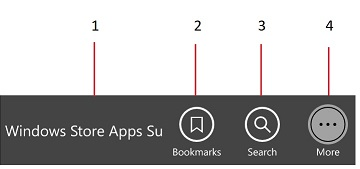

Top toolbar has the following elements

1.	A TextBlock which displays the PDF name
2.	Bookmark button	
3.	Text search button	
4.	More options button

Add a Grid with name &#34;TopToolbar&#34; to the parentGrid. In successive columns add a TextBlock with name &#34;DocumentName&#34;, Two buttons with name &#34;BookmarkButton&#34; and &#34;SearchButton&#34; and a ToggleButton with name &#34;MoreButton&#34;. 




   <Grid x:Name="TopToolbar" Height="70" >
       <Grid.ColumnDefinitions>
            <ColumnDefinition Width="5*"></ColumnDefinition>
            <ColumnDefinition Width="2*"></ColumnDefinition>
            <ColumnDefinition Width="2*"></ColumnDefinition>
            <ColumnDefinition Width="2*"></ColumnDefinition>
       </Grid.ColumnDefinitions>

          <TextBlock Grid.Column="0" Name="DocumentName" Foreground="White" Margin="5 0 0 0"/>
       
          <Button Grid.Column="1" x:Name="BookmarkButton"Click="BookmarkButton_Click" HorizontalAlignment="Center"/>

          <Button Grid.Column="2" Name="SearchButton" Click="SearchButton_Click" />
        
           <ToggleButton Grid.Column="3" Name="MoreButton" Checked="MoreButton_Checked" Unchecked="MoreButton_Unchecked" />
</Grid>




The document name is set to the DocumentName text block when the PDF is loaded in both PageLoaded method described above and the OpenButton_Click method which will be described later. 
In the Click event handler of the BookmarkButton make the bookmark pane visible. The bookmark pane will be described later. 




private void BookmarkButton_Click(object sender, RoutedEventArgs e)
{
    BookmarkToolbar.Visibility = Visibility.Visible;
}




In the Checked event handler of the more button make the more options toolbar visible and in the Unchecked event handler make it invisible. 




private void MoreButton_Checked(object sender, RoutedEventArgs e)
{
     MoreOptionsTab.Visibility = Visibility.Visible;
}

private void MoreButton_Unchecked(object sender, RoutedEventArgs e)
{
     MoreOptionsTab.Visibility = Visibility.Collapsed;
}




### More options toolbar

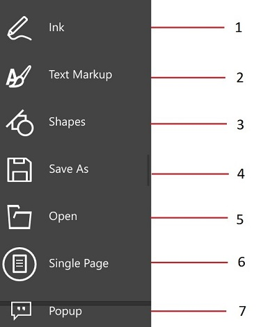

More options toolbar contains buttons to perform the following operations
1.	Add ink annotations
2.	Add text markups
3.	Add shapes
4.	Save the PDF
5.	Open a PDF
6.	Set the view mode to single page
7.	Add popup annotations

Add a Grid with name &#34;MoreOptionsTab&#34; to the parentGrid.  




<Grid x:Name="MoreOptionsTab" >
     <Grid.RowDefinitions>
         <RowDefinition Height="1*"></RowDefinition>
         <RowDefinition Height="1*"></RowDefinition>
         <RowDefinition Height="1*"></RowDefinition>
         <RowDefinition Height="1*"></RowDefinition>
         <RowDefinition Height="1*"></RowDefinition>
         <RowDefinition Height="1*"></RowDefinition>
         <RowDefinition Height="1*"></RowDefinition>
      </Grid.RowDefinitions>

      <Button x:Name="GlobalInkButton" Grid.Row="0" Click="InkButton_Click" />
 
      <Button x:Name="TextMarkupButton" Grid.Row="1" Click="TextMarkupButton_Click" />
 
      <Button x:Name="ShapesButton" Grid.Row="2" Click="ShapesButton_Click" />
      
       <Button x:Name="GlobalSaveButton" Grid.Row="3" Click="SaveButton_Click" />
       
       <Button x:Name="GlobalOpenButton" Grid.Row="4" Click="OpenButton_Click" />
                                
       <Button Name="singlePageButton" Grid.Row="5" Click="SinglePageButton_OnClick" />
                
       <Button Name="normalViewButton" Grid.Row="5" Click="NormalViewButton_Click" />

       <Button x:Name="PopupButton" Grid.Row="6" Click="PopupButton_Click" />
 </Grid>




The single page button and normal view button occupy the same column. Their visibility is toggled based on the current view mode. In the click event handlers of the annotation buttons make the corresponding toolbar visible. These toolbars for each annotation will be described further below. 




private void InkButton_Click(object sender, RoutedEventArgs e)
{
     InkAnnotationToolbar.Visibility = Visibility.Visible;
}

private void PopupButton_Click(object sender, RoutedEventArgs e)
{
     PopupAnnotationToolbar.Visibility = Visibility.Visible;
}

private void TextMarkupButton_Click(object sender, RoutedEventArgs e)
{
     TextMarkupAnnotationToolbar.Visibility = Visibility.Visible;
}

private void ShapesButton_Click(object sender, RoutedEventArgs e)
{
     ShapeAnnotationToolbar.Visibility = Visibility.Visible;
}




In the Click event handler of the save button save the PDF to the location picked by the user.




private void SaveButton_Click(object sender, RoutedEventArgs e)
{
    Stream stream = pdfViewer.Save();
    string filename = "output.pdf";
    stream.Position = 0;

    FileSavePicker savePicker = new FileSavePicker();
    savePicker.DefaultFileExtension = ".pdf";
    savePicker.SuggestedFileName = filename;
    savePicker.FileTypeChoices.Add("Adobe PDF Document", new List<string>() { ".pdf" });
    StorageFile stFile = await savePicker.PickSaveFileAsync();
    if (stFile != null)
    {
         Windows.Storage.Streams.IRandomAccessStream fileStream = await stFile.OpenAsync(FileAccessMode.ReadWrite);
         Stream st = fileStream.AsStreamForWrite();
         st.SetLength(0);
         st.Write((stream as MemoryStream).ToArray(), 0, (int)stream.Length);
         st.Flush();
         st.Dispose();
         fileStream.Dispose();
         MessageDialog messageDialog = new MessageDialog("File has been saved successfully.");
         IUICommand cmd = await messageDialog.ShowAsync();
    }

}




When the open button is clicked read the file picked by the user into a stream and load the stream to PdfViewer. Then populate the tree navigator with the bookmark titles as was done when the default PDF was loaded when the app was launched. 




async private void OpenButton_Click(object sender, RoutedEventArgs e)
{
	var picker = new FileOpenPicker();
	picker.SuggestedStartLocation = PickerLocationId.DocumentsLibrary;
	picker.ViewMode = PickerViewMode.List;
	picker.FileTypeFilter.Add(".pdf");
	var file = await picker.PickSingleFileAsync();
	if (file == null) return;
	var stream = await file.OpenAsync(Windows.Storage.FileAccessMode.Read);
	Stream fileStream = stream.AsStreamForRead();
	byte[] buffer = new byte[fileStream.Length];
	fileStream.Read(buffer, 0, buffer.Length);
	PdfLoadedDocument loadedDocument = new PdfLoadedDocument(buffer);

	if (PageCountText != null)
		PageCountText.Text = string.Format("of {0}", pdfViewer.PageCount.ToString());

	//Fill the bookmark tree with the bookmarks available in the PDF
	LoadNavigator(loadedDocument);
}




When the view mode buttons are clicked set the PageView property of PdfViewer accordingly. 




private void NormalViewButton_Click(object sender, RoutedEventArgs e)
{
     pdfViewer.PageView = PdfViewerPageView.ContinuousPageView;
     singlePageButton.Visibility = Visibility.Visible;
}

private void SinglePageButton_OnClick(object sender, RoutedEventArgs e)
{
     pdfViewer.PageView = PdfViewerPageView.SinglePageView;
     singlePageButton.Visibility = Visibility.Collapsed;
}




### Toolbars for different annotations

When any of the annotations button is clicked the annotation toolbars will be shown. The designs of these toolbars are almost similar. 

### Common bottom toolbar

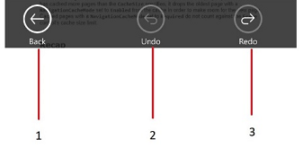

The bottom toolbar is common for ink, text markup, shape and popup annotations. 

1.	Back button which hides the toolbars
2.	Undo button
3.	Redo button

Add a new Grid with name &#34;BottomAnnotationToolbar&#34; to the parent grid. This new grid will serve as the bottom toolbar as show in the screenshot which contains the buttons marked as 1, 2 and 3. 
Set the Command properties of the 2nd and 3rd buttons to the UndoCommand and RedoCommand of PdfViewer respectively. 




<Grid Grid.Row="3" Name="BottomAnnotationToolbar" >
            <Grid.ColumnDefinitions>
                <ColumnDefinition Width="2*"></ColumnDefinition>
                <ColumnDefinition Width="2*"></ColumnDefinition>
                <ColumnDefinition Width="2*"></ColumnDefinition>
            </Grid.ColumnDefinitions>

  <Button Grid.Column="0"  Click="BackButton_Click" Name="BackButton" />
  <Button Grid.Column="1" Name="UndoButton" Command="{Binding ElementName=pdfViewer, Path=UndoCommand, Mode=TwoWay}" 
  <Button Grid.Column="2" Name="RedoButton" Command="{Binding ElementName=pdfViewer, Path=RedoCommand, Mode=TwoWay}">

</Grid>




When the back button is clicked, close all the annotation toolbars and show the default top and bottom toolbars. 




private void BackButton_Click(object sender, RoutedEventArgs e)
{
	if (InkAnnotationToolbar.Visibility == Visibility.Visible)
		InkAnnotationToolbar.Visibility = Visibility.Collapsed;
	else if (TextMarkupAnnotationToolbar.Visibility == Visibility.Visible)
		TextMarkupAnnotationToolbar.Visibility = Visibility.Collapsed;
	else if (ShapeAnnotationToolbar.Visibility == Visibility.Visible)
		ShapeAnnotationToolbar.Visibility = Visibility.Collapsed;
	else if (PopupAnnotationToolbar.Visibility == Visibility.Visible)
		PopupAnnotationToolbar.Visibility = Visibility.Collapsed;
	BottomAnnotationToolbar.Visibility = Visibility.Collapsed;
	TopToolbar.Visibility = Visibility.Visible;
	BottomToolbar.Visibility = Visibility.Visible;
}




### Ink toolbar

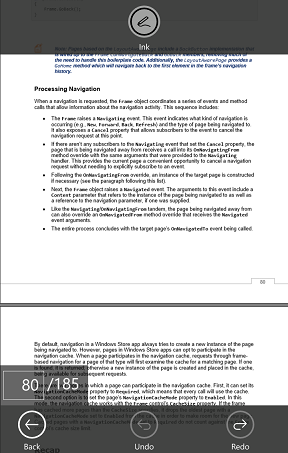

The ink toolbar has only one button which enables or disables the ink annotation mode alternatively. 
Add a grid with name &#34;InkAnnotationToolbar&#34; to the parent grid with a toggle button. 




<Grid Grid.Row="1" x:Name="InkAnnotationToolbar" Height="70" >
    <ToggleButton x:Name="InkButton" Checked="InkButton_Checked" Unchecked="InkButton_Unchecked"/>
</Grid>




When the toggle button was checked enable ink annotation mode and disable it when unchecked. 




private void InkButton_Checked(object sender, RoutedEventArgs e)
{
     pdfViewer.InkAnnotationCommand.Execute(true);
}

private void InkButton_Unchecked(object sender, RoutedEventArgs e)
{
     pdfViewer.InkAnnotationCommand.Execute(false);
}




### Shape annotation toolbar

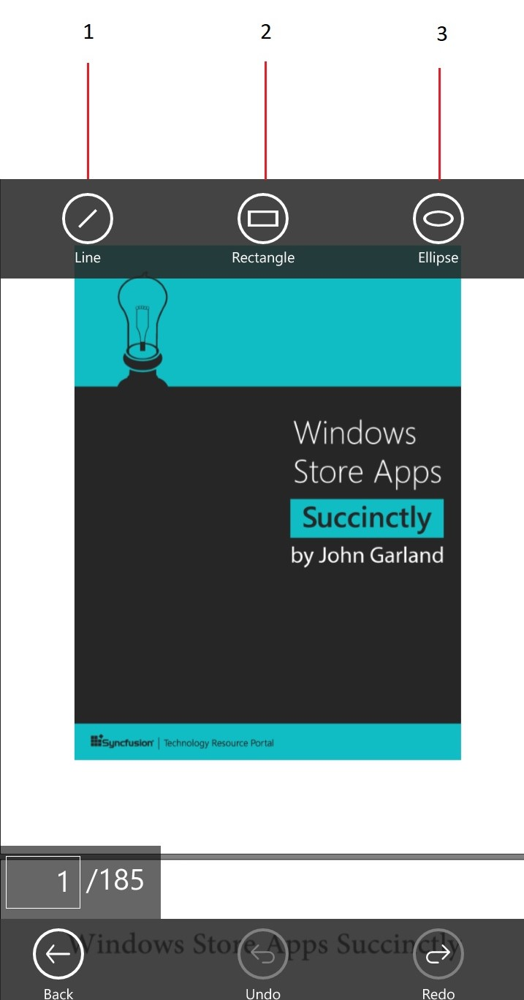

The shape annotation toolbar has three buttons. 
1.	Line annotation mode button
2.	Rectangle annotation mode button
3.	Ellipse annotation mode button

Add a grid with name &#34;ShapeAnnotationToolbar&#34; to the parent grid and add three toggle buttons to the grid. 




   <Grid x:Name="ShapeAnnotationToolbar" Grid.Row="1">
       <Grid.ColumnDefinitions>
           <ColumnDefinition Width="2*"></ColumnDefinition>
           <ColumnDefinition Width="2*"></ColumnDefinition>
           <ColumnDefinition Width="2*"></ColumnDefinition>
       </Grid.ColumnDefinitions>

      <ToggleButton Grid.Column="0" x:Name="LineButton"Checked="LineButton_Checked" Unchecked="LineButton_Unchecked" />
      
       <ToggleButton Grid.Column="1" x:Name="RectangleButton" Checked="RectangleButton_Checked" Unchecked="RectangleButton_Unchecked" />
       <ToggleButton Grid.Column="2" x:Name="EllipseButton" Checked="EllipseButton_Checked" Unchecked="EllipseButton_Unchecked" />
        </Grid>




In the Checked event of the toggle buttons enable the corresponding shape mode and disable the same in the Unchecked event. 




   private void LineButton_Checked(object sender, RoutedEventArgs e)
{
    pdfViewer.LineAnnotationCommand.Execute(true);
}

private void LineButton_Unchecked(object sender, RoutedEventArgs e)
{
    pdfViewer.LineAnnotationCommand.Execute(false);
}

private void RectangleButton_Checked(object sender, RoutedEventArgs e)
{
    pdfViewer.RectangleAnnotationCommand.Execute(true);
}

private void RectangleButton_Unchecked(object sender, RoutedEventArgs e)
{
    pdfViewer.RectangleAnnotationCommand.Execute(false);
}

private void EllipseButton_Checked(object sender, RoutedEventArgs e)
{
    pdfViewer.EllipseAnnotationCommand.Execute(true);
}

private void EllipseButton_Unchecked(object sender, RoutedEventArgs e)
{
    pdfViewer.EllipseAnnotationCommand.Execute(false);
}




### Popup annotation toolbar

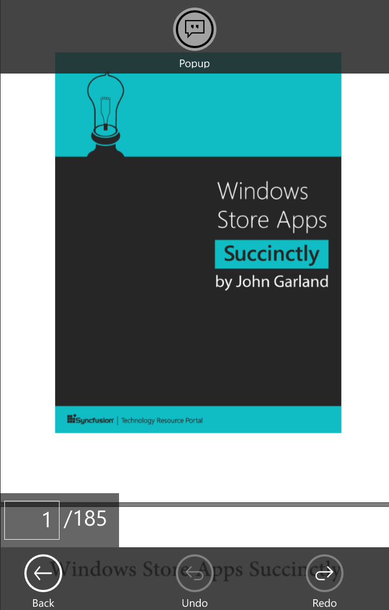

Popup annotation toolbar also has only one button to toggle the popup annotation mode.
Add a grid to the parent grid and add a toggle button to it. 




    <Grid x:Name="PopupAnnotationToolbar" Grid.Row="1"  >
         <ToggleButton x:Name="PopupButton" Checked="PopupButton_Checked" Unchecked="PopupButton_Unchecked">
        </Grid>




Enable popup annotation when the toggle button is checked and disable it when it is unchecked. 




private void PopupButton_Checked(object sender, RoutedEventArgs e)
{
     pdfViewer.PopupAnnotationCommand.Execute(true);
}
private void PopupButton_Unchecked(object sender, RoutedEventArgs e)
{
     pdfViewer.PopupAnnotationCommand.Execute(false);
}




### Text markup annotation toolbar

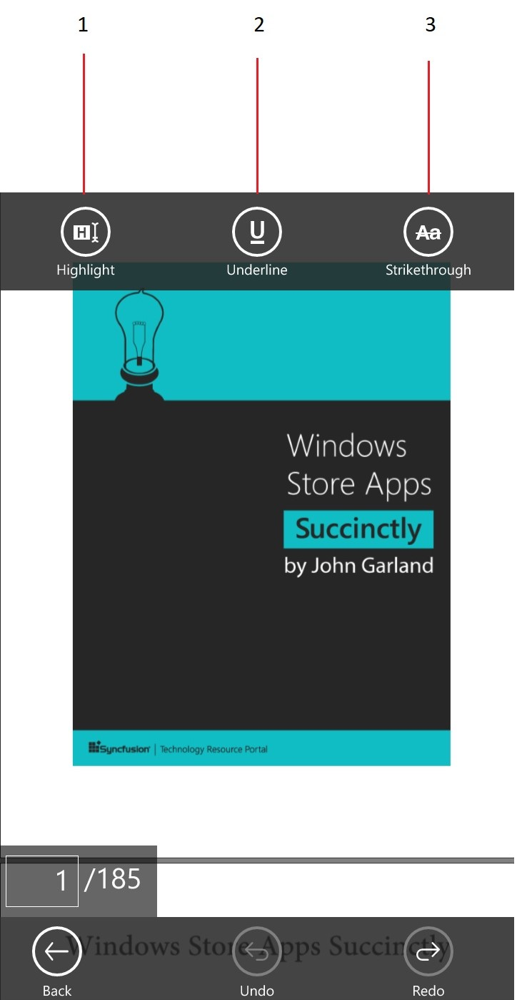

Text markup annotation toolbar has three toggle buttons for the options listed below. 
1.	Text highlight 
2.	Text underline 
3.	Text strikethrough 

Add a grid with name &#34;TextMarkupAnnotationToolbar&#34; to the parent grid and add three toggle buttons to the grid in successive columns. 




    <Grid x:Name="TextMarkupAnnotationToolbar" Grid.Row="1" >
       <Grid.ColumnDefinitions>
          <ColumnDefinition Width="2*"></ColumnDefinition>
          <ColumnDefinition Width="2*"></ColumnDefinition>
          <ColumnDefinition Width="2*"></ColumnDefinition>
       </Grid.ColumnDefinitions>

  <ToggleButton x:Name="HighlightButton" Grid.Column="0" Checked="HighlightButton_Checked" Unchecked="HighlightButton_Unchecked" />

                 
  <ToggleButton x:Name="UnderlineButton" Grid.Column="1" Checked="UnderlineButton_Checked" Unchecked="UnderlineButton_Unchecked">

  <ToggleButton x:Name="StrikethroughButton" Grid.Column="2" Checked="StrikethroughButton_Checked" Unchecked="StrikethroughButton_Unchecked"        

    </Grid>




When a toggle button is checked enable the corresponding annotation mode and disable it when unchecked. 




private void HighlightButton_Checked(object sender, RoutedEventArgs e)
{
     pdfViewer.HighlightAnnotationCommand.Execute(true);
}
private void HighlightButton_Unchecked(object sender, RoutedEventArgs e)
{
     pdfViewer.HighlightAnnotationCommand.Execute(false);
}

private void UnderlineButton_Checked(object sender, RoutedEventArgs e)
{
     pdfViewer.UnderlineAnnotationCommand.Execute(true);
}

private void UnderlineButton_Unchecked(object sender, RoutedEventArgs e)
{
     pdfViewer.UnderlineAnnotationCommand.Execute(false);
}

private void StrikethroughButton_Checked(object sender, RoutedEventArgs e)
{
     pdfViewer.StrikeoutAnnotationCommand.Execute(true);
}

private void StrikethroughButton_Unchecked(object sender, RoutedEventArgs e)
{
     pdfViewer.StrikeoutAnnotationCommand.Execute(false);
}




### Search toolbar

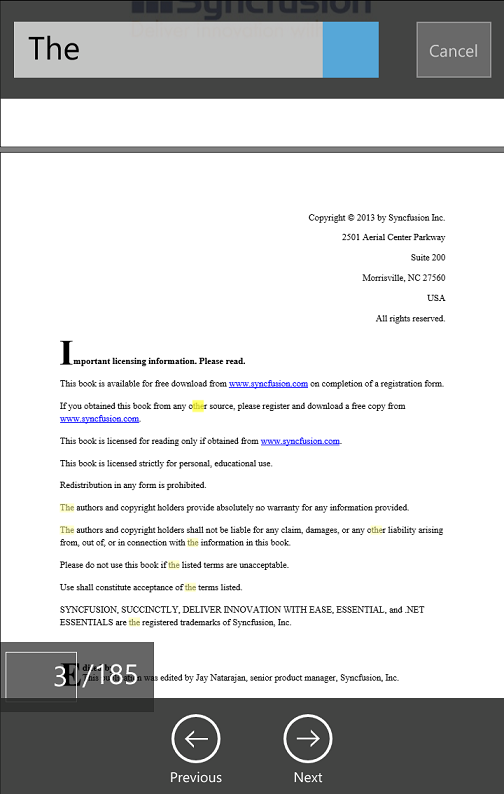

The search toolbar has two toolbars, one at the top and one at the bottom. 

### Search top toolbar

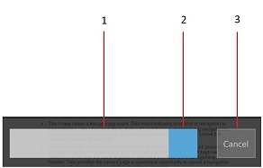

The search top toolbar has the following UI elements

1.	Text box to get the input text
2.	Search button
3.	Cancel button
Add a grid with name &#34;TopSearchToolbar&#34; to the parent grid and add a text box and two buttons. 




    <Grid x:Name="TopSearchToolbar" >
           <Grid.ColumnDefinitions>
               <ColumnDefinition Width="8.0*"></ColumnDefinition>
               <ColumnDefinition Width="2.0*"></ColumnDefinition>
           </Grid.ColumnDefinitions>

           <Grid Grid.Column="0" >
                 <Grid.ColumnDefinitions>
                     <ColumnDefinition Width="10*"></ColumnDefinition>
                  </Grid.ColumnDefinitions>

           <Grid Grid.Column="0">
               <Grid >
                    <Grid.ColumnDefinitions>
                        <ColumnDefinition Width="8*"></ColumnDefinition>
                        <ColumnDefinition Width="2*"></ColumnDefinition>
                    </Grid.ColumnDefinitions>

           <Grid Grid.Column="0">
           <TextBox  Name="PageSearchTextBox" />
           </Grid>

           <Grid Grid.Column="1">
           <Button x:Name="SearchIcon" Click="SearchIcon_Click"/>
           </Grid>
           </Grid>
           </Grid>
                  

           </Grid>
           <Grid Grid.Column="1" x:Name="Close" >
           <Button Name="CloseButton" Content="Cancel" Click="CloseSearch_Click"/>
           </Grid>
              
           </Grid>




When the search button was clicked, call the SearchText method of PdfViewer with the text obtained from the pageSearchTextBox. If a match is found, make the next button and previous button at the bottom search toolbar visible. The bottom search toolbar will be described later. 




private void SearchIcon_Click(object sender, RoutedEventArgs e)
{
	if (!string.IsNullOrEmpty(PageSearchTextBox.Text))
	{
		if (pdfViewer.SearchText(PageSearchTextBox.Text))
		{
			NextButton.Visibility = Visibility.Visible;
			PrevButton.Visibility = Visibility.Visible;
		}
	}
}




When the cancel button was clicked the top and bottom toolbars will be hidden and the text will be cleared from the search text box. And the highlights on the found text instances will be cleared using PdfViewer&#39;s ClearTextSelectionCommand. 




private void CloseSearch_Click(object sender, RoutedEventArgs e)
{
	TopSearchTab.Visibility = Visibility.Collapsed;
	SearchBottomToolbar.Visibility = Windows.UI.Xaml.Visibility.Collapsed;
	TopTab.Visibility = Visibility.Visible;
	BottomToolbar.Visibility = Windows.UI.Xaml.Visibility.Visible;
	PageSearchTextBox.Text = "";
	pdfViewer.ClearTextSelectionCommand.Execute(true);
}




### Search bottom toolbar

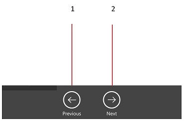

The search bottom toolbar has two buttons

1.	Previous button to go to the previous instance
2.	Next button to go to the next instance

Add a grid to the parent grid with the name &#34;SearchBottomToolbar&#34; and two buttons. Set the Command property of the buttons to PdfViewer&#39;s SearchPreviousCommand and SearchNextCommand respectively. 




<Grid Grid.Row="5" x:Name="SearchBottomToolbar">
  <Grid.ColumnDefinitions>
     <ColumnDefinition Width="8*"></ColumnDefinition>
     <ColumnDefinition Width="2*"></ColumnDefinition>
     <ColumnDefinition Width="8*"></ColumnDefinition>
   </Grid.ColumnDefinitions>
                  
<Button x:Name="PrevButton" Grid.Column="0"  Command="{Binding SearchPreviousCommand}" CommandParameter="{Binding Text, ElementName=PageSearchTextBox}" />

<Button x:Name="NextButton" Grid.Column="2" Command="{Binding SearchNextCommand}" CommandParameter="{Binding Text, ElementName=PageSearchTextBox}"  />

</Grid>




### Bookmark toolbar

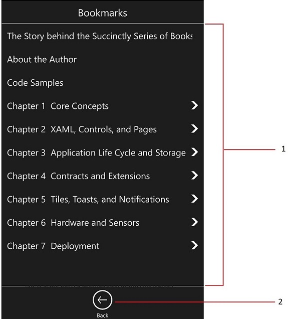

Bookmark toolbar has the following UI elements. 

1.	SfTreeNavigator inside a ScrollView to display the available bookmarks
2.	Button to hide the bookmark toolbar

Add a grid to the parent grid with name &#34;BookmarkLayer&#34; and add the tree navigator and the button. The bookmarks will be populated in the navigator whenever a new PDF is opened as described earlier. 




<Grid x:Name="BookmarkToolbar" Grid.Column="0" Visibility="Collapsed">
  <Grid.RowDefinitions>
     <RowDefinition Height="*" />
     <RowDefinition Height="60" />
  </Grid.RowDefinitions>

<ScrollViewer Grid.Row="0" x:Name="bookmarkScroller">
  <tn:SfTreeNavigator x:Name="treeNavigator" NavigationMode="Extended" >
  </tn:SfTreeNavigator>
 </ScrollViewer>

<Button Grid.Row="1" x:Name="BookmarkBackButton"Click="BookmarkBackButton_Click" />

</Grid>




When the back button in the bookmark toolbar is clicked hide the bookmark toolbar and show the default toolbars. 




private void BookmarkBackButton_Click(object sender, RoutedEventArgs e)
{
     BookmarkToolbar.Visibility = Visibility.Collapsed;
     TopTab.Visibility = Visibility.Visible;
     BottomToolbar.Visibility = Visibility.Visible;
     PageNumberPanel.Visibility = Visibility.Visible;
}




### Page slider

The page slider grid has a slider which will navigate to pages when it is adjusted.




<Grid  Grid.Row="3" Name="BottomToolbar" >
   <Grid.ColumnDefinitions>
      <ColumnDefinition Width="1*"></ColumnDefinition>
      <ColumnDefinition Width="8*"></ColumnDefinition>
      <ColumnDefinition Width="1*"></ColumnDefinition>
   </Grid.ColumnDefinitions>
<Slider Name="PdfSlider" GotFocus="PdfSlider_GotFocus" ValueChanged="PdfSlider_ValueChanged" Grid.Column="1" ></Slider>
            
</Grid>




When the value of the slider changes, run the slider timer. When the slider timer ticks go to the page that corresponds to the current position of the slider. 




private void PdfSlider_ValueChanged(object sender, RangeBaseValueChangedEventArgs e)
{
    Slider slider = sender as Slider;
    m_sliderCurrentValue = (int)e.NewValue;
    m_sliderTickCount = 0;
    m_sliderTimer.Start();
}

void sliderTimer_Tick(object sender, object e)
{
    if (m_sliderTickCount == 50)
    {
        if (m_sliderCurrentValue == pdfViewer.PageCount)
            pdfViewer.GotoPage(m_sliderCurrentValue);
         else if ((m_sliderCurrentValue) > 0)
             pdfViewer.GotoPage(m_sliderCurrentValue);
         m_sliderTickCount = 0;
         m_sliderTimer.Stop();
    }
            m_sliderTickCount++;
}




### Page number panel 

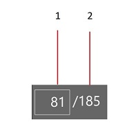

The page number panel has the following UI elements

1.	A text box to get input page number
2.	A text block to display the total number of pages




<Grid Grid.Row="3" Name="PageNumberPanel" >
    <Grid.ColumnDefinitions>
        <ColumnDefinition Width="5*"></ColumnDefinition>
        <ColumnDefinition Width="5*"></ColumnDefinition>
    </Grid.ColumnDefinitions>

    <TextBox Name="CurrentPage" Grid.Column="0" KeyDown="PageDestinationTextBox_KeyDown" />
    <TextBlock Grid.Column="1" Name="PageCount" >
</Grid>




When the enter key is pressed after entering the input page number, navigate to the page using PdfViewer&#39;s GoToPage method with the entered number as parameter. 




private async void PageDestinationTextBox_KeyDown(object sender, KeyRoutedEventArgs e)
{
   int destinationPage = 0;

   if (!string.IsNullOrEmpty(CurrentPage.Text))
   {
       bool gotoResult = int.TryParse(CurrentPage.Text, out destinationPage);
       if (e.Key == VirtualKey.Enter && gotoResult)
       {
            pdfViewer.GotoPage(destinationPage);
            PageDestinationTextBox.Text = string.Empty;
            e.Handled = true;
       }
   }
}




The page count on the PageCount text block is set whenever a new PDF is loaded as described earlier. 

Sample link:
<http://www.syncfusion.com/downloads/support/directtrac/general/ze/PdfViewerCustomToolbar154257435>

Note that this sample is common to both mobile design and desktop design. 
