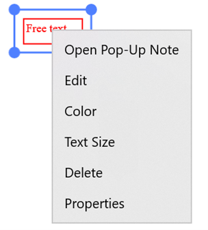

# Working with free text annotations in UWP PDF Viewer (SfPdfViewer)

The PDF Viewer allows you to include free text annotations in a PDF document and provides options to modify or remove the existing free text annotations.

## Adding free text annotations

### Enabling free text annotation mode

To enable a free text annotation, execute the `FreeTextAnnotationCommand` with true as a parameter.




<syncfusion:SfPdfViewerControl x:Name="pdfViewer"/>
<Button x:Name="FreeTextAnnotationButton" Click="FreeTextAnnotationButton_Click"/>




private void FreeTextAnnotationButton_Click(object sender, RoutedEventArgs e)
{
	pdfViewer.FreeTextAnnotationCommand.Execute(true);
}




### Disabling free text annotation mode

The free text annotation can be disabled by executing the same command with false as a parameter.




<syncfusion:SfPdfViewerControl x:Name="pdfViewer"/>
<Button x:Name="ResetAnnotationButton" Click="ResetAnnotationButton_Click" />




private void ResetAnnotationButton_Click(object sender, RoutedEventArgs e)
{
	pdfViewer.FreeTextAnnotationCommand.Execute(false);
}




## Customizing the appearance of free text annotations

You can customize the default values of text color, text size, stroke color, fill color, and stroke width of all free text annotations to be added. This will not affect the already added free text annotations.

### Setting the default text color

You can set the default text color of the free text annotations by using the [`TextColor`](https://help.syncfusion.com/cr/uwp/Syncfusion.Windows.PdfViewer.PdfViewerFreeTextAnnotationSettings.html#Syncfusion_Windows_PdfViewer_PdfViewerFreeTextAnnotationSettings_TextColor) property. Refer to the following code.



SfPdfViewerControl pdfViewer = new SfPdfViewerControl();
pdfViewer.FreeTextAnnotationSettings.TextColor = Color.FromArgb(255, 255, 0, 0);



### Setting the default text size

You can set the default text size of the free text annotations by using the [`TextSize`](https://help.syncfusion.com/cr/uwp/Syncfusion.Windows.PdfViewer.PdfViewerFreeTextAnnotationSettings.html#Syncfusion_Windows_PdfViewer_PdfViewerFreeTextAnnotationSettings_TextSize) property. Refer to the following code.



SfPdfViewerControl pdfViewer = new SfPdfViewerControl();
pdfViewer.FreeTextAnnotationSettings.TextSize = 10;



### Setting the default fill color

You can set the default fill background color of the free text annotations by using the [`FillColor`](https://help.syncfusion.com/cr/uwp/Syncfusion.Windows.PdfViewer.PdfViewerFreeTextAnnotationSettings.html#Syncfusion_Windows_PdfViewer_PdfViewerFreeTextAnnotationSettings_FillColor) property. Refer to the following code.



SfPdfViewerControl pdfViewer = new SfPdfViewerControl();
pdfViewer.FreeTextAnnotationSettings.FillColor= Color.FromArgb(255, 255, 0, 0);



### Setting the default border stroke color

You can set the default border stroke color of the free text annotations by using the [`StrokeColor`](https://help.syncfusion.com/cr/uwp/Syncfusion.Windows.PdfViewer.PdfViewerFreeTextAnnotationSettings.html#Syncfusion_Windows_PdfViewer_PdfViewerFreeTextAnnotationSettings_StrokeColor) property. Refer to the following code.



SfPdfViewerControl pdfViewer = new SfPdfViewerControl();
pdfViewer.FreeTextAnnotationSettings.StrokeColor = Color.FromArgb(255, 255, 0, 0);



### Setting the default border stroke width

You can set the default border stroke width of the free text annotations by using the [`StrokeWidth`](https://help.syncfusion.com/cr/uwp/Syncfusion.Windows.PdfViewer.PdfViewerFreeTextAnnotationSettings.html#Syncfusion_Windows_PdfViewer_PdfViewerFreeTextAnnotationSettings_StrokeWidth) property. Refer to the following code.



SfPdfViewerControl pdfViewer = new SfPdfViewerControl();
pdfViewer.FreeTextAnnotationSettings.StrokeWidth = 2;



### Changing the properties of a selected free text

You can change the properties of a selected free text annotation or remove it by right clicking it and choosing the desired property from the displayed options.
 
 

## Detecting the change in appearance properties of free text annotations

The changes made to the free text annotation properties can be detected using the `FreeTextAnnotationEdited` event. The property values before and after the change can be obtained using the [`FreeTextAnnotationEditedEventArgs`](https://help.syncfusion.com/cr/uwp/Syncfusion.Windows.PdfViewer.FreeTextAnnotationEditedEventArgs.html) parameter of the event’s handler.



SfPdfViewerControl pdfViewer = new SfPdfViewerControl();
pdfViewer.FreeTextAnnotationEdited += PdfViewer_FreeTextAnnotationEdited;

private void PdfViewer_FreeTextAnnotationEdited (object sender, FreeTextAnnotationEditedEventArgs e)
{
	//Obtain the text after change
	string newText = e.NewText;
	//Obtain the text before change
	string oldText = e.OldText;
	//Obtain the text size after change
	double newTextSize = e.NewTextSize;
	//Obtain the text size before change
	double oldTextSize = e.OldTextSize;
	//Obtain the color after change
	Color newColor = e.NewColor;
	//Obtain the color before change
	Color oldColor = e.OldColor;
}

