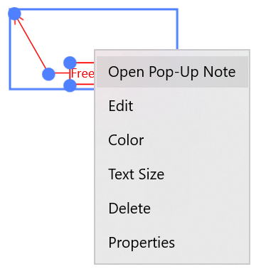

# Working with free text callout annotations in UWP PDF Viewer (SfPdfViewer)

PDF Viewer allows you to include free text callout annotations in a PDF document and provides options to modify or remove the existing free text callout annotations.

## Adding free text callout annotations

### Enabling free text callout annotation mode

To enable a free text callout annotation, execute the FreeTextCalloutAnnotationCommand with true as parameter.




<syncfusion:SfPdfViewerControl x:Name="pdfViewer"/>
<Button x:Name="FreeTextCalloutAnnotationButton" Click="FreeTextCalloutAnnotationButton_Click"/>




private void FreeTextCalloutAnnotationButton_Click(object sender, RoutedEventArgs e)
{
	pdfViewer.FreeTextCalloutAnnotationCommand.Execute(true);
}




### Disabling free text callout annotation mode

Free text callout annotation can be disabled by executing the same command with false as parameter.




<syncfusion:SfPdfViewerControl x:Name="pdfViewer"/>
<Button x:Name="resetAnnotationButton" Click="resetAnnotationButton_Click" />




private void resetAnnotationButton_Click(object sender, RoutedEventArgs e)
{
	pdfViewer.FreeTextCalloutAnnotationCommand.Execute(false);
}




## Customizing the appearance of free text callout annotations
You can customize the default values of text color, text size, stroke color, fill color, stroke width and opacity of all free text callout annotations to be added. This will not affect the already added free text annotations.

### Setting the default text color
You can set the default text color of the free text callout annotations by using the SfPdfViewerControl.FreeTextCalloutAnnotationSettings.TextColor property. Refer to the following code.



SfPdfViewerControl pdfViewer = new SfPdfViewerControl();
pdfViewer.FreeTextCalloutAnnotationSettings.TextColor = Color.FromArgb(255, 255, 0, 0);



### Setting the default text size
You can set the default text size of the free text callout annotations by using the SfPdfViewerControl.FreeTextCalloutAnnotationSettings.TextSize property. Refer to the following code.



SfPdfViewerControl pdfViewer = new SfPdfViewerControl();
pdfViewer.FreeTextCalloutAnnotationSettings.TextSize = 10;



### Setting the default fill color

You can set the default fill background color of the free text callout annotations by using the SfPdfViewerControl.FreeTextCalloutAnnotationSettings.FillColor property. Refer to the following code.



SfPdfViewerControl pdfViewer = new SfPdfViewerControl();
pdfViewer.FreeTextAnnotationCalloutSettings.FillColor= Color.FromArgb(255, 255, 0, 0);



### Setting the default border stroke color

You can set the default border stroke color of the free text callout annotations by using the SfPdfViewerControl.FreeTextCalloutAnnotationSettings.StrokeColor property. Refer to the following code.



SfPdfViewerControl pdfViewer = new SfPdfViewerControl();
pdfViewer.FreeTextCalloutAnnotationSettings.StrokeColor = Color.FromArgb(255, 255, 0, 0);



### Setting the default border stroke width

You can set the default border stroke width of the free text callout annotations by using the SfPdfViewerControl.FreeTextCalloutAnnotationSettings.StrokeWidth property. Refer to the following code.



SfPdfViewerControl pdfViewer = new SfPdfViewerControl();
pdfViewer.FreeTextCalloutAnnotationSettings.StrokeWidth = 2;



### Setting the default opacity

You can set the default opacity of free text callout annotations by using the SfPdfViewerControl.FreeTextCalloutAnnotationSettings.Opacity property. Opacity value ranges from 0 to 1. Refer to the following code example.



SfPdfViewerControl pdfViewer = new SfPdfViewerControl();
pdfViewer.FreeTextCalloutAnnotationSettings.Opacity = 0.5f;



### Setting the default minimum width and minimum size

By using the MinWidth and MinHeight properties, you can set the minimum width and height of the free text callout annotation for resizing.



SfPdfViewerControl pdfViewer = new SfPdfViewerControl();
pdfViewer.FreeTextCalloutAnnotationSettings.MinWidth= 100;
pdfViewer.FreeTextCalloutAnnotationSettings.MinHeight= 100;



### Enable a free text input box with automatic resizing

By using the AutoSizeFreeTextInputBox property, you can enable or disable the automatic resizing of the free text input box.



SfPdfViewerControl pdfViewer = new SfPdfViewerControl();
pdfViewer.FreeTextCalloutAnnotationSettings.AutoSizeFreeTextInputBox= true;



### Setting the default callout line segment count

You can set the default callout line segment count of the annotations by using the SfPdfViewerControl.FreeTextCalloutAnnotationSettings.CalloutLineSegmentCount property. By default, the free text callout annotation is added with two line segments.



SfPdfViewerControl pdfViewer = new SfPdfViewerControl();
pdfViewer.FreeTextCalloutAnnotationSettings.CalloutLineSegmentCount = CalloutLineSegmentCount.One;



### Changing the properties of a selected free text callout

You can change the properties of a selected free text callout annotation or remove it by right clicking it and choosing the desired property from the displayed options.
 
 

## Detecting the movement of free text callout annotations

The movement made in free text callout annotations can be detected using the SfPdfViewerControl.FreeTextCalloutAnnotationMoved event. The property values before and after the change can be obtained using the FreeTextCalloutAnnotationMovedEventArgs parameter of the event’s handler.



SfPdfViewerControl pdfViewer = new SfPdfViewerControl();
pdfViewer.FreeTextCalloutAnnotationMoved += PdfViewer_FreeTextCalloutAnnotationMoved;

private void PdfViewer_FreeTextCalloutAnnotationMoved (object sender, FreeTextCalloutAnnotationMovedEventArgs e)
{
         //Obtain the new bounds of entire annotation after change
	Rect newBounds =  e.NewBounds;
	// Obtain the old bounds of entire annotation after change
	Rect oldBounds = e.OldBounds;
	// Obtain the new bounds of callout text after change
	Rect newCalloutBounds = e.NewCalloutBounds;
 	// Obtain the old bounds of callout text after change
	Rect oldCalloutBounds = e.OldCalloutBounds;
}



## Detecting the resize of free text callout annotations

The resize of free text callout annotations can be detected using the SfPdfViewerControl.FreeTextCalloutAnnotationResized event. The property values before and after the change can be obtained using the FreeTextCalloutAnnotationResizedEventArgs parameter of the event’s handler.



SfPdfViewerControl pdfViewer = new SfPdfViewerControl();
pdfViewer.FreeTextCalloutAnnotationResized += PdfViewer_FreeTextCalloutAnnotationResized;

private void PdfViewer_FreeTextCalloutAnnotationResized (object sender, FreeTextCalloutAnnotationResizedEventArgs e)
{
         //Obtain the new bounds of entire annotation after change
	Rect newBounds =  e.NewBounds;
	// Obtain the old bounds of entire annotation after change
	Rect oldBounds = e.OldBounds;
	// Obtain the new bounds of callout text after change
	Rect newCalloutBounds = e.NewCalloutBounds;
	// Obtain the old bounds of callout text after change
	Rect oldCalloutBounds = e.OldCalloutBounds;
}


