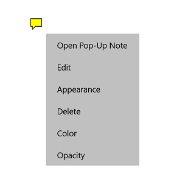
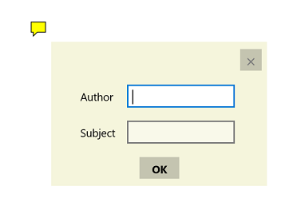

# Working with popup annotations in UWP PDF Viewer (SfPdfViewer)

PDF Viewer allows you to include popup annotations in a PDF document and provides options to modify or remove the existing popup annotations.

## Adding popup annotations

### Enabling popup annotation mode

To enable an popup annotation, execute the `PopupAnnotationCommand` with `true` as parameter.




<syncfusion:SfPdfViewerControl x:Name="pdfViewer"/>
<Button x:Name="popupAnnotationButton" Click="popupAnnotationButton_Click"/>





private void popupAnnotationButton_Click(object sender, RoutedEventArgs e)
{
	pdfViewer.PopupAnnotationCommand.Execute(true);
}




### Disabling popup annotation mode

popup annotation can be disabled by executing the same command with `false` as parameter. 




<syncfusion:SfPdfViewerControl x:Name="pdfViewer"/>
<Button x:Name="resetAnnotationButton" Click="resetAnnotationButton_Click" />




private void resetAnnotationButton_Click(object sender, RoutedEventArgs e)
{
	pdfViewer.PopupAnnotationCommand.Execute(false);
}




## Detecting the inclusion of popup annotations

The inclusion of a popup annotation can be obtained by using the `SfPdfViewerControl.PopupAnnotationAdded` event. The properties of the added popup can be obtained using the `PopupAnnotationAddedEventArgs` parameter of the event handler. 



SfPdfViewerControl pdfViewer = new SfPdfViewerControl();
pdfViewer.PopupAnnotationAdded += PdfViewer_PopupAnnotationAdded;

private void PdfViewer_PopupAnnotationAdded(object sender, PopupAnnotationAddedEventArgs e)
{	

	//Obtain the location where the popup is added
    PointF location = e.Location;
	
	//Obtain the page number in which the popup is added
	int pageNumber = e.PageNumber;
}



## Customizing the appearance of popup annotations

You can customize the default values of color, opacity, horizontal scale, vertical scale and icon type of all popup annotations to be added. This will not affect the already added popup annotations.

### Setting the default color

You can set the default color of the popup annotations by using the `SfPdfViewerControl.PopupAnnotationSettings.Color` property. Refer to the following code. 
 


SfPdfViewerControl pdfViewer = new SfPdfViewerControl();
pdfViewer.PopupAnnotationSettings.Color = Color.FromArgb(255, 255, 0, 0);



### Setting the default opacity

You can set the default opacity of the popup annotations by using the `SfPdfViewerControl.PopupAnnotationSettings.Opacity` property. Opacity value ranges from 0 to 1. Refer to the following code example.



SfPdfViewerControl pdfViewer = new SfPdfViewerControl();
pdfViewer.PopupAnnotationSettings.Opacity = 0.5f; 



### Setting the default horizontal scale

You can set the horizontal scale of the popup annotations by using the `SfPdfViewerControl.PopupAnnotationSettings.ScaleX` property. Refer to the following code example. 



SfPdfViewerControl pdfViewer = new SfPdfViewerControl();
pdfViewer.PopupAnnotationSettings.ScaleX = 2;



### Setting the default vertical scale

You can set the vertical scale of the popup annotations by using the `SfPdfViewerControl.PopupAnnotationSettings.ScaleY` property. Refer to the following code example. 



SfPdfViewerControl pdfViewer = new SfPdfViewerControl();
pdfViewer.PopupAnnotationSettings.ScaleY = 2;



### Setting the default icon type

You can set the icon type of the popup annotations by using the `SfPdfViewerControl.PopupAnnotationSettings.Icon` property. Refer to the following code example. 



SfPdfViewerControl pdfViewer = new SfPdfViewerControl();
pdfViewer.PopupAnnotationSettings.Icon = PopupIcon.Comment;



### Changing the properties of a selected popup

You can change the properties of a selected popup annotation or remove it by right clicking it and choosing the desired property from the displayed options.

### Setting author name and subject of popup annotations

The author name and subject of popup annotations can be added by right clicking the popup and choose 'Edit' from the context menu

## Detecting the change in appearance properties of popup annotations

The changes made in popup annotation's properties can be detected using the `SfPdfViewerControl.PopupEdited` event. The property values before and after change can be obtained using the `PopupEditedEventArgs` parameter of the event's handler. In the below example, only the new properties are illustrated.



SfPdfViewerControl pdfViewer = new SfPdfViewerControl();
pdfViewer.PopupEdited += PdfViewer_PopupEdited;

private void PdfViewer_PopupEdited(object sender, PopupEditedEventArgs e)
{	
	PopupProperties newProperties = e.PopupNewProperties;
	PopupProperties oldProperties = e.PopupOldProperties;

	//Obtain the author of the popup
	string Author = newProperties.Author;

	//Obtain the icon type of the popup
	PopupIcon icon = newProperties.PopupIcon;

	//Obtain the color of the popup
	Color color = newProperties.Color;

	//Obtain the comment of the popup
	string comment = newProperties.Comment;

	//Obtain the subject of the popup
	string subject = newProperties.Subject;

	//Obtain the opacity of the popup
	double opacity = newProperties.Opacity;

	//Obtain the location of the popup
	PointF location = newProperties.Location;

	//Obtain the page number in which the popup is added
	int pageNumber = e.PageNumber;
}


