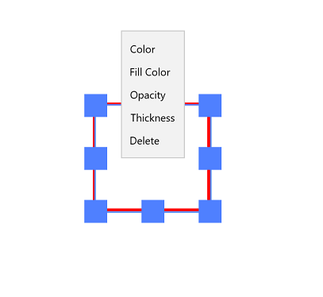

# Working with shape annotations in UWP Pdf Viewer (SfPdfViewer)

PDF Viewer allows you to include shape annotations in a PDF document and provides options to modify or remove the existing shape annotations. The supported shape annotations are:

1. Rectangle
2. Ellipse
3. Line

In all the code snippets that follow, only Rectangle shape annotation is used for brevity. Other shape annotations can be used in the same way. 

## Adding shape annotations

### Enabling shape annotation mode

To enable a shape annotation, execute the annotation's corresponding command with `true` as parameter.




<syncfusion:SfPdfViewerControl x:Name="pdfViewer"/>
<Button x:Name="shapeAnnotationButton" Click="shapeAnnotationButton_Click"/>





private void shapeAnnotationButton_Click(object sender, RoutedEventArgs e)
{
	pdfViewer.RectangleAnnotationCommand.Execute(true);
}




### Disabling shape annotation mode

Shape annotations can be disabled by executing the same command with `false` as parameter. 




<syncfusion:SfPdfViewerControl x:Name="pdfViewer"/>
<Button x:Name="resetAnnotationButton" Click="resetAnnotationButton_Click" />




private void resetAnnotationButton_Click(object sender, RoutedEventArgs e)
{
	pdfViewer.RectangleAnnotationCommand.Execute(false);
}




## Customizing the appearance of shape annotations

You can customize the default values of stroke color, fill color (except for line annotation), opacity, and thickness of all shape annotations to be added. This will not affect the already added shape annotations.

### Setting the default stroke color

You can set the default stroke color of rectangle annotations by using the `SfPdfViewerControl.RectangleAnnotationSettings.Color` property. Refer to the following code. 
 


SfPdfViewerControl pdfViewer = new SfPdfViewerControl();
pdfViewer.RectangleAnnotationSettings.Color = Color.FromArgb(255, 255, 0, 0);



### Setting the default opacity

You can set the default opacity of rectangle annotations by using the `SfPdfViewerControl.RectangleAnnotationSettings.Opacity` property. Opacity value ranges from 0 to 1. Refer to the following code example.



SfPdfViewerControl pdfViewer = new SfPdfViewerControl();
pdfViewer.RectangleAnnotationSettings.Opacity = 0.5f; 



### Setting the default thickness

You can set the thickness of the rectangle annotations by using the `SfPdfViewerControl.RectangleAnnotationSettings.Thickness` property. Refer to the following code example. 



SfPdfViewerControl pdfViewer = new SfPdfViewerControl();
pdfViewer.RectangleAnnotationSettings.Thickness = 5;



### Changing the properties of a selected shape

You can change the properties of the selected annotation or remove it by right clicking it and choosing the desired property from the displayed options.

## Detecting the change in appearance properties of shape annotations

The changes made in shape annotations' properties can be detected using the `SfPdfViewerControl.ShapeEdited` event. The property values before and after change can be obtained using the `ShapeEditedEventArgs` parameter of the event's handler. 



SfPdfViewerControl pdfViewer = new SfPdfViewerControl();
pdfViewer.ShapeEdited += PdfViewer_ShapeEdited;

private void PdfViewer_ShapeEdited(object sender, ShapeEditedEventArgs e)
{
	//Obtain the thickness after change
	double newThickness = e.NewThickness;
	
	//Obtain the thickness before change
	double oldThickness = e.OldThickness;
	
	//Obtain the opacity after change
	double newOpacity = e.NewOpacity;
	
	//Obtain the opacity before change
	double oldOpacity = e.OldOpacity;
	
	//Obtain the color after change
	Color newColor = e.NewColor;
	
	//Obtain the color before change
	Color.oldColor = e.OldColor;
	
	//Obtain the fill color after change
	Color newFillColor = e.NewFillColor;
	
	//Obtain the fill color before change
	Color oldFillColor = e.OldFillColor;
	
	//Obtain the page number in which the shape is added
	int pageNumber = e.PageNumber;
}


