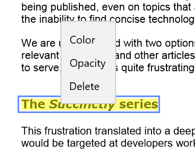

# Working with text markup annotations in UWP PDF Viewer

PDF Viewer allows users to include text markup annotations in a PDF document and provides options to modify or remove the existing text markup annotations. The supported text markup annotations are:

1. Highlight
2. Underline
3. Strikeout

In all the code snippets that follow, only Highlight annotation is used for brevity. Other text markup annotations can be used in the same way. 

## Adding text markup annotations

### Enabling text markup annotation mode

To enable a text markup annotation, execute the annotation's corresponding command with `true` as parameter.




<syncfusion:SfPdfViewerControl x:Name="pdfViewer"/>
<Button x:Name="textMarkupAnnotationButton" Click="TextMarkupAnnotationButton_Click"/>





private void TextMarkupAnnotationButton_Click(object sender, RoutedEventArgs e)
{
	pdfViewer.HighlightAnnotationCommand.Execute(true);
}




### Disabling text markup annotation mode

Text markup annotation can be disabled by executing the same command with `false` as parameter. 




<syncfusion:SfPdfViewerControl x:Name="pdfViewer"/>
<Button x:Name="resetAnnotationButton" Click="resetAnnotationButton_Click" />




private void resetAnnotationButton_Click(object sender, RoutedEventArgs e)
{
	pdfViewer.HighlightAnnotationCommand.Execute(false);
}




## Customizing the appearance of text markup annotations

You can customize the default values of color and opacity of all text markup annotations to be added. This will not affect the already added text markup annotations.

### Setting the default color

You can set the default color of a highlight annotation by using the `SfPdfViewerControl.HighlightAnnotationSettings.Color` property. Refer to the following code. 
 


SfPdfViewerControl pdfViewer = new SfPdfViewerControl();
pdfViewer.HighlightAnnotationSettings.Color = Color.FromArgb(255, 255, 0, 0);



### Setting the default opacity

You can set the default opacity of a highlight markup annotation by using the `SfPdfViewerControl.HighlightAnnotationSettings.Opacity` property. Opacity value ranges from 0 to 1. Refer to the following code example.



SfPdfViewerControl pdfViewer = new SfPdfViewerControl();
pdfViewer.HighlightAnnotationSettings.Opacity = 0.5f; 



### Changing the properties of a selected text markup

You can change the properties of a selected text markup annotation or remove it by right clicking it and choosing the desired property from the displayed options.

