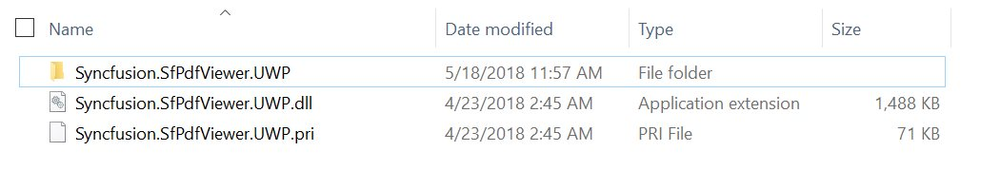
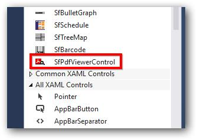
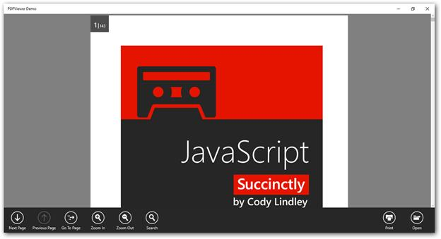

# Getting Started with UWP PDF Viewer (SfPdfViewer)
This section explains about the assemblies required for the deployment of SfPdfViewer and how to create simple application using the SfPdfViewer control.

## Required Assemblies

The following list of assemblies are required for adding a PDF viewer control to the Universal Windows Platform application.

* Syncfusion.SfPdfViewer.UWP
* Syncfusion.Pdf.UWP
* Syncfusion.SfColorPickers.UWP
* Syncfusion.SfInput.UWP
* Syncfusion.SfRadialMenu.UWP
* Syncfusion.SfShared.UWP

Each of these assemblies always needs to be in parallel with its associated resource files as shown in the screenshot below. However, it is not necessary to have all these assemblies in a single folder as long as the resource files are along with the assemblies in their respective folders. The screenshot shows only the SfPdfViewer assembly for brevity.

The aforementioned placement of the assemblies and the resource files in the same folder becomes important only when the assemblies need to be moved from the installed location of the assemblies to somewhere else. When the assemblies are moved the resource files must also be moved and placed in the same folder as the assemblies.

N> Starting with v16.2.0.x, if you reference Syncfusion assemblies from trial setup or from the NuGet feed, you also have to include a license key in your projects. Please refer to [this link](https://help.syncfusion.com/common/essential-studio/licensing/overview) to know about registering Syncfusion license key in your UWP application to use our components.

## Create a simple application with the SfPdfViewer

Follow the below steps to create a simple application with the SfPdfViewer and load a PDF document.

1. Create a new UWP application in the Visual Studio.

2. Open the Visual Studio tool box and drag the SfPdfViewerControl toolbox item to the designer window. Name the SfPdfViewerControl as pdfViewer.

When you drag the SfPdfViewer toolbox item to the window, it automatically adds the required assembly references to the current application.

To add the SfPdfViewer by using code, add the required assemblies mentioned previously as reference to the project.

Add the following code in XAML to make use of the SfPdfViewer.



<Page
    x:Class="SimpleSample.MainPage"
    xmlns="http://schemas.microsoft.com/winfx/2006/xaml/presentation"
    xmlns:x="http://schemas.microsoft.com/winfx/2006/xaml"
    xmlns:local="using:SimpleSample"
    xmlns:d="http://schemas.microsoft.com/expression/blend/2008"
    xmlns:mc="http://schemas.openxmlformats.org/markup-compatibility/2006"
    xmlns:syncfusion="using:Syncfusion.Windows.PdfViewer"
    >
    <Grid>
        <syncfusion:SfPdfViewerControl Name="pdfViewer"> </syncfusion:SfPdfViewerControl>
    </Grid>
</Page>



## Loading PDF document through binding

The following steps explains how to load a PDF document through binding.

1. The SfPdfViewer’s ItemSource property allows you to bind PDF documents in XAML. The ItemsSource property accepts a stream input that can be bound to the viewer during initialization.

2. To bind the PDF file, add the PDF file to the project as an asset. Right Click the PDF file and open the properties window. In the properties window, set the Build Action as Embedded Resource.

3. Create a simple class that loads a PDF report and provides the stream as a property that can be bound to the viewer as shown in the following code. Save the class file as PdfReport.cs.



class PdfReport : INotifyPropertyChanged
    {
        private Stream docStream;
        public event PropertyChangedEventHandler PropertyChanged;

        /// 

        /// Stream object to be bound to the ItemsSource of the PDF Viewer
        /// 

        public Stream DocumentStream
        {
            get
            {
                return docStream;
            }
            set
            {
                docStream = value;
                OnPropertyChanged(new PropertyChangedEventArgs("DocumentStream"));
            }
        }

        public PdfReport()
        {
            //Loads the stream from the embedded resource.
            Assembly assembly = typeof(MainPage).GetTypeInfo().Assembly;
            docStream = assembly.GetManifestResourceStream("SimpleSample.Assets.JavaScript_Succinctly.pdf");
        }

        public void OnPropertyChanged(PropertyChangedEventArgs e)
        {
            if (PropertyChanged != null)
                PropertyChanged(this, e);
        }        
    }


Class PdfReport
    Implements INotifyPropertyChanged

    Private docStream As Stream
    Private Event PropertyChanged As PropertyChangedEventHandler Implements INotifyPropertyChanged.PropertyChanged

    ''' 

    ''' Stream object to be bound to the ItemsSource of the PDF Viewer
    ''' 

    Public Property DocumentStream As Stream
        Get
            Return docStream
        End Get
        Set
            docStream = Value
            OnPropertyChanged(New PropertyChangedEventArgs("DocumentStream"))
        End Set
    End Property

    Public Sub New()
        'Loads the stream from the embedded resource.
        Dim assembly As Assembly = GetType(MainPage).GetTypeInfo().Assembly
        docStream = assembly.GetManifestResourceStream("SimpleSample.JavaScript_Succinctly.pdf")
    End Sub

    Public Sub OnPropertyChanged(e As PropertyChangedEventArgs)
        RaiseEvent PropertyChanged(Me, e)
    End Sub
End Class



In order to bind the DocumentStream property of the PdfReport class, the DataContext needs to be set for the page. To add the DataContext in XAML, use the following code example.



<Page
    x:Class="SimpleSample.MainPage"
    xmlns="http://schemas.microsoft.com/winfx/2006/xaml/presentation"
    xmlns:x="http://schemas.microsoft.com/winfx/2006/xaml"
    xmlns:local="using:SimpleSample"
    xmlns:d="http://schemas.microsoft.com/expression/blend/2008"
    xmlns:mc="http://schemas.openxmlformats.org/markup-compatibility/2006"
    xmlns:syncfusion="using:Syncfusion.Windows.PdfViewer"
    Loaded="Page_Loaded">
    <Page.DataContext>
        <local:PdfReport/>
    </Page.DataContext>
    <Grid>
        <syncfusion:SfPdfViewerControl Name="pdfViewer"></syncfusion:SfPdfViewerControl>
    </Grid>
</Page>



Once the DataContext has been set, the ItemSource dependency property can be set by using the following code in XAML.



<Page
    x:Class="SimpleSample.MainPage"
    xmlns="http://schemas.microsoft.com/winfx/2006/xaml/presentation"
    xmlns:x="http://schemas.microsoft.com/winfx/2006/xaml"
    xmlns:local="using:SimpleSample"
    xmlns:d="http://schemas.microsoft.com/expression/blend/2008"
    xmlns:mc="http://schemas.openxmlformats.org/markup-compatibility/2006"
    xmlns:syncfusion="using:Syncfusion.Windows.PdfViewer"
    Loaded="Page_Loaded">
    <Page.DataContext>
        <local:PdfReport/>
    </Page.DataContext>
    <Grid>
        <syncfusion:SfPdfViewerControl Name="pdfViewer" ItemsSource="{Binding DocumentStream}"></syncfusion:SfPdfViewerControl>
    </Grid>
</Page>



## Loading PDF document using FileOpenPicker

Alternatively, a FileOpenPicker can also be used to load documents at run time. To achieve this, include a button to the application.



<Button Name="Open" Click="Open_Click" Content="Open"/>



Include the below code in the click event of the button.



async private void Open_Click(object sender, RoutedEventArgs e)
        {
            //Opens a file picker.
            var picker = new FileOpenPicker();
            picker.SuggestedStartLocation = PickerLocationId.DocumentsLibrary;
            picker.ViewMode = PickerViewMode.List;
            //Filters PDF files in the documents library.
            picker.FileTypeFilter.Add(".pdf");
            var file = await picker.PickSingleFileAsync();
            if (file == null) return;
            //Reads the stream of the loaded PDF document.
            var stream = await file.OpenAsync(Windows.Storage.FileAccessMode.Read);
            Stream fileStream = stream.AsStreamForRead();
            byte[] buffer = new byte[fileStream.Length];
            fileStream.Read(buffer, 0, buffer.Length);
            //Loads the PDF document.
            PdfLoadedDocument loadedDocument = new PdfLoadedDocument(buffer);
            pdfViewer.LoadDocument(loadedDocument);
        }


Private Async Sub Open_Click(sender As Object, e As RoutedEventArgs)
    'Opens a file picker.
    Dim picker = New FileOpenPicker()
    picker.SuggestedStartLocation = PickerLocationId.DocumentsLibrary
    picker.ViewMode = PickerViewMode.List
    'Filters PDF files in the documents library.
    picker.FileTypeFilter.Add(".pdf")
    Dim file = Await picker.PickSingleFileAsync()
    If file Is Nothing Then
        Return
    End If
    'Reads the stream of the loaded PDF document.
    Dim stream = Await file.OpenAsync(Windows.Storage.FileAccessMode.Read)
    Dim fileStream As Stream = stream.AsStreamForRead()
    Dim buffer As Byte() = New Byte(fileStream.Length - 1) {}
    fileStream.Read(buffer, 0, buffer.Length)
    'Loads the PDF document.
    Dim loadedDocument As New PdfLoadedDocument(buffer)
    pdfViewer.LoadDocument(loadedDocument)
End Sub



## Magnification operations

The SfPdfViewer provides the following set of commands to perform magnification.

* IncreaseZoomCommand
* DecreaseZoomCommand

The following XAML code shows how to bind the IncreaseZoomCommand to a button


<Button Content="ZoomIn" Command="{Binding ElementName=pdfViewer, Path=IncreaseZoomCommand}" HorizontalAlignment="Left" VerticalAlignment="Top"></Button>



The following XAML code shows how to bind the DecreaseZoomCommand to a button



<Button Content="ZoomOut" Command="{Binding ElementName=pdfViewer, Path=DecreaseZoomCommand}" HorizontalAlignment="Left" VerticalAlignment="Top"></Button>



N>
* By default, the SfPdfViewer also supports the Ctrl + scroll key combination for performing magnification by using the keyboard and mouse.
* When the PDF viewer zoom value is decreased below 100%, the view will be automatically changed to show the thumbnails.

## Printing a document

The following XAML code shows how to bind the PrintCommand to a Button


<Button Content="Print" Command="{Binding ElementName=pdfViewer, Path=PrintCommand}" ></Button>



## Search Operations

The SearchText method can be used to search a text in the document. In addition to the current match, the method also highlights all the possible matches in the current page with a different color.

The following commands can be used for performing the Search-Next and Search-Previous operations.

* SearchNextCommand
* SearchPreviousCommand

Code example to initiate text search



private void searchButton_Click(object sender, RoutedEventArgs e)
        {
            pdfViewer.SearchText((searchTxtBx.Text));
        }


Private Sub searchButton_Click(sender As Object, e As RoutedEventArgs)
    pdfViewer.SearchText((searchTxtBx.Text))
End Sub



Binding SearchNextCommand and SearchPreviousCommand to buttons



<Button Content="Search Next" Command="{Binding ElementName=pdfViewer, Path=SearchNextCommand}" ></Button>

<Button Content="Search Previous" Command="{Binding ElementName=pdfViewer, Path=SearchPreviousCommand}" ></Button>



## Page Navigations

The below list of commands are helpful for performing the page navigation operations.

* FirstPageCommand
* LastPageCommand
* PreviousPageCommand
* NextPageCommand

## Unloading PDF document from the viewer

The SfPdfViewer control allows you to unload the PDF document from the viewer when the control is not in use anymore. This releases the PDF document and all its associated resources. To achieve this include a button in the application.



<Button Name="Unload" Click="Unload_Click" Content="Open"/>



Include the below code in the click event of the button.



private void Unload_Click(object sender, RoutedEventArgs e)
        {
            //Unloads the PDF Document displayed in the PDF Viewer Control.
            pdfViewer.Unload();
        }


Private Sub Unload_Click(sender As Object, e As RoutedEventArgs)
    pdfViewer.Unload()
End Sub



## Saving a PDF document

The `Save` method returns the PDF document along with the changes made (annotations addition and modification) as a stream, which can be saved as a file.




//Save the PDF document
Stream pdfDocumentStream = pdfViewerControl.Save();




N> The Save method does not save the stamp annotations in the PDF document. Instead, use the SaveAsync method to save them.

## Saving a PDF document asynchronously

The PDF Viewer also allows you to save and return the PDF document with the changes as a stream asynchronously using the `SaveAsync` method.




//Save the PDF document asynchronously 
Task<Stream> pdfDocumentStream = pdfViewerControl.SaveAsync();




## Events to track the loading of PDFs

The PDFViewer control allows you to track the loading of PDFs using the following events. The DocumentLoaded event triggers after the document is properly loaded in the SfPdfViewer. The following code example explains the same.




SfPdfViewerControl pdfViewer = new SfPdfViewerControl();

pdfViewer.DocumentLoaded += PdfViewer_DocumentLoaded;

private void PdfViewer_DocumentLoaded(object sender, DocumentLoadedEventArgs args)  
{  
        // Get the total page count of the loaded PDF document. 
        int pageCount = pdfViewer.PageCount; 
}




## Dispose the managed resources of PDFViewer

The PDFViewer control allows you to dispose the managed resources which are associated with the viewer. You need to call the Dispose method of the PDFViewer control as shown in the following code sample to achieve the same.




//Disposes all the managed resources of SfPdfViewer
pdfViewer.Dispose();




## Supported input interactions

The SfPdfViewerControl supports the following input interactions to be performed in the PDF document:

* Mouse or Touch pad
* Touch
* Stylus or pen

The following is the list of possible operations to be performed with the supported input interactions in the SfPdfViewerControl:

<table>

<tr>
<th>Operations</th>
<th>Mouse or Touch pad</th>
<th>Touch</th>
<th>Stylus or Pen</th>
</tr>

<tr>
<td>Scrolling</td>
<td>Supported</td>
<td>Supported</td>
<td>Supported</td>
</tr>

<tr>
<td>Zooming</td>
<td>Supported</td>
<td>Supported</td>
<td>Not supported</td>
</tr>

<tr>
<td>Adding annotations</td>
<td>Supported</td>
<td>Supported</td>
<td>Supported</td>
</tr>

<tr>
<td>Moving and resizing the annotations</td>
<td>Supported</td>
<td>Supported</td>
<td>Supported</td>
</tr>

<tr>
<td>Editing the annotations</td>
<td>Supported</td>
<td>Supported</td>
<td>Supported</td>
</tr>

</table>
The following image shows the final SfPdfViewer with all the features being implemented.

