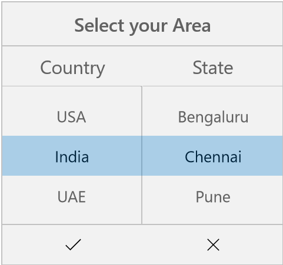

# Cascading in UWP Picker (SfPicker)

We have demonstrated how to create custom Cascading sample using Picker control in the following steps.

We have created the cascading sample for updating state collection based on selected item of SfPicker.

Please refer the below steps to create the cascading sample 

**Step** **1** **:** We have created three ObservableCollection with object type in PickerCascading class. 

**Collection** **details** **:** 

Area Collection, Country Collection and State Collection.

Country Collection -> We have added country names.

State Collection -> We have added state names.

Area Collection -> We have added above  2 collections.

Area Collection is main collection we have assigned this collection to ItemsSource of Picker Control.

The below code demonstrates Area collection creation.



    using Syncfusion.UI.Xaml.Controls.Input;
    using Windows.UI.Xaml;

    namespace CascadingPickerSample
   
    {

     public class PickerCascading : INotifyPropertyChanged
  
      {

        #region Public Properties

        /// 

      
        /// Area is the actual DataSource for SfPicker control which will holds the collection of Country and State
      
        /// 

      
        /// <value>The area.</value>
     
        public ObservableCollection<object> Area { get; set; }

        //Country is the collection of country names
    
        private ObservableCollection<object> Country { get; set; }

        //State is the collection of state names
     
        private ObservableCollection<object> State { get; set; }

        /// 

      
        /// Headers API is holds the column name for every column in cascading picker
      
        /// 

      
        /// <value>The Headers.</value>
     
        public ObservableCollection<string> Header { get; set; }

        private object _selected area;

        public event PropertyChangedEventHandler PropertyChanged;

        #endregion

        //Identify the selected area using property changed method
      
        public object SelectedArea
      
        {

            get { return _selected area; }
      
            set { _selected area = value; RaisePropertyChanged("SelectedArea"); }
        
        }

        public PickerCascading()
      
        {

            Area = new ObservableCollection<object>();
      
            Header = new ObservableCollection<string>();

            Country = new ObservableCollection<object>();
      
            State = new ObservableCollection<object>();

            //populate Countries
      
            Country.Add("UK");
      
            Country.Add("USA");
      
            Country.Add("India");
      
            Country.Add("UAE");
      
            Country.Add("Germany");

            //populate states
      
            State.Add("London");
      
            State.Add("Manchester");
      
            State.Add("Cambridge");
      
            State.Add("Edinburgh");
      
            State.Add("Glasgow");
      
            State.Add("Birmingham");

            Area.Add(Country);

            Area.Add(State);

            Header.Add("Country");

            Header.Add("State");

            SelectedArea = new ObservableCollection<object>() { "UK", "London" };
        
        }

        //Hooked when changes occurred 
      
        public void RaisePropertyChanged(string name)
      
        {

            if (PropertyChanged != null)
      
                PropertyChanged(this, new PropertyChangedEventArgs(name));
        
        }
      
      }
    
    }



**Step** **2** **:** We have updated the state collection  based on selected item of country name using Selection changed event of SfPicker control.



    using Syncfusion.UI.Xaml.Controls.Input;
    using Windows.UI.Xaml;

    namespace CascadingPickerSample
   
    {

      private void picker_SelectionChanged(object sender, SelectionChangedEventArgs e)
    
        {
      
            if (picker.ItemsSource != null && CurrentItem != (e.AddedItems[0] as IList)[0].ToString())

            {
        
                 //Updated the second column collection based on first column selected value.
         
                (picker.ItemsSource as ObservableCollection<object>).RemoveAt(1);
         
                (picker.ItemsSource as ObservableCollection<object>).Add(GetCountry((e.AddedItems[0] as IList)[0].ToString()));
         
            }
         
          }
        
        }



**Step** **3** **:** We have defined column headers as  “Country” and  “State” using ColumnHeaderText property of SfPicker control. The below code demonstrates how to define header for each column of SfPicker control.



    using Syncfusion.UI.Xaml.Controls.Input;
    using Windows.UI.Xaml;

    namespace CascadingPickerSample
    
    {

    public class PickerCascading:INotifyPropertyChanged

    {           

    /// 

    /// Headers API is holds the column name for every column in cascading picker

    /// 

    /// <value>The Headers.</value>

    public ObservableCollection<string> Header { get; set; }

        public PickerCascading()

        {

        Header = new ObservableCollection<string>();

        Header.Add("Country");

        Header.Add("State");

        }
      
      }
    
    }



**Step** **4** **:** We have added the cascading picker control in MainPage  page. Please refer the below code snippets.





    <Page xmlns="http://schemas.microsoft.com/winfx/2006/xaml/presentation"
    x:Class="CascadingPickerSample.MainPage"
    xmlns:local="using:CascadingPickerSample"
    xmlns:x="http://schemas.microsoft.com/winfx/2006/xaml"
    xmlns:input="using:Syncfusion.UI.Xaml.Controls.Input">

       <Grid Background="{ThemeResource ApplicationPageBackgroundThemeBrush}">

            <StackPanel VerticalAlignment="Center" HorizontalAlignment="Center">
      
                <Button  Click="Button_Click" Height="40" Content="Open Picker" Width="200" />
      
            </StackPanel>

            <input:SfPicker x:Name="picker" Header="Select your Area" ColumnHeaderText="{Binding Header}" ShowHeader="True" ItemsSource="{Binding Area}" Height="300"
                PickerMode="Dialog" Width="320" SelectedItem="{Binding SelectedArea}" SelectionChanged="picker_SelectionChanged" ShowColumnHeader="True" ShowFooter="True"/>            />
        
          </Grid>
      
        </Page>





    using Syncfusion.UI.Xaml.Controls.Input;
    using Windows.UI.Xaml;

    namespace CascadingPickerSample
  
    {

     public partial class MainPage : ContentPage

      {

        public MainPage()

        {   

          this.InitializeComponent();

        }

      private void Button_Clicked(object sender, EventArgs e)

       {

        picker.IsOpen = true;

       }

      }

    }





Screen shot for the above codes.

We have attached Cascading sample for reference. Please download the sample from the following link.

Sample link: [Cascading](http://www.syncfusion.com/downloads/support/directtrac/general/CASCAD~21201217029.ZIP)
