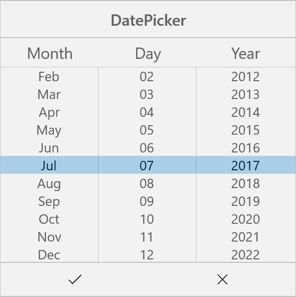

# Date Picker in UWP Picker (SfPicker)

We have demonstrated in the following steps to create custom Date Picker using Picker control.

**Step** **1** **:** We have created custom class named as “CustomDatePicker”. This class should inherit from SfPicker control.



    using Syncfusion.UI.Xaml.Controls.Input;
    using Windows.UI.Xaml;

    namespace DatePicker
   
    {    

     public class CustomDatePicker : SfPicker
  
      {

  
      }
  
    }



**Step** **2** **:** After that create four ObservableCollection with object type in DatePicker class. 

**Collection** **details** **:** 

Date Collection, Day Collection, Month Collection and Year Collection.

Day Collection -> We have added current month days using DateTime.DaysInMonth.

Month Collection -> We have added Jan to Dec months

Year Collection -> We have added 1990 to 2050 years.

Date Collection -> We have added all the three collections.

Date Collection is main collection we have assigned this collection to ItemsSource of Picker Control.

The below code demonstrates Date collection creation.


 
    using Syncfusion.UI.Xaml.Controls.Input;
    using Windows.UI.Xaml;

    namespace DatePicker
  
    {    

      public class DatePicker : SfPicker    
  
      {

        #region Public Properties

        // Months API is used to modify the Day collection as per change in Month

        internal Dictionary<string, string> Months { get; set; }

        /// 

        /// Date is the actual DataSource for SfPicker control which will holds the collection of Day ,Month and Year

        /// 

        /// <value>The date.</value>

        public ObservableCollection<object> Date { get; set; }

        //Day is the collection of day numbers

        internal ObservableCollection<object> Day { get; set; }

        //Month is the collection of Month Names

        internal ObservableCollection<object> Month{ get; set; }

        //Year is the collection of Years from 1990 to 2042

        internal ObservableCollection<object> Year{ get; set; }

        #endregion

        public CustomDatePicker() 
        
        {

            Months = new Dictionary<string, string>();

            Date = new ObservableCollection<object>();

            Day = new ObservableCollection<object>();

            Month = new ObservableCollection<object>();

            Year = new ObservableCollection<object>();

            PopulateDateCollection();

            this.ItemsSource = Date;

        }

        public void PopulateDateCollection()
  
        {
  
            //populate Days

            for (int i = 1; i <= DateTime.DaysInMonth(DateTime.Now.Year, DateTime.Now.Month); i++)
  
            {
  
                if (i < 10)

                    Day.Add("0" + i);

                else
  
                    Day.Add(i.ToString());
  
            }

            //populate Months

            for (int i = 1; i < 13; i++)
      
            {
      
                if (!Months.ContainsKey(CultureInfo.CurrentCulture.DateTimeFormat.GetMonthName(i).Substring(0, 3)))
                    Months.Add(CultureInfo.CurrentCulture.DateTimeFormat.GetMonthName(i).Substring(0, 3), CultureInfo.CurrentCulture.DateTimeFormat.GetMonthName(i));
                Month.Add(CultureInfo.CurrentCulture.DateTimeFormat.GetMonthName(i).Substring(0, 3));
      
            }

            //populate Years

            for (int i = 1990; i <= 2050; i++)
      
                Year.Add(i.ToString());        

            Date.Add(Month);
            
            Date.Add(Day);
            
            Date.Add(Year);     

        }
     
      }
    
    }



**Step** **3** **:** We have updated the day value based on month and year value using Selection changed event of SfPicker control. Since the days of each month differs we have to handle this collection.


 
    using Syncfusion.UI.Xaml.Controls.Input;
    using Windows.UI.Xaml;

    namespace DatePicker
   
    {    

      public CustomDatePicker()         
   
      {
   
        //hook selection changed event

         this.SelectionChanged += DateTimePicker_SelectionChanged;

      }

      private void DateTimePicker_SelectionChanged(object sender, SelectionChangedEventArgs e)
   
        {

            UpdateDays(Date, e);
   
        }

        //Update days method is used to alter the Date collection as per selection change in Month column(if Feb is Selected day collection has value from 1 to 28)

        private void UpdateDays(ObservableCollection<object> Date, SelectionChangedEventArgs e)
   
        {

            try
   
            {

                bool update = false;
   
                if (e.AddedItems != null && e.RemovedItems != null)
   
                {
   
                    if ((e.AddedItems[0] as IList)[2] != (e.RemovedItems[0] as IList)[2])
   
                    {
   
                        update = true;
   
                    }

                    if ((e.AddedItems[0] as IList)[0] != (e.RemovedItems[0] as IList)[0])
   
                    {
   
                        update = true;
   
                    }
   
                }

                if (update)
   
                {
   
                    ObservableCollection<object> days = new ObservableCollection<object>();
   
                    int month = DateTime.ParseExact(Months[(e.AddedItems[0] as IList)[0].ToString()], "MMMM", CultureInfo.InvariantCulture).Month;
   
                    int year = int.Parse((e.AddedItems[0] as IList)[2].ToString());
   
                    for (int j = 1; j <= DateTime.DaysInMonth(year, month); j++)
   
                    {
   
                        if (j < 10)
   
                        {
   
                            days.Add("0" + j);
   
                        }
   
                        else
   
                            days.Add(j.ToString());
   
                    }

                    if (days.Count > 0)
   
                    {
   
                        this.Date.RemoveAt(1);
   
                        this.Date.Insert(1, days);
   
                    }
   
                }

            }
   
            catch
   
            {

            }
   
        }
   
    }



**Step** **4** **:** We have defined each column headers “MONTH”, “DAY” and “YEAR” using ColumnHeaderText property of SfPicker control. The below code demonstrates how to define header for each column of SfPicker control.



    using Syncfusion.UI.Xaml.Controls.Input;
    using Windows.UI.Xaml;

    namespace DatePicker
  
    {    

      public class CustomDatePicker : SfPicker    
  
      {

        /// 

        /// Headers API is holds the column name for every column in date picker

        /// 

        /// <value>The Headers.</value>

        public ObservableCollection<string> Headers { get; set; }

        public CustomDatePicker()         
  
        {

            Headers = new ObservableCollection<string>();

            Headers.Add("Month");
           
            Headers.Add("Day");
           
            Headers.Add("Year");

            Header = "DatePicker";

            this.ColumnHeaderText = Headers;
  
        }
  
      }
  
    }



**Step** **5** **:** Finally we have enabled SfPicker footer, header and Column header using ShowFooter, ShowHeader and ShowColumnHeader properties.



    using Syncfusion.UI.Xaml.Controls.Input;
    using Windows.UI.Xaml;

    namespace DatePicker
 
    {    
 
      public DatePicker()    
 
      {
 
        ShowFooter = true;

        ShowHeader = true;

        ShowColumnHeader = true;

      }
 
    }



**Step** **6** **:** We have added the DatePicker control in MainPage page. Please refer the below code snippets.





    <Page xmlns="http://schemas.microsoft.com/winfx/2006/xaml/presentation"

    x:Class="DatePicker.MainPage"

    xmlns:local="using:DatePicker"

    xmlns:x="http://schemas.microsoft.com/winfx/2006/xaml"

    xmlns:input="using:Syncfusion.UI.Xaml.Controls.Input">

      <Grid>

        <Button Click="Button_Click" Height="50" VerticalAlignment="Center" HorizontalAlignment="Center" Content="Show Picker" Width="200" />

        <local:CustomDatePicker x:Name="date" ColumnHeaderHeight="40" HorizontalAlignment="Center" VerticalAlignment="Center"  PickerMode="Dialog" Height="400" Width="400"  SelectedItem="{Binding StartDate}"/>

      </Grid>

    </Page>





    using Syncfusion.UI.Xaml.Controls.Input;
    using Windows.UI.Xaml;

    namespace DatePicker
 
    {    

     public sealed partial class MainPage : Page
 
      {
 
        public MainPage()
 
        {
 
            this.InitializeComponent();
 
            DateTimeViewModel datetime view model = new DateTimeViewModel();
 
            this.DataContext = datetime view model;
 
        }

        private void Button_Click(object sender, RoutedEventArgs e)
      
        {
      
            date.IsOpen = !date.IsOpen;
      
        }
      
      }
    
    }





Screen shot for the above code.

We have attached DatePicker sample for reference. Please download the sample from the following link.

Sample link: [DatePicker](http://www.syncfusion.com/downloads/support/directtrac/general/DATEPI~2-1811511138.ZIP)

